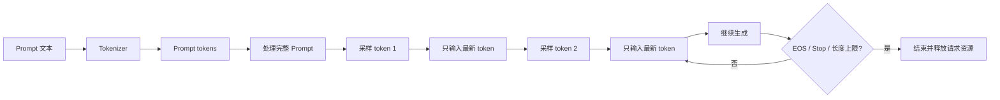
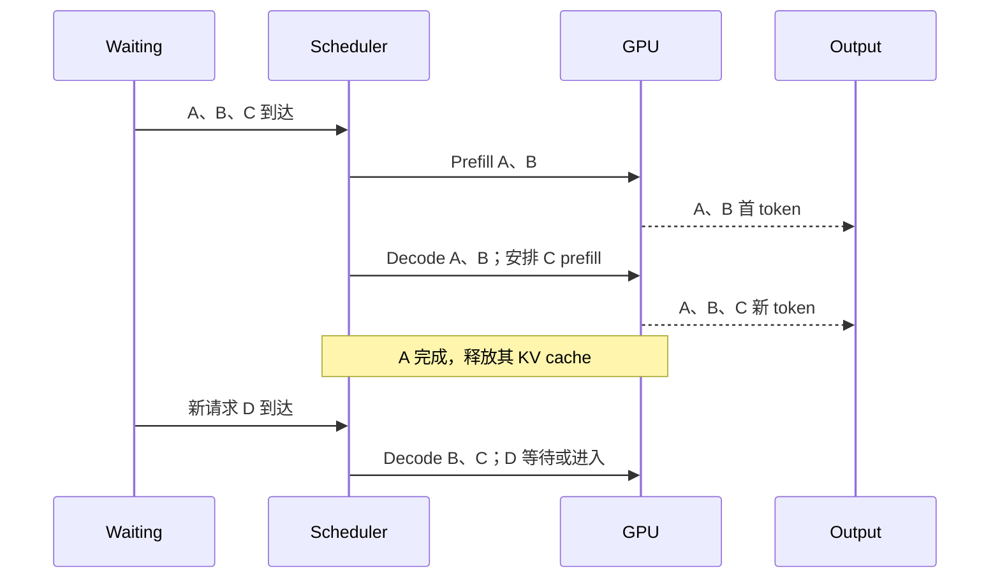
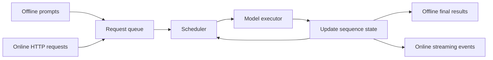

# Week 01：一次回答是怎样被生成出来的

## 先看一个看似简单的请求

假设用户向服务端发送了一段 1,000 token 的 prompt，并要求最多生成 100 token。

从用户视角看，这件事非常简单：输入问题，等待回答。可如果把服务端内部的过程放慢来看，会发现它绝不是“把 1,000 个 token 送进模型，再一次性得到 100 个 token”。自回归语言模型一次只能决定下一个 token，因此服务端实际要完成的是：

1. 先处理完整的 1,000-token prompt，得到第一个输出 token；
2. 把第一个输出 token 作为新输入，再生成第二个；
3. 重复这个过程，直到生成结束；
4. 在这段时间里，其他用户的请求还会不断到来。

如果服务端真的在第 2 步重新计算前面 1,001 个 token，在第 3 步重新计算 1,002 个 token，越到后面重复工作就越多。KV cache 正是为了避免这种浪费。但 KV cache 又会占用大量显存，于是系统不得不继续解决：显存怎样分、请求怎样排队、哪些请求可以一起算，以及超出容量时应该拒绝谁。

LLM serving 的整条技术主线，基本都从这个矛盾展开：

```text
我们希望复用历史计算
-> 因而保存 KV cache
-> KV cache 消耗显存
-> 并发请求争夺显存和 GPU 时间
-> 需要调度、分页管理和准入控制
-> 最后用 TTFT、TPOT、吞吐和尾延迟判断取舍是否合理
```

第一周先把这条主线看完整。后面的 CUDA、PagedAttention、continuous batching 和多卡规划，都是在解决其中某一段问题。

---

## 在进入流程前，先把几个基础概念说清楚

LLM serving 的资料经常直接使用 token、logits、sampling 等词。如果这些词只是“似乎见过”，后面理解 prefill 和 decode 时就很容易把不同阶段混在一起。

### 文本、Token 与 Token ID

用户输入的是文本，模型接收的却是整数序列。Tokenizer 负责完成两步转换：先按词表规则把文本切成 token，再把每个 token 映射为 token ID。

例如下面的文本：

```text
KV cache is useful.
```

不一定会按照空格被切成四段。词表可能把 `cache` 当成一个 token，也可能把它拆成更小的子词。中文、代码、数字和罕见单词的切分方式也会不同。因此，字符数不能可靠代表模型实际处理的长度。

这件事会直接影响 serving：

- 模型的上下文长度按 token 计算，不按字符计算；
- prefill 计算量与 prompt token 数有关；
- KV cache 容量与总 token 数有关；
- throughput 通常报告 tokens/s，而不是 characters/s；
- 按字符限制请求只能作为粗略的入口保护，最终仍要检查 token 数。

模型生成的也是 token ID。服务端把一个个输出 ID 交给 tokenizer decode，才能还原成用户看到的文本。有些 token 只是一个词的一部分，因此 streaming 时“收到一个 token”也不一定等于“屏幕上多出一个完整汉字或单词”。

### 词表与 Logits

假设模型词表大小为 `V`。每次 forward 的最后，模型都会为当前位置输出一个长度为 `V` 的向量：

```text
logits = [z1, z2, ..., zV]
```

Logit 不是概率，它可以是任意实数。数值越大，只表示模型越偏好对应 token。经过 softmax 后，才得到总和为 1 的概率分布：

```text
p_i = exp(z_i) / sum_j(exp(z_j))
```

模型 forward 到这里就结束了。究竟选择哪个 token，是推理系统的 sampling 模块决定的。

### Greedy、Temperature 与 Sampling

Greedy decoding 直接选择最大 logit 对应的 token：

```text
next_token = argmax(logits)
```

它没有随机抽样，适合正确性对齐和可复现实验。`temperature > 0` 时，系统通常先缩放 logits：

```text
softmax(logits / temperature)
```

温度越低，概率越集中在少数高分 token；温度越高，分布越平，低分 token 被采到的机会增加。Top-k 只保留分数最高的 `k` 个候选；top-p 则保留累计概率达到阈值 `p` 的最小候选集合。

Sampling 参数不只是“回答风格设置”。它还影响批处理：如果一个 serving 实现只能合并 sampling 配置兼容的请求，那么参数差异会改变实际 batch 组成。做性能 baseline 时，应该固定 temperature、top-k/top-p、seed 和输出上限。

### EOS、Stop 与 Finish Reason

生成循环必须知道什么时候结束。常见条件包括：

- 模型生成 EOS token；
- 生成了用户配置的 stop token；
- 达到 `max_tokens`；
- 达到模型最大上下文长度；
- 客户端取消或断开；
- 服务端超时、过载或发生错误。

服务端应把结束原因作为 `finish_reason` 返回。否则调用者无法判断回答是自然结束，还是被长度上限截断。

### Chat Template 不是装饰

Chat API 接收的是带角色的 messages：

```text
system: 你是一名助教
user: 什么是 KV cache？
```

模型通常不是直接对这个 JSON 做推理。服务端会用 chat template 加入角色标记、分隔符和 generation prompt，再进行 tokenization。不同模板会产生不同 token 序列，进而改变模型输出、prompt 长度和 TTFT。讨论 `/v1/chat/completions` 时，必须把“协议里的 messages”和“模型最终看到的 prompt tokens”区分开。

## 一、模型为什么不能一次生成整段回答

语言模型接收一串 token，并为词表中的每个候选 token 输出一个分数。设当前上下文为：

```text
x1, x2, ..., xt
```

模型输出：

```text
logits_t in R^vocab_size
```

经过 greedy 或 sampling 后，我们选出下一个 token `x(t+1)`。但此时回答还没有结束。新的 token 要接回上下文，模型再计算：

```text
P(x(t+2) | x1, x2, ..., xt, x(t+1))
```

这种“根据已经出现的 token 预测下一个 token”的方式叫 **自回归生成**。其中的“回归”不是指传统统计学里的线性回归，而是指模型把自己已经生成的结果再次作为条件输入。

训练和生成在这里有一个重要差异。训练时，完整答案通常已知，可以使用 teacher forcing，让多个位置的 next-token prediction 在一次 forward 中并行计算；在线生成时，`x(t+1)` 尚未出现，必须先采样得到它，才能继续计算 `x(t+2)`。这就是 decode 必须逐步推进的根本原因，不是框架故意把一个大任务拆慢了。

因此，一次回答不是一次 forward，而是一段持续变化的状态：



图中“处理完整 Prompt”和“只输入最新 token”就是两种不同的计算阶段，前者叫 **prefill**，后者叫 **decode**。

这里先记住一个容易被忽略的事实：服务端并不是被调用一次后就安静地等模型返回。它要在每个 token 之间重新进入调度、检查停止条件、维护缓存，并决定何时把结果发给用户。

## 二、Prefill：先把问题读完

仍以 1,000-token prompt 为例。为了生成第一个输出 token，模型必须让这 1,000 个 token 依次经过所有 Transformer 层。

在每一层 Attention 中，输入会被投影为 Q、K、V：

```text
Q = XWq
K = XWk
V = XWv
```

Q、K、V 可以先用“检索”来理解：

- Query 表示当前位置想寻找什么信息；
- Key 表示每个历史位置可以用什么特征被匹配；
- Value 表示匹配到该位置后真正取回什么内容。

模型先计算 Query 与所有可见 Key 的相似度，再把相似度归一化成注意力权重，最后对 Value 做加权求和：

```text
scores  = QK^T / sqrt(head_dim)
weights = softmax(scores + causal_mask)
output  = weights V
```

如果 prompt 有 4 个 token，causal mask 允许的位置可以画成：

```text
            被关注的位置
          1   2   3   4
当前位置1  ✓   ×   ×   ×
当前位置2  ✓   ✓   ×   ×
当前位置3  ✓   ✓   ✓   ×
当前位置4  ✓   ✓   ✓   ✓
```

第 2 个 token 不能偷看第 3、4 个 token，否则训练时就会泄露未来信息。Prefill 虽然一次处理完整 prompt，但 causal mask 仍保证每个位置只使用当时已经出现的上下文。

第 `i` 个 token 只能关注自己和它之前的 token，因此还要应用 causal mask。整个 prompt 可以作为一个较大的张量送进 GPU。虽然 Attention 内存在因果依赖，但 prompt 各位置的大量矩阵计算仍然可以并行完成。

Prefill 完成后，系统得到两类重要结果：

- 最后一个位置的 logits，用来选择第一个输出 token；
- 所有层、所有 prompt token 的 K/V，用于后续生成。

这批 K/V 不会随着后续 token 的到来而失效。prompt 中第 37 个 token 的 K/V，在生成第 1 个输出 token 时是什么，生成第 100 个输出 token 时仍然是什么。所以系统把它们保存下来，这就是 KV cache。

Prefill 通常呈现出较大的矩阵计算。prompt 越长，需要处理的 token 越多，用户看到第一个字之前等待的时间往往也越长。注意这里说的是“往往”，而不是给所有模型和 GPU 下一个绝对结论：真实瓶颈还要结合 batch、kernel、硬件和排队时间测量。

## 三、Decode：模型开始逐字回答

假设 prefill 选出的第一个输出 token 是 `y1`。生成 `y2` 时，服务端不再输入原来的 1,000 个 token，而只输入 `y1`。

为什么只输入一个 token 也能利用完整上下文？因为模型会为 `y1` 计算新的 Q/K/V，然后：

- 用 `y1` 的 Q 查询 prompt 和 `y1` 的全部 K；
- 用得到的注意力权重读取全部 V；
- 把 `y1` 的 K/V 追加进 KV cache。

下一步生成 `y3` 时，只输入 `y2`，但缓存中已经包含 prompt、`y1` 和 `y2` 的历史信息。

这里还要区分 Q 与 K/V 的生命周期。历史 token 的 K/V 会被后续步骤反复使用，所以值得缓存；但某一步的 Q 只负责查询当时的历史，下一步会产生新的 Q，旧 Q 不再需要。因此通常叫 KV cache，而不是 QKV cache。

假设 prefill 后缓存长度为 1,000：

```text
decode step 1:
  新输入 token 数 = 1
  读取历史 KV 长度 = 1,000
  写入新 KV 数 = 1

decode step 2:
  新输入 token 数 = 1
  读取历史 KV 长度 = 1,001
  写入新 KV 数 = 1
```

由此能看出 decode 的一个特点：每步新计算的 token 很少，但要访问的历史不断增长。上下文越长，KV cache 的读取和 Attention 工作越重。

于是一次 100-token 的输出，模型大致经历：

```text
1 次 prefill
+ 最多 99 次后续 decode
```

Decode 每一步的输入很小，单个请求很难充分利用 GPU；但它又必须读取越来越长的 KV cache，并不断启动下一轮计算。此时系统性能不仅取决于矩阵乘有多快，还取决于缓存布局、Attention kernel、调度开销和一次能合并多少请求。

### 两阶段放在一起看

| 问题 | Prefill | Decode |
| --- | --- | --- |
| 本轮输入多少 token | 整个 prompt | 每个请求通常 1 个新 token |
| 历史信息从哪里来 | 本轮直接计算 | 从 KV cache 读取 |
| 用户在等什么 | 第一个输出 token | 后续 token 连续出现 |
| 常见优化方向 | 长序列 Attention、大矩阵、分块 prefill | 合批、KV 读取、低开销 kernel |
| 最直接影响的体验 | TTFT | TPOT / ITL |

作者在 DistServe 相关文章中把两阶段与 TTFT、TPOT 分开分析，这是很重要的系统视角：[分离式推理架构1：从DistServe谈起](https://zhuanlan.zhihu.com/p/706761664)。课程后续不会直接假设两阶段一定要物理分离，而是先学习为什么它们值得分别测量。

## 四、KV Cache 到底会吃掉多少显存

“KV cache 很占显存”如果只停留在一句话上，学生很难真正建立数量感。我们直接算一个例子。

假设课程模型采用下面这组参数：

```text
num_layers   = 28
num_kv_heads = 8
head_dim     = 128
dtype        = bfloat16 = 2 bytes
```

每层、每个 token 都要保存 K 和 V，所以单 token 的缓存约为：

```text
28 * 2 * 8 * 128 * 2 bytes
= 114,688 bytes
= 112 KiB
```

如果一个请求当前有 2,048 个上下文 token：

```text
112 KiB * 2,048 = 224 MiB
```

如果同时运行 32 个这样的请求，仅 KV cache 理论值就是：

```text
224 MiB * 32 = 7 GiB
```

这 7 GiB 还不包括模型权重、激活、临时张量、CUDA workspace 和 allocator 碎片。由此可以看出：

```text
模型权重能放进显存
```

只说明服务具备启动的必要条件，并不能说明它能承受目标并发。

### 为什么不能简单给每个请求预留最大长度

如果系统允许最大上下文 32k，并为每个请求一开始就预留完整连续空间，大多数短请求会留下大量未使用区域。更麻烦的是，即使显存总空闲量足够，连续大块也可能因为碎片而分配失败。

这正是 Week 10 要引出 PagedAttention 的地方。它把逻辑 token 位置映射到固定大小的物理块，请求增长时再逐块分配，而不是一次押注最终长度。作者的 [PagedAttention 原理](https://zhuanlan.zhihu.com/p/691038809) 使用操作系统分页来建立直觉；课程会沿用这个类比，但重新绘制适合本项目 block table 的图。

## 五、用户感受到的“快”究竟是什么

考虑下面一次真实时间线。请求在 `0 ms` 到达：

```text
0 ms      请求到达
120 ms    排队结束，开始 prefill
620 ms    prefill 与首次采样结束
650 ms    第一个 token 到达客户端
705 ms    第二个 token 到达
758 ms    第三个 token 到达
816 ms    第四个 token 到达，请求结束
```

### 1. TTFT

第一个 token 在 650 ms 可见：

```text
TTFT = 650 - 0 = 650 ms
```

这 650 ms 里既有 120 ms 排队，也有 prefill、sampling 和返回开销。所以 TTFT 不能直接等同于 GPU prefill 时间。

### 2. ITL 与 TPOT

后续 token 间隔分别为：

```text
705 - 650 = 55 ms
758 - 705 = 53 ms
816 - 758 = 58 ms
```

平均 TPOT 可写成：

```text
TPOT = (816 - 650) / 3
     ≈ 55.3 ms/token
```

不同 benchmark 对 TPOT 是否包含某些边界时间可能有不同定义。提交报告时必须把公式写出来，而不能只给一个名为 `tpot` 的数字。

课程工程当前 benchmark 还输出一个名为 `estimated_tpot_s` 的简化代理量：

```text
estimated_tpot_s = 所有请求延迟之和 / 所有输出 token 数
```

这个量包含排队、prefill 和首 token 时间，并不是上面定义的标准 TPOT。它只适合在请求分布、并发度和测量边界完全相同的课程实验中做粗略对比，不能与其他系统报告的 TPOT 直接比较。后续整理 benchmark 时，应优先记录每个 token 的到达时间，再按明确公式计算标准指标。

### 3. 端到端延迟

```text
E2E latency = 816 - 0 = 816 ms
```

### 4. 吞吐

如果 10 秒内完成了 40 个请求，共生成 3,200 个 token：

```text
request throughput = 40 / 10 = 4 requests/s
token throughput   = 3200 / 10 = 320 tokens/s
```

两者必须一起看。一个请求生成 8 token，另一个请求生成 512 token，它们对系统造成的负担明显不同。

### 5. 为什么还要看 p99

假设 99 个请求在 1 秒内拿到首 token，另一个请求排队了 20 秒。平均 TTFT 可能没有看起来那么糟，但那一个用户已经认为服务不可用。

因此在线系统通常报告 p50、p90、p99，并给出 SLO：

```text
p99 TTFT < 2 s
p99 TPOT < 80 ms
success rate >= 99.9%
```

吞吐只有在 SLO 内才有价值。把请求无限塞入队列可以让 GPU 一直忙，却会让用户等待时间失控。

### 6. Queueing、Service Time 与 Goodput

为了定位问题，还需要把请求总时间拆得更细：

```text
E2E latency = queueing time + service time
```

Queueing time 是请求到达后等待资源的时间。Service time 是请求真正进入执行路径后，完成 prefill、decode 和返回所花的时间。高负载时，模型本身可能没有变慢，但 queueing time 会快速增长。

吞吐也有“完成多少”和“有多少满足目标”的区别。假设系统每秒完成 100 个请求，但只有 60 个请求满足 TTFT SLO，那么原始吞吐是 100 requests/s，SLO goodput 只有 60 requests/s：

```text
goodput = 满足指定 SLO 的成功请求数 / elapsed_time
```

Goodput 能防止一种虚假优化：系统通过无限排队提高表面吞吐，实际大部分用户已经无法接受延迟。

### 7. 指标必须说明聚合口径

报告 p99 TTFT 时，还需要说明测试持续时间、请求到达模式和样本数。10 个请求的 p99 几乎没有稳定意义；一次性 burst 和恒定速率到达也会产生完全不同的排队行为。

至少应说明：

```text
请求总数
并发度或到达率
输入/输出 token 长度分布
是否包含失败和超时请求
预热次数与正式测量区间
```

## 六、为什么多个请求要混在一起算

现在同时到来三个请求：

```text
A: prompt 128 tokens，预计输出 4 tokens
B: prompt 512 tokens，预计输出 20 tokens
C: prompt 64 tokens，预计输出 8 tokens
```

最简单的办法是先完整生成 A，再生成 B，最后生成 C。这种方式容易实现，但 A decode 时每一步只有一个 token，GPU 的并行能力大量闲置；而 C 明明很短，却必须等 B 完整生成。

另一种办法是把 A、B、C 固定成一个 batch，直到三者都结束。这样 GPU 利用率提高了，但 A 结束后，它在 batch 中的位置可能长期空着，仍然要等 B。

Continuous batching 的关键变化是：**每一轮都允许重新决定 batch 里有哪些请求。**



注意，图里把 prefill 和 decode 写在同一时间线上，是为了说明调度思想，不代表任何实现都能无条件把两种工作混成一个 kernel。真实系统会考虑 token budget、显存、请求优先级、chunked prefill 和模型执行器能力。

### Waiting、Running 与一次调度迭代

调度器通常至少维护两类请求：

- `waiting`：已经到达，但尚未获得本轮执行资源；
- `running`：已经拥有必要状态，并被纳入当前或后续 decode 的请求。

有些系统还会记录 swapped、preempted、finished 等状态。名字会随版本变化，但核心问题相同：请求当前是否占用 KV，下一轮是否允许执行，以及资源不足时怎样让出空间。

“一轮”通常不是把某个请求从头生成到尾，而是执行一次调度决策加一次模型步骤。完成这一轮后：

1. 已结束的请求退出并释放资源；
2. 未结束请求更新上下文长度；
3. 新请求可能从 waiting 进入 running；
4. 调度器重新检查 token budget 和 KV 容量；
5. 形成下一轮 batch。

### Batch Size 与 Batched Tokens 不是同一个限制

只限制“最多 8 个请求”并不足够。8 个请求可能都是 16-token 短 prompt，也可能都是 8k-token 长 prompt，两者的 prefill 成本和显存需求完全不同。

所以调度器常同时考虑：

```text
max_num_seqs            # 同时容纳多少序列
max_num_batched_tokens  # 本轮最多处理多少 token
KV cache 可用块数
```

这也是为什么 serving 系统的 batch size 会动态变化：真正稀缺的资源不仅是“请求槽位”，还有本轮 token 预算和持续增长的 KV 空间。

### 一个容易混淆的问题：Streaming 是不是 batching

不是。

Streaming 解决的是“token 生成后什么时候发给用户”；continuous batching 解决的是“下一轮 GPU 要算哪些请求”。一个服务完全可能边生成边返回，但内部一次只服务一个请求。反过来，non-streaming 请求也可以在内部高效合批，只是在最后一次性返回文本。

## 七、Offline Batching 和 Online Serving 共用什么

离线批处理往往在开始前就拿到了全部输入，调用者关心整组任务多久完成。在线服务则不断接收新请求，每个请求都有独立的到达时间、取消状态和延迟目标。

外部语义虽然不同，内部却可以共享同一个推理内核：请求进入调度器，调度器每一轮选择工作，模型执行一步，然后更新请求状态。



作者在新旧两版 vLLM 整体流程文章中都围绕这条共享内核展开：[vLLM V1 整体流程](https://zhuanlan.zhihu.com/p/1900126076279160869)、[旧版整体架构](https://zhuanlan.zhihu.com/p/691045737)。这里要学习的是稳定的系统关系，而不是记住某一版源码的类名。

## 九、把几个常见误解当场拆开

### “Streaming 让模型更快”

不一定。Streaming 主要让已经生成的 token 更早可见。即使模型总耗时不变，用户体验也会更好，因为不必等待完整回答。

### “TTFT 就是 prefill 时间”

不是。请求在 prefill 前可能已经排队，prefill 后还要 sampling 和发送首 token。要得到纯 GPU prefill 时间，需要在服务端分段测量。

### “GPU 利用率越高越好”

如果为了让 GPU 满载而等待更大的 batch，TTFT 可能变差；如果把太多请求放进系统，p99 和错误率可能失控。利用率是手段，SLO 才是约束。

### “模型只有 1GB，所以 24GB 显卡能跑 24 个并发”

权重不是唯一显存消耗。KV cache 随总上下文 token 数增长，临时张量和碎片也需要空间。并发容量必须计算，而不能按权重大小做除法。

### “用了异步 API，模型就能并行执行”

异步 API 让服务器不必用一个线程阻塞等待请求结束，但 GPU 工作仍要由调度器组织。控制流异步和模型计算并行是两件不同的事。

## 十、学完本节，应能回答这些问题

1. 为什么生成 100 个 token 不是执行一次模型 forward？
2. Prefill 为什么一次处理整个 prompt，而 decode 通常只输入一个 token？
3. KV cache 省掉了什么计算，又引入了什么系统成本？
4. TTFT 为什么不能直接当作 prefill 时间？
5. Streaming 和 continuous batching 的边界在哪里？
6. 为什么模型权重能放进显存，仍不代表服务能承受目标并发？
7. 一个长 prompt、短输出请求与一个短 prompt、长输出请求，分别更容易压迫哪个阶段？

如果这些问题能用自己的话解释清楚，第一周的目标就完成了。后续课程会把这里暂时画成方框的部分逐一打开：先看 profiling，再看 CUDA 算子，然后进入 KV、分页、调度和多卡容量。

## 参考与素材说明

- 猛猿：[图解Vllm V1系列1：整体流程](https://zhuanlan.zhihu.com/p/1900126076279160869)
- 猛猿：[图解大模型计算加速系列：vLLM源码解析1，整体架构](https://zhuanlan.zhihu.com/p/691045737)
- 猛猿：[分离式推理架构1：从DistServe谈起](https://zhuanlan.zhihu.com/p/706761664)
- 猛猿：[vLLM核心技术PagedAttention原理](https://zhuanlan.zhihu.com/p/691038809)

本讲义吸收了上述文章建立直觉、分层解释和用流程图串联机制的方法。正文、计算例子与图示均为课程重新组织和原创绘制；涉及具体 vLLM 类名与实现时，应以课程指定版本和对应官方文档为准。
