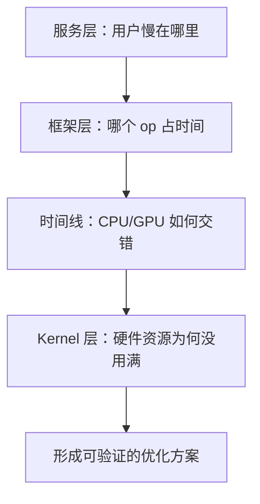
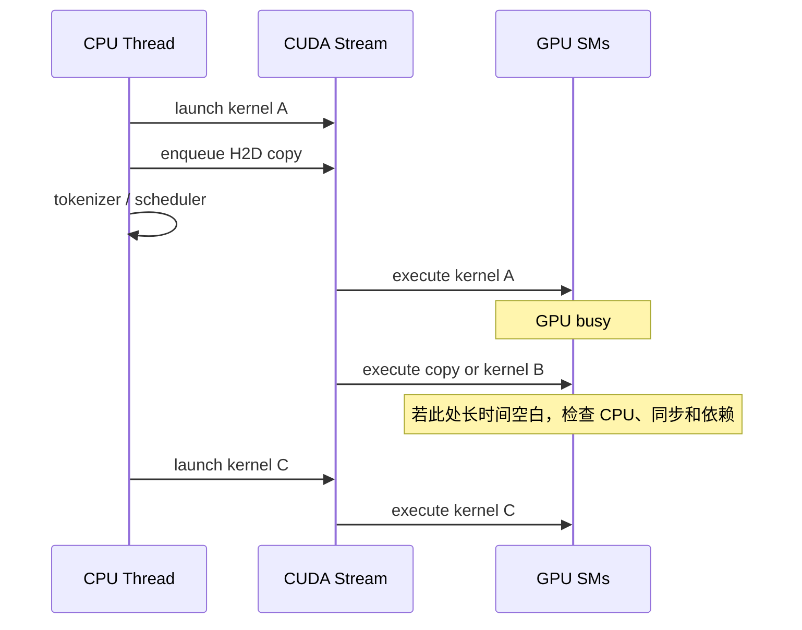

# Week 02：性能分析不是猜哪里慢

## 从一个错误的优化故事开始

服务压测结果显示，平均延迟从 1.8 秒上升到了 2.4 秒。有人打开 CUDA 文件，看见 softmax kernel 写得很朴素，于是花两天重写 reduction。kernel benchmark 快了 30%，重新跑服务，端到端延迟几乎没有变化。

问题不一定出在优化能力，而是出在证据顺序。服务变慢可能来自：

- 请求进入得更快，排队时间增加；
- prompt 变长，prefill 工作量增加；
- 输出 token 变多，decode 轮数增加；
- CPU 在某个同步点等待 GPU；
- batch 太小，kernel 很快但 GPU 大部分时间空闲；
- H2D copy 没有和计算重叠；
- 某个 kernel 的确低效，但它只占总时间的 2%。

如果不知道 2.4 秒分别花在哪里，就不知道应该改调度器、数据搬运、模型算子，还是根本不该改代码。

本周的目标不是学会点击某个 profiler，而是建立一套不会乱优化的调查方法：

```text
先定义 workload
-> 观察用户侧现象
-> 分解时间
-> 提出可证伪假设
-> 选择合适工具
-> 修改一个变量
-> 用同一 workload 复验
```

---

## 一、性能数字为什么必须带上下文

“系统达到 500 tokens/s”听起来是一个结论，实际上缺少大量信息：

```text
用的什么模型和 dtype？
输入长度是多少？
输出长度是多少？
并发度和请求到达方式是什么？
是 prefill tokens/s 还是 output tokens/s？
有多少请求违反 TTFT SLO？
是否包含模型加载与 JIT 编译？
```

下面两个系统都报告 500 tokens/s：

| 系统 | 输入 | 输出 | 并发 | p99 TTFT |
| --- | ---: | ---: | ---: | ---: |
| A | 128 tokens | 16 tokens | 64 | 12 s |
| B | 2,048 tokens | 128 tokens | 16 | 1.8 s |

只看 tokens/s，无法判断谁更好。性能数据只有和 workload、硬件、软件版本及统计口径绑定后才有意义。

### Workload 不是一条 prompt

完整 workload 至少包含四类分布：

- 输入长度分布；
- 输出长度分布；
- 请求到达分布；
- sampling 与模型配置。

一次性同时发送 100 个请求叫 burst；每秒稳定发送 10 个请求是固定到达率；前一个请求结束后才发送下一个是 closed-loop。三种方式对排队和吞吐的含义完全不同。

## 二、把端到端延迟拆开

设一个请求经历以下阶段：


于是可以概念性写成：

```text
E2E latency
= queueing
+ preprocessing
+ prefill
+ first sampling
+ decode
+ response overhead
```

这不是说每个系统都必须用完全相同的打点，而是提醒我们：端到端数字是许多阶段叠加的结果。

### 一个具体分解

假设某请求总耗时 2,000 ms：

```text
queueing       700 ms
tokenization    20 ms
prefill        480 ms
decode         760 ms
response        40 ms
```

如果只优化一个占 20 ms 的 tokenizer，即使无限加速，端到端最多改善 1%。这就是 Amdahl's Law 在性能工程中的直观版本：

```text
优化收益受目标部分在总时间中的占比限制
```

优化前先回答“它占多少”，通常比先回答“它还能快多少”更重要。

## 三、四层性能证据分别回答什么

### 第一层：服务指标

服务指标站在用户和系统容量视角：

```text
TTFT / TPOT / ITL
E2E p50/p90/p99
requests/s / tokens/s / goodput
queue depth / reject rate / error rate
average and max batch size
KV cache utilization
```

它能告诉我们“症状是什么”，但很难独立说明“哪一个 CUDA kernel 导致症状”。

### 第二层：框架算子

PyTorch profiler 一类工具把时间归到框架 op 和关联的 CUDA kernel：

```text
aten::matmul
aten::copy_
aten::softmax
cudaLaunchKernel
自定义 rms_norm_kernel
```

它适合发现某个 op 占比过高、隐藏 copy 太多、CPU 和 CUDA 时间不匹配，或者模型走了意外的 fallback 路径。

### 第三层：系统时间线

Nsight Systems 关心先后关系：

- CPU 什么时候提交 kernel；
- 哪条 CUDA stream 在工作；
- kernel 之间是否存在空洞；
- memcpy 与 compute 是否重叠；
- 哪个线程在等待、sleep 或同步。

如果 GPU timeline 大量空白，单个 kernel 即使优化 30%，整体也可能没有明显收益。

### 第四层：单 Kernel 微架构

Nsight Compute 进一步解释 kernel 内部：

```text
memory throughput
SM utilization
achieved occupancy
register / shared memory usage
warp stall reasons
global load efficiency
branch divergence
```

它适合回答“为什么这个 kernel 没达到预期”，不适合直接回答“为什么某用户排队 10 秒”。



调查通常从上往下收窄，而不是一开始就钻进最底层。

## 四、GPU 是异步的：计时最容易犯的错

在 Python 中调用 CUDA op，CPU 往往只是把工作提交到 GPU stream，然后继续执行。下面这种计时可能只测到 launch 开销：

```python
start = time.time()
y = torch.matmul(a, b)
elapsed = time.time() - start
```

当 `elapsed` 被计算时，GPU 可能仍在工作。正确的教学计时至少要在边界同步：

```python
torch.cuda.synchronize()
start = time.time()
y = torch.matmul(a, b)
torch.cuda.synchronize()
elapsed = time.time() - start
```

更细的 GPU 时间可以使用 CUDA events。关键不是背 API，而是理解：

```text
CPU 提交完成 != GPU 执行完成
```

### 为什么不能到处 synchronize

同步能让计时正确，却也会改变程序行为。真实服务依赖异步提交、stream 和 copy/compute overlap；在每个 op 后同步，会人为消除重叠并增加空洞。

因此：

- microbenchmark 可以在测量区间边界同步；
- 端到端服务不要为了打点在热路径中频繁同步；
- 观察真实异步关系应使用 profiler timeline。

## 五、Warmup、JIT 和缓存

第一次运行通常比后续运行慢，因为它可能包含：

- CUDA context 初始化；
- PyTorch CUDA extension JIT 编译；
- kernel module 加载；
- allocator 首次申请；
- cuBLAS heuristic 或算法选择；
- 文件系统与模型权重缓存。

如果把第一次运行直接放进平均值，会把“初始化成本”和“稳态性能”混在一起。

一个基础 microbenchmark 通常分为：

```text
setup
-> warmup 若干次
-> synchronize
-> repeat 正式测量
-> 报告均值和分位数
```

但 cold start 不是无意义数据。在线弹性扩容时，模型加载和首次编译会影响实例何时可服务。正确做法是把 cold-start latency 和 steady-state latency 分开报告。

## 六、Roofline：先判断数据搬运还是计算更贵

Roofline 模型用两个硬件上界描述 kernel 性能：

```text
峰值计算能力 P_peak       [FLOP/s]
显存带宽 BW_peak          [byte/s]
```

算子的 arithmetic intensity（AI）定义为：

```text
AI = FLOPs / bytes moved
```

可达到的性能上界近似为：

```text
P_attainable = min(P_peak, AI * BW_peak)
```

两条上界的交点称为 ridge point：

```text
AI_ridge = P_peak / BW_peak
```

如果算子的 AI 远低于 ridge point，它更可能受带宽限制；如果 AI 足够高，才有机会接近计算峰值。

### 例一：Vector Add

对 float32 向量加法：

```text
c[i] = a[i] + b[i]
```

每个元素约做 1 次加法，读取 `a/b` 共 8 bytes，写 `c` 4 bytes：

```text
AI ≈ 1 FLOP / 12 bytes
   ≈ 0.083 FLOP/byte
```

它几乎没有数据复用，典型优化目标是合并访存、减少额外 copy，而不是提高浮点计算吞吐。

### 例二：大矩阵乘

计算：

```text
C[M,N] = A[M,K] @ B[K,N]
```

FLOPs 约为：

```text
2 * M * N * K
```

如果 A/B tile 被许多输出元素重复使用，数据复用会显著提高 AI。实现合理且矩阵足够大时，GEMM 更可能进入 compute-bound 区域。

### 例三：RMSNorm

RMSNorm 要读输入、做平方和归约、读 weight、写输出。每个元素只有少量计算，且整行数据必须搬运，通常更容易受到内存带宽和 reduction 效率影响。

### 例四：Decode Attention

单请求 decode 每步只有一个 query，却要读取完整历史 K/V。上下文越长，读取量越大；如果 batch 不足，计算并行度也有限。因此它常呈现强烈的访存压力。

这些判断是调查起点，不是最终证据。最终还要用实际计数器和 workload 验证。

## 七、Roofline 最容易被误用的地方

### 只按数学公式算 bytes

实际实现可能重复读取数据、产生中间 tensor、发生 layout conversion。理论最小 bytes 不能代替 profiler 中的真实流量。

### 把低 occupancy 直接当作问题

Occupancy 表示可驻留 warp 相对硬件上限的比例。低 occupancy 可能限制延迟隐藏，但高 occupancy 也不保证 kernel 快。寄存器复用良好的计算 kernel 可能主动使用更多寄存器，occupancy 降低却性能更高。

### 看到 memory-bound 就放弃优化

Memory-bound 仍可通过减少读写次数、融合 kernel、改善 coalescing、使用 shared memory 或压缩数据类型优化。它只说明增加算术单元不一定有用。

### 用硬件峰值替代可实现峰值

峰值规格通常要求特定 dtype、指令和理想 workload。教学 kernel 不应轻易声称“只达到峰值的 5% 就很差”，必须确认比较口径。

## 八、如何读一张 CPU/GPU Timeline

把时间线想成两条生产线：CPU 准备并提交工作，GPU 执行工作。



阅读时按顺序问：

1. GPU 是否连续有工作？
2. 空洞之前 CPU 在做什么？
3. 是否出现同步 API？
4. memcpy 和 compute 是否在同一 stream 被串行化？
5. kernel 是否太碎，launch overhead 占比高？
6. 多个 stream 是否真的发生重叠，还是存在数据依赖？

## 九、从现象到结论的完整范例

### 观测

并发从 1 提升到 8 后：

```text
tokens/s: 80 -> 310
p50 TTFT: 0.5s -> 0.8s
p99 TTFT: 0.7s -> 5.2s
```

### 初步解释

吞吐提升说明 batching 更有效；p99 大幅恶化说明部分请求长时间排队，不能只宣布“优化成功”。

### 假设

调度器为了形成更大 batch，允许 waiting queue 积累；长 prompt 还可能阻塞短请求。

### 证据

- 服务统计显示 queue depth 峰值升高；
- TTFT 分解显示 GPU prefill 时间变化不大，queueing 增长；
- Nsight Systems 中 GPU 比以前更忙，没有对应 5 秒空洞；
- 因此主要问题更可能在排队策略，而非单 kernel。

### 行动

调整 batch waiting、token budget 或 admission policy，再用完全相同 workload 复验 tokens/s、p99 TTFT 和 goodput。

这才是可辩护的性能结论：每一步都有证据，也明确说明尚未证明什么。

## 十一、常见错误

### Profiler 打开后，直接比较绝对延迟

Profiler 本身有开销。它适合定位结构和热点，端到端性能应在关闭重型采集后重新测量。

### 只贴截图，不写结论

截图不是结论。必须标出时间区间、kernel 名称、现象、假设和下一步验证。

### 同时修改多个变量

换模型、改 batch、改 dtype、改 kernel 后得到更快结果，无法判断是哪项造成。一次实验尽量只改变一个因素。

### 用平均值隐藏长尾

服务系统必须报告分位数和失败率。平均值无法保护最慢的用户。

### 把相关性写成因果

“GPU utilization 上升且 tokens/s 上升”不自动证明某个 kernel 优化有效。还要检查 workload、batch 和排队是否改变。

## 十二、学完本周，应能回答

1. 为什么端到端延迟无法直接指导 kernel 优化？
2. PyTorch profiler、Nsight Systems 和 Nsight Compute 分别回答什么？
3. CUDA 异步执行为什么会让普通计时失真？
4. Arithmetic intensity 如何帮助判断优化方向？
5. 为什么低 occupancy 不一定代表 kernel 很差？
6. 吞吐提升但 p99 恶化时，应如何评价结果？
7. 一份可复现性能报告必须记录哪些 workload 条件？

## 参考与素材说明

- 猛猿：[FlashAttention V1：从硬件到计算逻辑](https://zhuanlan.zhihu.com/p/669926191)
- 猛猿：[从啥也不会到 CUDA GEMM 优化](https://zhuanlan.zhihu.com/p/703256080)
- 课程工程：Week 02 profiling、benchmark 与报告模板

本讲义借鉴参考文章从硬件约束解释算法的教学方法，正文、例子和图示均重新组织。工具字段会随 GPU、CUDA 和 profiler 版本变化，实验报告应记录实际环境和工具版本。
