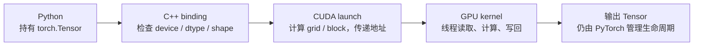
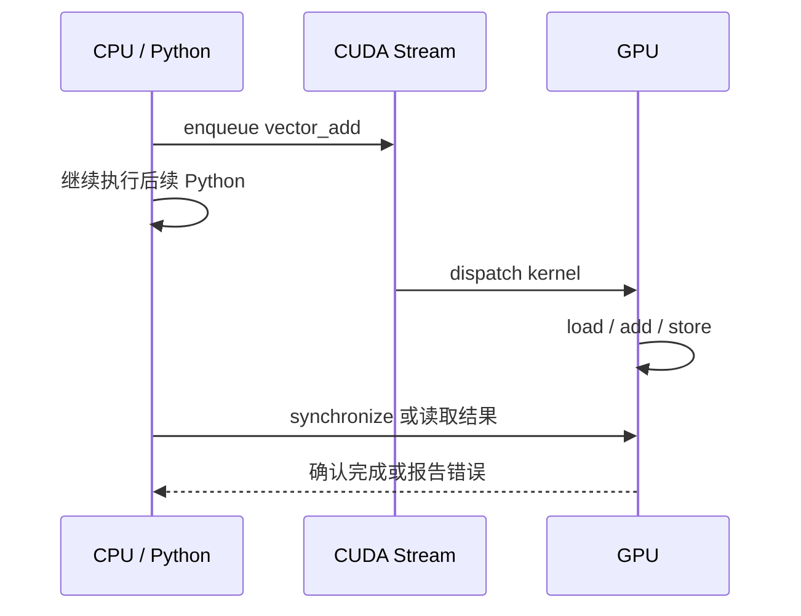

# 第 3 章：PyTorch CUDA Extension 的执行模型

PyTorch 已经提供了大量张量算子，但模型实现仍可能需要框架尚未提供的运算，或需要把若干运算融合为一个专用 kernel。PyTorch 官方教程将 C++/CUDA custom operator 作为这类需求的标准扩展路径，并将算子注册、后端实现和正确性检查视为一个完整接口，而不只是单独编译一段 CUDA 代码。[PyTorch：Custom C++ and CUDA Operators](https://docs.pytorch.org/tutorials/advanced/cpp_custom_ops.html)

本章以向量加法为最小案例：

```text
out[i] = a[i] + b[i]
```

该算子的数学定义十分简单，因而适合单独考察软件栈和执行模型。与后续的 RMSNorm、GEMM 和 Attention 相比，向量加法不涉及归约、片上数据复用或复杂张量形状。若输出不正确，可以将原因集中在输入约束、索引映射、绑定接口和启动配置，而不必同时排查算法公式。

本章的学习目标包括：说明 `torch.Tensor` 从 Python 接口到 CUDA kernel 的调用路径；推导一维数据的线程索引与边界条件；分析向量加法的访存特征；区分数值正确性、后端分派正确性和性能测量有效性。

## 3.1 自定义算子的调用路径

课程工程中的最小 CUDA 示例位于 [kernels/vector_add.cu](../../../kernels/vector_add.cu)。其 host 端入口如下：

```cpp
torch::Tensor vector_add(torch::Tensor a, torch::Tensor b) {
  TORCH_CHECK(a.is_cuda() && b.is_cuda(), "inputs must be CUDA tensors");
  TORCH_CHECK(a.dtype() == torch::kFloat32 &&
              b.dtype() == torch::kFloat32, "inputs must be float32");
  TORCH_CHECK(a.numel() == b.numel(), "input sizes must match");

  auto out = torch::empty_like(a);
  int n = a.numel();
  vector_add_kernel<<<(n + 255) / 256, 256>>>(
      a.data_ptr<float>(),
      b.data_ptr<float>(),
      out.data_ptr<float>(),
      n);
  return out;
}
```

该函数依次完成输入验证、输出分配、设备地址提取和 kernel launch。逐元素计算由 device 函数完成：

```cpp
__global__ void vector_add_kernel(
    const float* a, const float* b, float* out, int n) {
  int idx = blockIdx.x * blockDim.x + threadIdx.x;
  if (idx < n) {
    out[idx] = a[idx] + b[idx];
  }
}
```

由此可以将调用路径划分为四层：



PyTorch 的 `torch.utils.cpp_extension` 可以将 C++ 与 CUDA 源文件编译并链接为可加载模块；CUDA 源文件中的 kernel 通常仍需由 C++ 函数启动，再通过绑定暴露给 Python。[PyTorch：torch.utils.cpp_extension](https://docs.pytorch.org/docs/stable/cpp_extension.html) 后续算子的输入约束、启动参数和 kernel body 会发生变化，但上述分层关系保持不变。

## 3.2 Tensor 元数据与设备存储

`torch.Tensor` 是一个带元数据的对象。它至少描述数据位于哪个 device、元素类型、每一维的大小和 stride、底层 storage 地址，以及谁管理这块 storage 的生命周期。

当 C++ 调用 `a.data_ptr<float>()` 时，并没有复制 tensor。它只是取得底层数据地址，并把这个地址作为 kernel 参数传给 GPU。于是三个条件不可忽略：

1. 地址必须指向当前 CUDA device 可访问的内存；
2. 指针类型必须和真实 dtype 一致；
3. kernel 对下标的解释必须符合 tensor 的布局。

若非连续 tensor 被当作连续数组读取，底层地址仍可能合法，但线性下标不再对应预期元素。实现通常选择拒绝非连续输入，或先调用 `.contiguous()` 生成符合 kernel 布局约定的 tensor。课程的通用包装层采用后一种方式，见 [course_vllm/kernels/cuda_ops.py](../../../course_vllm/kernels/cuda_ops.py)。

### 3.2.1 不同接口层的约束

检查应放在最了解约束的边界：

| 层次 | 适合检查的内容 | 不应承担的内容 |
| --- | --- | --- |
| Python wrapper | 参数组合、默认值、自动回退策略 | 解释裸 device pointer |
| C++ binding | device、dtype、shape、contiguous、同设备 | 每个线程的边界 |
| CUDA launcher | grid/block、shared memory、launch error | 业务层 fallback |
| CUDA kernel | 当前线程下标、局部边界、并行计算 | 抛出 Python 异常 |

仅在 Python 层检查不能保护可被独立调用的 C++ 接口；将检查全部推迟到 kernel 又会降低错误的可诊断性。因此，约束应在最接近其语义的接口层验证。

## 3.3 CUDA 执行层次与一维索引

CPU 循环把时间看成主要组织维度：

```text
i=0 -> i=1 -> i=2 -> ... -> i=n-1
```

GPU 程序以大量逻辑线程组织数据并行。CUDA kernel 的一次启动产生一个 grid；grid 由 thread block 组成，每个 block 再包含若干 thread。NVIDIA 的编程指南将 kernel、thread hierarchy 和 memory hierarchy 作为 CUDA 编程模型的基本组成部分。[NVIDIA：CUDA C++ Programming Guide](https://docs.nvidia.com/cuda/cuda-c-programming-guide/contents.html)

对于一维向量，线程的全局编号通常写成：

```text
idx = blockIdx.x * blockDim.x + threadIdx.x
```

`threadIdx.x` 是线程在当前 block 中的位置，`blockIdx.x` 是 block 在 grid 中的位置，`blockDim.x` 是每个 block 的线程数。

### 3.3.1 索引实例：`n=1000`

设 `blockDim.x = 256`。需要的 block 数是：

```text
num_blocks = ceil(1000 / 256)
           = (1000 + 256 - 1) // 256
           = 4
```

四个 block 实际创建 1024 个线程：

| blockIdx.x | threadIdx.x 范围 | 全局 idx 范围 | 有效元素 |
| ---: | ---: | ---: | ---: |
| 0 | 0..255 | 0..255 | 256 |
| 1 | 0..255 | 256..511 | 256 |
| 2 | 0..255 | 512..767 | 256 |
| 3 | 0..255 | 768..1023 | 232 |

最后 24 个线程的 `idx` 为 1000 至 1023，不对应有效输入元素，必须由 `if (idx < n)` 排除。该判断构成 kernel 的内存安全条件。

最后一个 warp 中会有部分线程失活，但代价只发生在数据末尾。为了消除这条判断而要求输入长度必须是 256 的整数倍，通常是不合理的接口设计。

## 3.4 Warp 执行与分支发散

程序员为 thread 编写代码，NVIDIA GPU 通常以 32 个线程组成的 warp 调度指令。一个 warp 中的线程执行同一条指令，但读写各自的数据，这种模式称为 SIMT（Single Instruction, Multiple Threads）。

考虑下面的分支：

```cpp
if (idx % 2 == 0) {
  path_a();
} else {
  path_b();
}
```

同一 warp 中奇数线程和偶数线程选择不同路径时，warp 需要依次执行被选择的分支路径，并屏蔽当次不参与的线程，这一现象称为分支发散。CUDA Programming Guide 将 warp 描述为由连续 thread ID 组成的调度单位；同一 warp 的线程选择不同路径时，各路径分别执行，而不同 warp 彼此独立。[NVIDIA：SIMT Architecture](https://docs.nvidia.com/cuda/archive/13.0.0/cuda-c-programming-guide/index.html#simt-architecture)

Block 还提供了 warp 之外的合作边界。同一 block 内的线程可以通过 shared memory 交换数据，并使用 `__syncthreads()` 做 block 内同步；不同 block 之间不能靠这条指令同步。因此需要全 grid 同步的算法往往拆成多个 kernel launch。

## 3.5 算术强度与全局内存访问

对每个 float32 元素，kernel 做：

```text
读取 a[i]   4 bytes
读取 b[i]   4 bytes
写出 out[i] 4 bytes
浮点加法     1 次
```

忽略缓存和写策略后，每次加法大约对应 12 bytes 全局内存流量，算术强度约为：

```text
AI ≈ 1 FLOP / 12 bytes ≈ 0.083 FLOP/byte
```

该算术强度很低，kernel 更可能受到显存带宽而非浮点吞吐限制。由于每个输入元素只被使用一次，将其先复制到 shared memory 不会增加数据复用，反而增加搬运和同步开销。

### 3.5.1 合并访问

当一个 warp 访问 `a[idx]` 时，线程 0、1、2……请求连续地址。硬件可以把这些访问合并成较少的内存事务，这称为 coalesced access。

```text
thread 0 -> a[0]
thread 1 -> a[1]
thread 2 -> a[2]
...
```

若线程以较大 stride 或离散地址访问，同样的数据量可能产生更多内存事务。CUDA Best Practices Guide 将 global memory coalescing 列为高优先级优化要求：一个 warp 的 load/store 会尽可能合并为较少的内存事务。[NVIDIA：Coalesced Access to Global Memory](https://docs.nvidia.com/cuda/cuda-c-best-practices-guide/index.html#coalesced-access-to-global-memory)

| 存储层次 | 主要作用域 | 典型用途 | 在 vector add 中 |
| --- | --- | --- | --- |
| Register | 单线程 | 下标、临时值、累加器 | 保存 `idx` 和加法结果 |
| Shared memory | 单 block | tile 复用、block 内归约 | 没有复用，通常不需要 |
| Global memory | 整个 device | tensor、权重、KV cache | 读取两个输入并写出结果 |

## 3.6 异步执行与计时边界

CUDA kernel launch 通常是异步的。CPU 把工作提交到 stream 后可以继续执行，GPU 稍后完成实际计算：



这种执行方式带来两个测量和调试问题。

第一，直接用 CPU 墙钟包住函数调用，测到的可能主要是 enqueue 时间，而不是 GPU 执行时间。第二，非法显存访问可能在后续同步点才报告，traceback 因而指向一行看似无关的 Python。

调试阶段可以在明确位置同步，使设备错误接近其发生位置；性能路径中的额外同步则可能破坏 CPU/GPU 重叠。CUDA Best Practices Guide 指出，使用 CPU 计时器测量异步 CUDA 调用时必须设置正确的同步边界，也可以使用 CUDA Event 在设备时间线上计时。[NVIDIA：CUDA 执行时间测量](https://docs.nvidia.com/cuda/cuda-c-best-practices-guide/index.html#timing) 课程的 [benchmark_cuda](../../../course_vllm/kernels/harness.py) 使用 CUDA Event，并在测量边界同步：

```python
for _ in range(warmup):
    fn()
torch.cuda.synchronize()

start.record()
for _ in range(repeat):
    fn()
end.record()
torch.cuda.synchronize()
```

Warmup 用于排除 JIT 编译、CUDA context、allocator 和缓存冷启动。这里测得的是稳态重复执行的平均时间，不是服务请求的端到端延迟。

## 3.7 JIT Extension 的编译过程

PyTorch 的 C++/CUDA extension 可以在第一次调用时完成：

```text
.cpp / .cu
-> host C++ compiler + nvcc
-> object files
-> shared library
-> Python 可导入模块
```

工程中的 [load_cuda_extension](../../../course_vllm/kernels/harness.py) 定位源码、设置编译参数并缓存加载结果。PyTorch 的 `load()` 接口会从指定源文件构建动态库并将其加载为 Python 模块；源码、编译选项和目标架构都会影响构建产物。[PyTorch：JIT loading extensions](https://docs.pytorch.org/docs/stable/cpp_extension.html#torch.utils.cpp_extension.load)

因此必须分开三个时间尺度：

- 编译时间：开发和冷启动成本，可能以秒计；
- kernel 时间：GPU 上一次计算的时间，可能以微秒计；
- 请求延迟：还包含排队、模型其他层、采样和返回。

把第一次 `pytest` 的总耗时称为“kernel latency”，会把完全不同的阶段混在一起。

## 3.8 正确性、分派与性能证据

假设系统支持三种 dispatch：

```text
torch  始终走 PyTorch reference
auto   CUDA 可用时尝试自定义 kernel，失败后允许回退
cuda   强制走自定义 kernel，失败立即报错
```

`auto` 便于同一工程跨环境运行，但也可能掩盖接入错误。例如 extension 编译失败后回退到 `torch.add`，最终数值仍然正确。

因此一个 CUDA 算子有三层证据：

1. **数值证据**：`actual` 与 PyTorch reference 在容差内一致；
2. **路径证据**：强制 CUDA 模式成功，或 profiler 中出现预期 kernel 名称；
3. **性能证据**：测量排除了编译和异步计时错误，并保持 workload 一致。

正确性测试要故意覆盖边界：

```text
n = 1, 255, 256, 257, 1000, 1024, 1025
```

`256` 检查整 block，`257` 检查新 block 的第一个线程，`255` 和 `1000` 检查尾部 guard。只测 `1024` 会让许多越界错误隐藏起来。

浮点算子通常用 `torch.testing.assert_close`，而不是要求逐 bit 相等。后续归约和矩阵乘会因为累加顺序不同产生舍入差异，容差应根据 dtype 和运算规模解释，不能为了让测试通过而任意放宽。

## 3.9 Block Size 的资源约束

`256 threads/block` 是常用起点，不是硬件定律。Block size 同时影响：

- 每个 block 包含多少 warp；
- 一个 SM 可驻留多少 block；
- register 和 shared memory 的资源压力；
- 边缘失活线程数量；
- 延迟隐藏能力。

对于简单 vector add，128、256、512 都可能正确，速度还会随 GPU、输入规模和 dtype 变化。调参的正确问题不是“哪个数字总是最快”，而是：

```text
在固定 GPU、固定输入和固定测量方法下，
block size 改变了哪些资源和访存行为，
观察到的差异是否超过测量噪声？
```

因此 block size 的选择应建立在可复现测量和资源分析上，而不能由单次结果决定。

## 3.10 执行模型向复杂算子的扩展

向量加法建立了一个可以逐层检查的闭环：

```text
Tensor 元数据
-> C++ 边界检查
-> data pointer
-> launch configuration
-> thread index
-> global memory access
-> 异步完成
-> correctness / dispatch / timing 证据
```

后续章节不会推翻这个模型，只会增加新的问题：

- RMSNorm 和 softmax 增加同一行数据的归约与同步；
- GEMM 增加 tile、shared memory 和跨线程数据复用；
- Attention 增加多维索引、在线 softmax 和更复杂的访存；
- Paged Attention 在地址计算中加入 block table。

分析复杂 kernel 时，可先将其还原到这条调用链，再判断新增复杂性位于哪一层。

## 3.11 本章小结

CUDA extension 是一条跨越对象模型、编译边界、运行时队列和并行硬件的调用链。向量加法排除了复杂数学的干扰，使这条调用链能够被逐层验证。

理解 CUDA extension 需要保持三个层次上的区分。tensor 对象保存的是数据解释方式和存储引用，并不等同于底层数据地址；thread 是 CUDA 暴露的编程抽象，而 warp 是分析实际执行行为与性能的重要单位；数值结果正确、CUDA 路径确已执行和性能测量可信，则分别对应不同的验证证据，不能相互替代。

## 3.12 思考题

1. 对 `n=4097`、`blockDim.x=256`，需要多少 block？最后一个 block 有多少有效线程？
2. 如果删掉 `idx < n`，为什么程序可能不是每次都立刻报错？
3. 非连续 tensor 的地址是合法的，为什么仍可能得到错误结果？
4. Vector add 为什么通常不值得先搬入 shared memory？用数据复用次数解释。
5. CPU 计时为何可能低估 kernel 时间？CUDA Event 解决的是哪个边界问题？
6. `auto` 模式得到正确结果后，还缺少哪类证据？
7. 如果 512 threads/block 比 256 慢，至少可以从哪些硬件资源角度提出假设？
8. 把本章四层调用链映射到 RMSNorm：每一层需要新增什么约束？

## 3.13 参考资料

- [NVIDIA CUDA C++ Programming Guide](https://docs.nvidia.com/cuda/cuda-c-programming-guide/contents.html)：执行层次、内存层次和异步模型。
- [NVIDIA CUDA C++ Best Practices Guide](https://docs.nvidia.com/cuda/cuda-c-best-practices-guide/)：访存合并、计时与性能分析方法。
- [PyTorch Custom C++ and CUDA Operators](https://docs.pytorch.org/tutorials/advanced/cpp_custom_ops.html)：自定义算子的官方集成路径。
- [PyTorch torch.utils.cpp_extension](https://docs.pytorch.org/docs/stable/cpp_extension.html)：JIT 构建与加载接口。
- 工程源码：[vector_add.cu](../../../kernels/vector_add.cu)、[harness.py](../../../course_vllm/kernels/harness.py) 与 [cuda_ops.py](../../../course_vllm/kernels/cuda_ops.py)。
