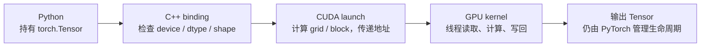
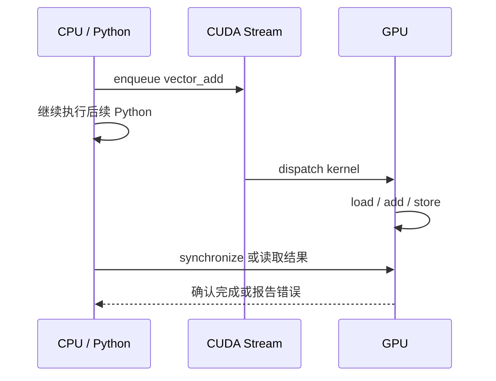

# 第 3 章：一个 PyTorch Tensor 怎样走进 CUDA Kernel

在 Python 里写下 `a + b` 只需要三个字符。把同一个加法写成自定义 CUDA 算子，却要经过 Python、C++、CUDA runtime 和 GPU 四个世界。多出来的代码没有改变数学，它解决的是另一类问题：谁检查输入，谁决定并行规模，谁持有内存地址，错误在哪一层报告，以及怎样证明 GPU 确实执行了自己的程序。

本章只研究向量加法：

```text
out[i] = a[i] + b[i]
```

选择这个近乎没有数学难度的算子，是为了把所有注意力放在执行链路上。RMSNorm 会增加归约，GEMM 会增加数据复用，Attention 会增加复杂 shape；如果第一次接触 CUDA 时同时引入这些问题，程序出错后很难判断究竟是公式、索引、同步还是绑定层出了问题。

读完本章，应当能够从一个 `torch.Tensor` 出发，解释它怎样到达一个具体 GPU 线程；也应当能够区分“结果正确”“CUDA 路径被调用”和“kernel 性能测量正确”这三个不同命题。

## 3.1 先追踪一次真实调用

课程工程中最小的 CUDA 示例位于 [kernels/vector_add.cu](../../../kernels/vector_add.cu)。先不讨论语法，顺着控制流读一遍：

```cpp
torch::Tensor vector_add(torch::Tensor a, torch::Tensor b) {
  TORCH_CHECK(a.is_cuda() && b.is_cuda(), "inputs must be CUDA tensors");
  TORCH_CHECK(a.dtype() == torch::kFloat32 &&
              b.dtype() == torch::kFloat32, "inputs must be float32");
  TORCH_CHECK(a.numel() == b.numel(), "input sizes must match");

  auto out = torch::empty_like(a);
  int n = a.numel();
  vector_add_kernel<<<(n + 255) / 256, 256>>>(
      a.data_ptr<float>(),
      b.data_ptr<float>(),
      out.data_ptr<float>(),
      n);
  return out;
}
```

这段 host code 做了四件事：验证输入；创建输出 tensor；取得三块显存的地址；启动 kernel。真正逐元素相加的代码只有：

```cpp
__global__ void vector_add_kernel(
    const float* a, const float* b, float* out, int n) {
  int idx = blockIdx.x * blockDim.x + threadIdx.x;
  if (idx < n) {
    out[idx] = a[idx] + b[idx];
  }
}
```

一次调用可以画成四层边界：



这张图是后面所有自定义算子的骨架。算子变复杂时，变化主要发生在输入约束、launch 参数和 kernel body，四层职责并不会消失。

## 3.2 Tensor 不是一份“传给 GPU 的数组”

`torch.Tensor` 是一个带元数据的对象。它至少描述数据位于哪个 device、元素类型、每一维的大小和 stride、底层 storage 地址，以及谁管理这块 storage 的生命周期。

当 C++ 调用 `a.data_ptr<float>()` 时，并没有复制 tensor。它只是取得底层数据地址，并把这个地址作为 kernel 参数传给 GPU。于是三个条件不可忽略：

1. 地址必须指向当前 CUDA device 可访问的内存；
2. 指针类型必须和真实 dtype 一致；
3. kernel 对下标的解释必须符合 tensor 的布局。

如果一个非连续 tensor 被当作连续数组读取，地址本身仍然合法，结果却可能错误。因此生产代码通常拒绝非连续输入，或者先调用 `.contiguous()` 得到符合 kernel 预期的布局。课程的通用包装层采用后一种方式，可在 [course_vllm/kernels/cuda_ops.py](../../../course_vllm/kernels/cuda_ops.py) 中看到。

### Python、C++ 和 kernel 各检查什么

检查应放在最了解约束的边界：

| 层次 | 适合检查的内容 | 不应承担的内容 |
| --- | --- | --- |
| Python wrapper | 参数组合、默认值、自动回退策略 | 解释裸 device pointer |
| C++ binding | device、dtype、shape、contiguous、同设备 | 每个线程的边界 |
| CUDA launcher | grid/block、shared memory、launch error | 业务层 fallback |
| CUDA kernel | 当前线程下标、局部边界、并行计算 | 抛出 Python 异常 |

把所有检查都塞进 Python 会让 C++ API 仍可被错误调用；把所有检查都推给 kernel，则错误难以定位，也会让设备代码承担不必要的控制逻辑。

## 3.3 一百万次加法怎样分给线程

CPU 循环把时间看成主要组织维度：

```text
i=0 -> i=1 -> i=2 -> ... -> i=n-1
```

GPU 则先创建一批逻辑线程，再让不同线程处理不同下标。CUDA 使用三级执行结构：一次 kernel launch 产生一个 grid，grid 包含若干 block，block 包含若干 thread。

对于一维向量，线程的全局编号通常写成：

```text
idx = blockIdx.x * blockDim.x + threadIdx.x
```

`threadIdx.x` 是线程在当前 block 中的位置，`blockIdx.x` 是 block 在 grid 中的位置，`blockDim.x` 是每个 block 的线程数。

### 一个不能跳过的手算：n = 1000

设 `blockDim.x = 256`。需要的 block 数是：

```text
num_blocks = ceil(1000 / 256)
           = (1000 + 256 - 1) // 256
           = 4
```

四个 block 实际创建 1024 个线程：

| blockIdx.x | threadIdx.x 范围 | 全局 idx 范围 | 有效元素 |
| ---: | ---: | ---: | ---: |
| 0 | 0..255 | 0..255 | 256 |
| 1 | 0..255 | 256..511 | 256 |
| 2 | 0..255 | 512..767 | 256 |
| 3 | 0..255 | 768..1023 | 232 |

最后 24 个线程得到 `idx=1000..1023`。它们是真实存在的线程，却没有对应数据，所以必须被 `if (idx < n)` 挡住。边界判断不是性能装饰，而是内存安全条件。

最后一个 warp 中会有部分线程失活，但代价只发生在数据末尾。为了消除这条判断而要求输入长度必须是 256 的整数倍，通常是不合理的接口设计。

## 3.4 Thread 是编程单位，Warp 是执行单位

程序员为 thread 编写代码，NVIDIA GPU 通常以 32 个线程组成的 warp 调度指令。一个 warp 中的线程执行同一条指令，但读写各自的数据，这种模式称为 SIMT（Single Instruction, Multiple Threads）。

考虑下面的分支：

```cpp
if (idx % 2 == 0) {
  path_a();
} else {
  path_b();
}
```

同一 warp 中奇数线程和偶数线程选择不同路径。硬件通常需要分别执行两条路径，并在每次执行时屏蔽另一部分线程。这称为分支发散。它不意味着 CUDA 不能写 `if`，而是意味着分支成本取决于一个 warp 内线程的选择是否一致。

Block 还提供了 warp 之外的合作边界。同一 block 内的线程可以通过 shared memory 交换数据，并使用 `__syncthreads()` 做 block 内同步；不同 block 之间不能靠这条指令同步。因此需要全 grid 同步的算法往往拆成多个 kernel launch。

## 3.5 Vector Add 的瓶颈不在加法器

对每个 float32 元素，kernel 做：

```text
读取 a[i]   4 bytes
读取 b[i]   4 bytes
写出 out[i] 4 bytes
浮点加法     1 次
```

忽略缓存和写策略后，每次加法大约对应 12 bytes 全局内存流量，算术强度约为：

```text
AI ≈ 1 FLOP / 12 bytes ≈ 0.083 FLOP/byte
```

这是一个很低的数值。即使 GPU 有强大的浮点计算单元，kernel 也更可能受显存带宽限制。把数据先搬到 shared memory 并不会自动变快，因为每个输入只使用一次，搬运反而增加了指令和同步。

### 相邻线程为什么应访问相邻地址

当一个 warp 访问 `a[idx]` 时，线程 0、1、2……请求连续地址。硬件可以把这些访问合并成较少的内存事务，这称为 coalesced access。

```text
thread 0 -> a[0]
thread 1 -> a[1]
thread 2 -> a[2]
...
```

如果线程按很大的 stride 或无规律地址读取，同样的数据量可能产生更多内存事务。线程数量相同不代表内存效率相同；下标映射同时决定正确性和访存形态。

| 存储层次 | 主要作用域 | 典型用途 | 在 vector add 中 |
| --- | --- | --- | --- |
| Register | 单线程 | 下标、临时值、累加器 | 保存 `idx` 和加法结果 |
| Shared memory | 单 block | tile 复用、block 内归约 | 没有复用，通常不需要 |
| Global memory | 整个 device | tensor、权重、KV cache | 读取两个输入并写出结果 |

## 3.6 Launch 之后，CPU 为什么已经往下走了

CUDA kernel launch 通常是异步的。CPU 把工作提交到 stream 后可以继续执行，GPU 稍后完成实际计算：



异步执行带来两个常见误判。

第一，直接用 CPU 墙钟包住函数调用，测到的可能主要是 enqueue 时间，而不是 GPU 执行时间。第二，非法显存访问可能在后续同步点才报告，traceback 因而指向一行看似无关的 Python。

调试阶段可以加入同步，让错误靠近发生位置；性能路径则不能随意同步，否则会破坏 CPU/GPU 重叠。课程的 [benchmark_cuda](../../../course_vllm/kernels/harness.py) 使用 CUDA Event，并在测量边界同步：

```python
for _ in range(warmup):
    fn()
torch.cuda.synchronize()

start.record()
for _ in range(repeat):
    fn()
end.record()
torch.cuda.synchronize()
```

Warmup 用于排除 JIT 编译、CUDA context、allocator 和缓存冷启动。这里测得的是稳态重复执行的平均时间，不是服务请求的端到端延迟。

## 3.7 JIT Extension 到底编译了什么

PyTorch 的 C++/CUDA extension 可以在第一次调用时完成：

```text
.cpp / .cu
-> host C++ compiler + nvcc
-> object files
-> shared library
-> Python 可导入模块
```

工程中的 [load_cuda_extension](../../../course_vllm/kernels/harness.py) 会定位源码、设置编译参数并缓存加载结果。修改源码、编译选项、PyTorch/CUDA 版本或 extension 名称，都可能让缓存失效。

因此必须分开三个时间尺度：

- 编译时间：开发和冷启动成本，可能以秒计；
- kernel 时间：GPU 上一次计算的时间，可能以微秒计；
- 请求延迟：还包含排队、模型其他层、采样和返回。

把第一次 `pytest` 的总耗时称为“kernel latency”，会把完全不同的阶段混在一起。

## 3.8 “输出一样”还不能证明接入成功

假设系统支持三种 dispatch：

```text
torch  始终走 PyTorch reference
auto   CUDA 可用时尝试自定义 kernel，失败后允许回退
cuda   强制走自定义 kernel，失败立即报错
```

`auto` 对跨环境运行很有用，但它可能掩盖接入错误：extension 编译失败，程序回退到 `torch.add`，最终数值仍然正确。

因此一个 CUDA 算子有三层证据：

1. **数值证据**：`actual` 与 PyTorch reference 在容差内一致；
2. **路径证据**：强制 CUDA 模式成功，或 profiler 中出现预期 kernel 名称；
3. **性能证据**：测量排除了编译和异步计时错误，并保持 workload 一致。

正确性测试要故意覆盖边界：

```text
n = 1, 255, 256, 257, 1000, 1024, 1025
```

`256` 检查整 block，`257` 检查新 block 的第一个线程，`255` 和 `1000` 检查尾部 guard。只测 `1024` 会让许多越界错误隐藏起来。

浮点算子通常用 `torch.testing.assert_close`，而不是要求逐 bit 相等。后续归约和矩阵乘会因为累加顺序不同产生舍入差异，容差应根据 dtype 和运算规模解释，不能为了让测试通过而任意放宽。

## 3.9 Block Size 不是需要背诵的答案

`256 threads/block` 是常用起点，不是硬件定律。Block size 同时影响：

- 每个 block 包含多少 warp；
- 一个 SM 可驻留多少 block；
- register 和 shared memory 的资源压力；
- 边缘失活线程数量；
- 延迟隐藏能力。

对于简单 vector add，128、256、512 都可能正确，速度还会随 GPU、输入规模和 dtype 变化。调参的正确问题不是“哪个数字总是最快”，而是：

```text
在固定 GPU、固定输入和固定测量方法下，
block size 改变了哪些资源和访存行为，
观察到的差异是否超过测量噪声？
```

这也是性能工程和碰运气调参的分界。

## 3.10 从最小闭环走向后续算子

向量加法建立了一个可以逐层检查的闭环：

```text
Tensor 元数据
-> C++ 边界检查
-> data pointer
-> launch configuration
-> thread index
-> global memory access
-> 异步完成
-> correctness / dispatch / timing 证据
```

后续章节不会推翻这个模型，只会增加新的问题：

- RMSNorm 和 softmax 增加同一行数据的归约与同步；
- GEMM 增加 tile、shared memory 和跨线程数据复用；
- Attention 增加多维索引、在线 softmax 和更复杂的访存；
- Paged Attention 在地址计算中加入 block table。

遇到复杂 kernel 时，先把它还原到这条链，再判断新增复杂性位于哪一层，调试会清楚得多。

## 章末小结

CUDA extension 并不是“Python 调用一段更快的 C++”。它是一条跨越对象模型、编译边界、运行时队列和并行硬件的调用链。向量加法的价值，是让这条链在没有复杂数学干扰时完整暴露。

本章最重要的三个区分是：

- tensor 对象与底层数据地址不是同一概念；
- thread 是编程抽象，warp 是重要的执行与性能单位；
- 数值正确、CUDA 路径真实执行、性能测量可信是三份不同证据。

## 思考题

1. 对 `n=4097`、`blockDim.x=256`，需要多少 block？最后一个 block 有多少有效线程？
2. 如果删掉 `idx < n`，为什么程序可能不是每次都立刻报错？
3. 非连续 tensor 的地址是合法的，为什么仍可能得到错误结果？
4. Vector add 为什么通常不值得先搬入 shared memory？用数据复用次数解释。
5. CPU 计时为何可能低估 kernel 时间？CUDA Event 解决的是哪个边界问题？
6. `auto` 模式得到正确结果后，还缺少哪类证据？
7. 如果 512 threads/block 比 256 慢，至少可以从哪些硬件资源角度提出假设？
8. 把本章四层调用链映射到 RMSNorm：每一层需要新增什么约束？

## 延伸阅读

- NVIDIA CUDA C++ Programming Guide：执行层次、内存层次和异步模型。
- PyTorch C++/CUDA Extension 文档：Tensor API、编译与 Python 绑定。
- 工程源码：[vector_add.cu](../../../kernels/vector_add.cu)、[harness.py](../../../course_vllm/kernels/harness.py) 与 [cuda_ops.py](../../../course_vllm/kernels/cuda_ops.py)。
