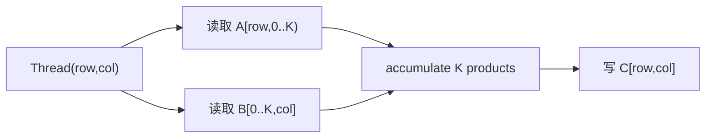
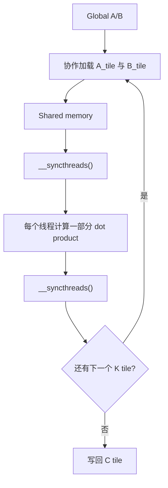
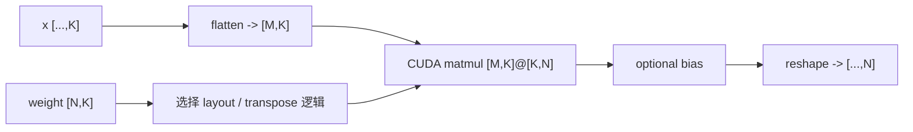

# 第 5 章：GEMM 的数据复用与 Linear 算子实现

## 5.1 Transformer 层中的 Linear 投影

一个 token 的 hidden vector 进入 Transformer 层后，会反复经过线性变换：

```text
Q = XWq
K = XWk
V = XWv
Attention 输出再乘 Wo
MLP 中还有 gate / up / down projections
```

RMSNorm 和 RoPE 很重要，但它们的计算量通常不是层内主体。大规模 Linear，也就是 GEMM，消耗了 Transformer 大量 FLOPs。

本章沿三个依赖关系逐步展开：

1. Linear 如何变成矩阵乘？
2. 每个线程计算一个输出元素，为什么正确却很慢？
3. Tiling 如何通过改变数据搬运方式提升性能？

最后还要回答一个工程问题：自定义 kernel 单测正确后，怎样安全替换模型中的 `nn.Linear`，并证明主路径真正使用了它。

---

## 5.2 Linear 与 GEMM 的 Shape 对应

PyTorch Linear 的数学形式：

```text
y = x W^T + b
```

参数常见 shape：

```text
x      [..., in_features]
weight [out_features, in_features]
bias   [out_features]
y      [..., out_features]
```

为什么要写 `W^T`？因为 weight 存储习惯是 `[out, in]`，而矩阵乘右操作数需要 `[in, out]`。

假设：

```text
x      [tokens, 1024]
weight [3072, 1024]
```

则：

```text
y = x @ weight.T
y shape = [tokens, 3072]
```

如果输入是 `[batch, seq, hidden]`，Linear 通常把前面的维度视为一组 rows：

```text
M = batch * seq
K = in_features
N = out_features
```

从 kernel 角度，最终处理的是：

```text
A[M,K] @ B[K,N] = C[M,N]
```

### 5.2.1 PyTorch Weight Layout 与矩阵乘方向

模型保存的是 `weight[out,in]`。实现可以：

- 在 Python/C++ 层显式得到转置后连续矩阵；
- 或让 kernel 按转置逻辑读取原 weight；
- 或设计接口直接接受 `[K,N]`。

三种都能正确，性能与额外 copy 不同。最危险的是接口写着接收 `[K,N]`，调用方却直接传 `[N,K]`，而某些方阵测试刚好没暴露错误。

因此测试必须包含 `K != N`。

## 5.3 GEMM 的运算量与数据量

矩阵乘：

```text
C[i,j] = sum(k=0..K-1) A[i,k] * B[k,j]
```

每个输出元素做 `K` 次乘法和约 `K` 次加法，通常按 `2K` FLOPs 估算。整个 GEMM：

```text
FLOPs ≈ 2 * M * N * K
```

例如：

```text
M=128, K=1024, N=3072
```

则约：

```text
2 * 128 * 1024 * 3072
= 805,306,368 FLOPs
≈ 0.805 GFLOPs
```

一个模型层有多次 projection，模型又有多层，decode 还会重复许多轮。GEMM kernel 的效率因此会被不断放大。

## 5.4 每线程计算一个输出元素的 Naive Kernel

最直观映射是二维 grid：

```text
thread(row, col) -> C[row, col]
```

线程内部循环 K：

```cpp
float acc = 0;
for (int k = 0; k < K; ++k) {
    acc += A[row * K + k] * B[k * N + col];
}
C[row * N + col] = acc;
```



### 5.4.1 二维 Grid 与输出坐标

常见写法：

```cpp
int col = blockIdx.x * blockDim.x + threadIdx.x;
int row = blockIdx.y * blockDim.y + threadIdx.y;
```

边界：

```cpp
if (row < M && col < N) { ... }
```

数学上没有问题。性能问题来自同一数据被许多线程反复从 global memory 读取。

## 5.5 Naive Kernel 的重复全局内存读取

考虑同一行输出：

```text
C[row,0], C[row,1], ..., C[row,N-1]
```

这些元素都需要 `A[row,:]`。Naive 实现中，计算不同列的线程各自读取同一行 A。

同理，同一列 B 会被多个输出 row 使用，但不同线程也会重复读取。

理想情况下：

```text
A 的一个元素被同一输出 tile 的多个列复用
B 的一个元素被同一输出 tile 的多个行复用
```

Naive kernel 可能依赖硬件 cache 获得部分复用，却没有显式组织它。Tiled matmul 的核心就是让复用关系变得明确。

## 5.6 Shared-Memory Tiling 与片上复用

[CUTLASS 的 Efficient GEMM 文档](https://docs.nvidia.com/cutlass/latest/media/docs/cpp/efficient_gemm.html)把 GEMM 实现组织为 thread block、warp 和 thread 多级 tile，并通过 shared memory 与寄存器在存储层次间复用数据。本节只实现其中最外层的 thread-block tiling，用来验证数据复用、同步和边界处理。

假设 tile size 为 `T`。一个 thread block 负责输出 C 的一个 `T x T` tile。

K 维也被分成若干段。每轮：

1. 从 global memory 加载 `A_tile[T,T]`；
2. 加载 `B_tile[T,T]`；
3. 放入 shared memory；
4. block 内线程使用 tile 计算部分和；
5. 移动到下一段 K；
6. 最终写回 C。



### 5.6.1 4x4 矩阵的 2x2 Tile 算例

设 A、B 都是 `4x4`，tile size 为 2。计算 C 左上角 `2x2` tile：

第一轮加载：

```text
A rows 0..1, cols 0..1
B rows 0..1, cols 0..1
```

得到 K=0..1 的部分和。

第二轮加载：

```text
A rows 0..1, cols 2..3
B rows 2..3, cols 0..1
```

得到 K=2..3 的部分和。两轮相加形成最终 `C[0:2,0:2]`。

每个 A tile 元素被 tile 内不同输出列复用，每个 B tile 元素被不同输出行复用。

## 5.7 Tiling 的全局内存读取量

简化地看，一个 `T x T` 输出 tile 在一轮 K tile 中需要：

```text
T*T 个 A 元素
T*T 个 B 元素
```

产生：

```text
T*T*T 次乘加相关工作
```

每个加载到 shared memory 的元素被约 T 个线程复用。Tile 越大，理论复用越多，但 shared memory、register 和线程数消耗也越大。

这说明 tile size 不是越大越好。它受限于：

- 每 block 最大线程数；
- shared memory 容量；
- registers；
- occupancy；
- 数据类型和目标架构。

## 5.8 Tile 载入与复用之间的同步

协作加载时，不同线程负责不同元素。某线程加载完自己的 A 元素，不代表其他线程已经加载完 B。计算前必须：

```cpp
__syncthreads();
```

当前 tile 计算完后，也不能让部分线程立刻覆盖 shared memory，另一些线程可能仍在读取。因此进入下一轮加载前还要同步。

```text
load tile
-> sync
-> compute using tile
-> sync
-> overwrite with next tile
```

如果 block 内存在某些线程提前 return，而其余线程执行 `__syncthreads()`，可能造成未定义行为或死锁。边界线程通常不直接退出，而是为越界加载写 0，并继续参与同步。

## 5.9 非整除矩阵维度的边界 Tile

M、N、K 不一定能被 T 整除。例如 `M=1000, T=32`，最后一个 tile 只有部分有效行。

加载时：

```cpp
As[ty][tx] = valid_a ? A[...] : 0.0f;
Bs[ty][tx] = valid_b ? B[...] : 0.0f;
```

写回时：

```cpp
if (row < M && col < N) C[...] = acc;
```

把越界元素当 0，可以让所有线程保持相同的同步结构，又不影响有效 dot product。

测试只用 1024x1024 很危险，因为许多 tile size 恰好整除。应包含：

```text
M=31, N=33, K=29
M=1, N=17, K=5
M=65, N=63, K=67
```

## 5.10 合并访存与矩阵 Layout

Tiling 只有在加载方式合理时才有效。让 thread `tx` 读取连续的 A/B 元素，通常有利于 coalescing。

如果 B 以 `[K,N]` row-major 存储，固定 k、连续 col 的读取是连续的；如果直接传入 `[N,K]` weight 并按转置逻辑访问，访问模式可能变化。

因此 Linear 接口设计不仅是 shape 正确问题，还关系到：

- 是否需要显式 transpose；
- transpose 是否产生 copy；
- kernel 访问是否连续；
- weight 是否可以预先转换并复用。

不能为了让 matmul kernel 更快，每次 forward 前都创建一个昂贵的 contiguous transpose，而不把这段时间算进端到端测试。

## 5.11 Shared Memory、寄存器与 Occupancy

Shared memory 容量有限，同一个 SM 上驻留的 block 会竞争它。Tile 增大可能提高复用，却减少并发驻留 block。

Shared memory 还被划分为多个 bank。同一 warp 的多个线程如果以冲突模式访问同一 bank，访问可能串行化。基础课程不要求完成复杂 bank-conflict 优化，但要知道“用了 shared memory”不等于访问一定高效。

## 5.12 累加精度与浮点执行顺序

矩阵乘是长 reduction。不同实现可能以不同顺序累加：

```text
((a0*b0 + a1*b1) + a2*b2) ...
```

浮点加法不满足严格结合律，顺序变化会产生低位差异。

常见策略：

- fp16/bf16 输入，fp32 accumulator；
- 最终写回目标 dtype；
- 用相对/绝对容差和 PyTorch reference 比较。

误差容差必须结合 K、dtype 和数值范围设定，不能看到测试失败就不断放宽。

## 5.13 Tensor Core、cuBLAS 与教学 Kernel 的边界

现代高性能 GEMM 远不止 shared-memory tile：

```text
warp-level tiling
register blocking
double buffering / async copy
Tensor Core MMA
复杂 layout
按 shape 选择 kernel
epilogue fusion
```

cuBLAS、CUTLASS 和 PyTorch 已经包含大量架构专项优化。课程 naive/tiled kernel 的目标是证明：

```text
数学公式没变
仅通过重新组织数据搬运和复用
性能就可能发生数量级变化
```

除非在非常特定 shape 上做了专门优化，教学 kernel 不应宣称普遍超过成熟库。

成熟 GEMM 还会使用 warp-level tile、寄存器 blocking、流水化拷贝和 Tensor Core 指令。[CUTLASS GEMM API](https://docs.nvidia.com/cutlass/latest/media/docs/cpp/gemm_api.html)明确区分 device、threadblock、warp 和 instruction 层级。课程将实现范围限制在 naive 与基础 tiled；该限制用于隔离核心机制，不表示高级层级对生产性能不重要。

## 5.14 Linear 在模型主路径中的 Dispatch

自定义 matmul 单测通过后，`CourseLinear` 需要处理：

```text
任意前导维度 flatten
weight layout
可选 bias
输出 reshape
device/dtype 检查
torch/auto/cuda dispatch
```



模型验证至少包含：

1. `CourseLinear` 与 `torch.nn.functional.linear` 对齐；
2. 非方阵 shape；
3. batch/seq 前导维；
4. `kernel_impl=cuda` 强制 dispatch；
5. 短生成中 profiler 能看到 kernel。

## 5.15 Naive、Tiled 与 PyTorch 基线的比较方法

公平比较必须：

- 使用相同 dtype、device 和 shape；
- 预先准备输入，不把随机生成算进时间；
- warmup；
- 正确同步或使用 CUDA events；
- 多次重复并报告统计量；
- 确认输出正确；
- 不把首次 JIT 编译计入稳态 kernel latency。

至少选择三类 shape：

```text
小 M：decode-like，例如 [batch, hidden] @ weight
大 M：prefill-like，例如 [batch*tokens, hidden] @ weight
非整除边界：专门检查 tile guard
```

同一个 kernel 在大矩阵上表现不错，不代表 decode 的小 M 场景也合适。

## 5.16 GEMM 优化结论的适用边界

### 5.16.1 Tiled 与 Naive 实现相同数学运算

没有。两者都计算同一个 dot product；区别是数据怎样搬运和复用。

### 5.16.2 Tile Size 受资源约束

更大 tile 增加复用，也消耗更多线程、shared memory 和 registers，可能降低 occupancy。

### 5.16.3 方阵测试不能覆盖 Layout 错误

方阵会掩盖 K/N 互换。必须测试非方阵 Linear。

### 5.16.4 浮点结果不要求逐 Bit 相同

不同累加顺序和 dtype 会带来合理浮点误差。应使用有依据的容差。

### 5.16.5 Kernel 时间不等同于模型收益

如果接口每次产生 transpose copy 或 reshape copy，端到端可能更慢。

### 5.16.6 教学 Kernel 不以超过 cuBLAS 为目标

成熟库使用 Tensor Core、架构专项 tiling 和 shape dispatch。课程目标是理解基本机制和证据。

## 5.17 本章小结与思考题

1. PyTorch Linear 的 weight 为什么是 `[out,in]`？
2. `2MNK` FLOPs 从哪里来？
3. Naive kernel 为什么反复读取 A/B？
4. Tiling 如何用 shared memory 换取 global-memory 复用？
5. 为什么每轮 tile 需要两次同步？
6. 边界 tile 为什么应补 0，而不是让线程提前退出？
7. Tile size 如何同时影响复用和 occupancy？
8. 为什么 kernel microbenchmark 与模型端到端结果可能不同？

## 参考资料

- NVIDIA CUTLASS：[Efficient GEMM in CUDA](https://docs.nvidia.com/cutlass/latest/media/docs/cpp/efficient_gemm.html)
- NVIDIA CUTLASS：[GEMM API](https://docs.nvidia.com/cutlass/latest/media/docs/cpp/gemm_api.html)
- NVIDIA：[CUDA C++ Best Practices Guide](https://docs.nvidia.com/cuda/cuda-c-best-practices-guide/)
- PyTorch：[`torch.nn.Linear`](https://docs.pytorch.org/docs/stable/generated/torch.nn.Linear.html)
- 课程工程：[`CourseLinear`](../../../course_vllm/model/ops.py)、[`course_ops.cpp`](../../../kernels/course_ops.cpp) 与 [`course_ops.cu`](../../../kernels/course_ops.cu)

工业 GEMM 的高级实现用于界定教学 kernel 与生产库的差距，不属于本章课程实现的功能范围。
