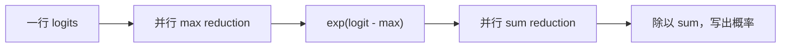
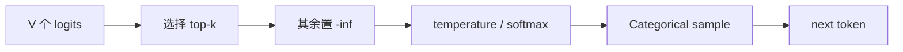
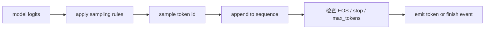

# 第 6 章：从 Logits 到 Token 的 Softmax 与 Sampling

## 6.1 模型输出与生成策略的接口

Transformer 最后一层输出 hidden state，再经过 LM head 得到词表上的 logits。假设词表有 150,000 个 token，那么每个正在生成的 sequence 都会得到一个 150,000 维向量。

这个向量不是答案，也不是概率。Sampling 模块还要决定：

```text
是否直接选择最高分 token？
是否用 temperature 改变分布？
是否截断到 top-k 候选？
使用哪个随机数生成器？
选择后是否满足停止条件？
```

一个请求每生成一个 token 都会经过这条路径。Sampling 的耗时通常小于大规模 Linear，但它决定生成语义，也可能影响请求能否合批，因此不能当作无关的后处理。

[Transformers generation strategies](https://huggingface.co/docs/transformers/main/en/generation_strategies)区分 greedy decoding、multinomial sampling、beam search 和 speculative decoding 等策略。本章只讨论课程 sampler 实际支持的 greedy、temperature 与 top-k 路径；未实现的策略不能仅凭参数名称推断行为。

---

## 6.2 Logits 与离散概率分布

模型输出：

```text
z = [z1, z2, ..., zV]
```

Logit 可以为负，也不要求总和为 1。它只表达相对偏好。比如：

```text
token A: 3.2
token B: 1.1
token C: -0.4
```

可以说 A 比 B 更受模型偏好，但不能说 A 的概率是 3.2。

Softmax 把 logits 转成概率：

```text
p_i = exp(z_i) / sum_j exp(z_j)
```

输出满足：

```text
p_i >= 0
sum_i p_i = 1
```

[PyTorch `softmax` 文档](https://docs.pytorch.org/docs/stable/generated/torch.nn.functional.softmax.html)将运算定义在指定维度上。对 serving sampler，归一化维通常是 vocabulary dimension；若错误地跨 batch 或 sequence 归一化，不同请求的概率会相互影响。

指数函数会放大 logit 差异。A 比 B 高 2，并不是概率只高 2，而是未归一化权重约高 `exp(2) ≈ 7.39` 倍。

## 6.3 Softmax 的平移不变性

对所有 logits 减去同一常数 `c`：

```text
exp(z_i-c) / sum_j exp(z_j-c)
```

分子分母都包含 `exp(-c)`，可以约掉，所以概率不变：

```text
softmax(z) = softmax(z-c)
```

这条性质允许我们选择最有利于数值稳定的 `c`，通常取本行最大值。

## 6.4 数值稳定的 Softmax

float32 能表示的有限范围并不足以直接计算任意 `exp(z)`。例如：

```text
z = [1000, 1001, 999]
```

直接计算 `exp(1001)` 会溢出到 infinity，随后 `inf/inf` 可能产生 NaN。

稳定实现先减最大值 1001：

```text
shifted = [-1, 0, -2]
exp     = [0.3679, 1, 0.1353]
sum     = 1.5032
probs   ≈ [0.2447, 0.6652, 0.0900]
```

最大指数变成 `exp(0)=1`，其他指数位于 `(0,1]`，避免正向溢出。

### 6.4.1 下溢与概率截断

非常负的 shifted logit 可能 `exp` 为 0。这通常表示该 token 概率小到当前 dtype 无法区分，往往比正向溢出更可接受。但如果所有有效候选都因为错误 mask 或 dtype 处理变成 `-inf`，分母会为 0，仍然产生 NaN。

## 6.5 Stable Softmax 的三个计算阶段

对每行 vocab：

```text
1. row_max = max(logits)
2. row_sum = sum(exp(logits - row_max))
3. probs   = exp(logits-row_max) / row_sum
```

其中 max 和 sum 都是 reduction：把很多元素合成一个值。



如果 batch 为 B，shape 是：

```text
logits [B,V]
probs  [B,V]
```

每一行必须独立归一化，不能跨 batch 求 max 或 sum。

## 6.6 Softmax 的 GPU Reduction

假设一个 block 处理一行 vocab。每个线程以 stride 读取多个元素，先求局部最大值：

```cpp
float local_max = -inf;
for (int i = threadIdx.x; i < V; i += blockDim.x)
    local_max = max(local_max, logits[row*V+i]);
```

随后要把各线程 `local_max` 合并。

### 6.6.1 Shared-Memory Tree Reduction

把局部结果写进 shared memory，然后每轮把参与线程减半：

```text
256 values
-> 128 pairwise maxima
-> 64
-> 32
-> ...
-> 1 row max
```

每轮需要保证前一轮写入已完成。

### 6.6.2 Warp Shuffle

同一 warp 的线程可以用 shuffle 指令交换寄存器值，不必先写 shared memory。常见结构是：

```text
每个 warp 内 reduction
-> 每个 warp 产生一个结果
-> 写入少量 shared memory
-> 第一个 warp 合并各 warp 结果
```

Warp primitive 能减少同步和 shared-memory 流量，但不会自动解决多 warp、任意 vocab 和边界问题。

### 6.6.3 Softmax 与 RMSNorm 的归约次数

RMSNorm 只需要平方和；稳定 softmax 必须先知道全行最大值，才能安全算指数，再对指数求和。因此至少有 max 和 sum 两个全行统计量。

## 6.7 Greedy Decoding

Greedy 不必显式计算完整概率，只要找最大 logit：

```text
next_token = argmax(logits)
```

它通常是确定性的，适合：

- correctness 对齐；
- 回归测试；
- 排查模型权重或 cache 逻辑；
- 需要稳定输出的任务。

如果最大值并列，具体选择可能由 argmax 的 tie-breaking 规则决定。不同设备或实现上的极端并列情况仍需谨慎。

许多 API 把 `temperature=0` 特殊解释为 greedy。数学上不能真的计算 `logits/0`。

## 6.8 Temperature 对概率比值的影响

```text
p_i(T) = softmax(z_i / T)
```

### 6.8.1 $T<1$

放大 logit 差异，分布更尖锐。高分 token 更占优势。

### 6.8.2 $T>1$

缩小差异，分布更平坦。低分 token 获得更多机会。

### 6.8.3 二元 Logits 数值算例

设 logits `[2,1]`：

```text
T=1:   softmax([2,1])   ≈ [0.731, 0.269]
T=0.5: softmax([4,2])   ≈ [0.881, 0.119]
T=2:   softmax([1,0.5]) ≈ [0.622, 0.378]
```

Temperature 不改变 token 排名，只改变随机采样时各候选被选中的概率。

## 6.9 Top-k Sampling

Top-k 只保留最高的 k 个 logits，其他设为 `-inf`，再 softmax 和抽样。



例如 top-k=3 时，即使词表有 150,000 个 token，最终只在最高的 3 个中采样。它减少长尾候选，但不保证三个候选都质量高。

### 6.9.1 `k=1` 与 Greedy 的输出关系

Top-k=1 后只剩一个候选，采样结果等价于 greedy，但实现路径可能仍经过筛选和概率计算，性能不一定相同。

## 6.10 Top-p Sampling 的动态候选集合

Top-p（nucleus sampling）按概率从高到低排序，保留累计概率达到 p 的最小集合。

Top-k 的候选数量固定；top-p 的候选数量随分布变化：

- 模型非常确定时，少数 token 就达到 p；
- 分布平坦时，需要保留更多 token。

课程主实现重点为 top-k，但理解 top-p 有助于认识 sampling 不只是 softmax 后调用一次随机函数，还可能包含排序、scan 和 mask。

## 6.11 随机数状态与可复现边界

Categorical sampling 根据概率随机选择 token。固定 seed 可以让相同执行路径更容易复现，但需要明确随机状态由谁维护：

```text
全局 generator？
每请求 generator？
CPU 还是 CUDA generator？
batch 顺序变化会不会改变随机数消费顺序？
```

假设两个请求共享全局 RNG。单独运行 A 时，A 使用第 1、2、3 个随机数；和 B 合批后，A 可能使用第 1、3、5 个。即使 seed 相同，输出也可能改变。

要实现“请求级可复现”，通常需要请求独立的 generator 或明确随机数分配策略。

## 6.12 Sampling 参数对 Batching 的约束

如果 batch 内所有请求共用一次 sampler 操作，不同请求仍可能有不同：

```text
temperature
top_k
seed / generator
stop_token_ids
```

实现可以为每行应用不同参数，也可以只合并参数完全相同的请求。后者简单，却会造成更多小 batch。

因此服务层看到“sampling 参数一致的请求更容易合批”不是模型数学限制，而是具体 sampler 和 batching engine 的工程取舍。

## 6.13 Sampling、Token Append 与停止检查的顺序

一次 decode step 常见顺序：



边界必须定义清楚。例如 `max_tokens=1` 时，prefill 后采样的第一个 token 是否返回？合理语义通常是返回一个生成 token，然后以 length 原因结束，而不是在采样前就结束并返回空输出。

## 6.14 Softmax CUDA Kernel 的职责边界

输入检查至少包括：

```text
CUDA device
支持的 dtype
2D row-wise shape 或明确 flatten 规则
contiguous layout
vocab > 0
```

Kernel 应处理：

- vocab 小于 block size；
- vocab 不是线程数整数倍；
- 大 vocab，每线程处理多个元素；
- 大正/负 logits；
- fp16/bf16 输入与 fp32 reduction。

工业 softmax 还可能融合 mask、scale、top-k 或 sampling，减少中间概率写回。课程先保证稳定 softmax 正确，再讨论 fusion 的收益边界。

## 6.15 Softmax 与 Sampling 的正确性测试

### 6.15.1 Softmax

```text
每行概率和接近 1
输出非负且 finite
与 torch.softmax 对齐
整体平移 logits 后结果不变
大正数不产生 NaN
```

### 6.15.2 Greedy

构造明确最大值，确认 token ID。加入非首位置最大值，避免错误地固定返回 0。

### 6.15.3 Temperature

不应只检查某次随机 token。可以检查变换后概率分布，或固定 generator 后比较 reference。

### 6.15.4 Top-k

确认被 mask 的 token 永远不会采到，并覆盖 `k=1`、`k=vocab` 和非法 k。

### 6.15.5 随机性

统计测试需要足够样本，不能因一次抽样没选到某 token 就断言概率为 0。普通单元测试更适合使用固定 RNG 和小分布 reference。

## 6.16 数值与生成语义的适用边界

### 6.16.1 最大 Logit 不保证高概率

不一定。如果多个 logits 接近，最大 token 概率仍可能很低。

### 6.16.2 `temperature=0` 应采用 Greedy 分支

实际 API 通常把它作为 greedy 特殊分支。

### 6.16.3 固定 Seed 不保证跨 Batching 策略一致

Batch 顺序可能改变随机数消费顺序。请求级复现需要更明确的 RNG 管理。

### 6.16.4 Stable Softmax 适用于所有浮点 Dtype

即使 float32，巨大 logit 的指数也会溢出。减 max 是通用稳定做法。

### 6.16.5 Sampling 同时影响执行分组

参数差异可能改变合批、排序工作和 sampler 开销。

### 6.16.6 生成实现不一定物化完整概率矩阵

Greedy 只需 argmax；融合 sampler 也可能避免把完整 probs 写回 global memory。

## 6.17 本章小结与思考题

1. Logit 与概率有什么区别？
2. 为什么 softmax 可以减去最大值而不改变结果？
3. Row-wise softmax 需要哪两次 reduction？
4. Warp shuffle 相比纯 shared reduction 改善了什么？
5. Temperature 如何改变分布但不改变排名？
6. Top-k 与 top-p 的候选集合有何不同？
7. 固定 seed 为什么不保证不同 batching 下结果相同？
8. Sampling 参数为什么可能降低合批机会？

## 6.18 参考资料

- PyTorch：[`torch.nn.functional.softmax`](https://docs.pytorch.org/docs/stable/generated/torch.nn.functional.softmax.html)
- PyTorch：[`torch.multinomial`](https://docs.pytorch.org/docs/stable/generated/torch.multinomial.html)
- Hugging Face Transformers：[Generation strategies](https://huggingface.co/docs/transformers/main/en/generation_strategies)
- NVIDIA：[CUDA C++ Programming Guide](https://docs.nvidia.com/cuda/cuda-c-programming-guide/contents.html)
- 课程工程：[`sampler.py`](../../../course_vllm/engine/sampler.py)、[`cuda_ops.py`](../../../course_vllm/kernels/cuda_ops.py) 与 [`course_ops.cu`](../../../kernels/course_ops.cu)

Attention 中不物化完整 score matrix 的 online softmax 将在第 7 章展开。
