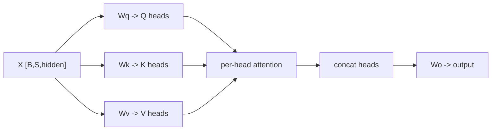
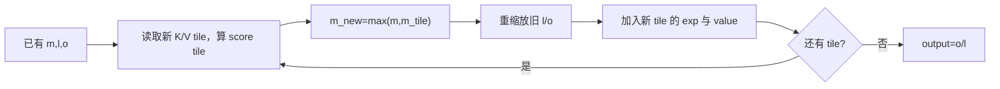
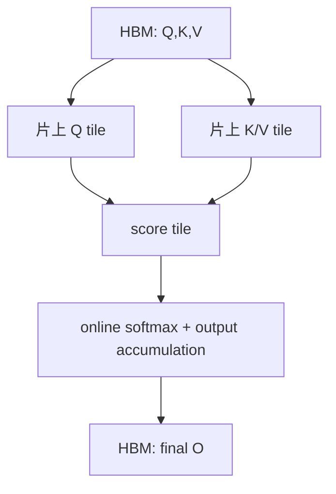

# 第 7 章：Attention 的张量语义与 IO-Aware 实现

## 7.1 Attention 的输入、权重与输出

对每个 query 位置，Attention 计算它与所有可见 keys 的匹配分数，将分数归一化为权重，再对相应 values 加权求和。[Attention Is All You Need](https://arxiv.org/abs/1706.03762)给出了 scaled dot-product attention 与 multi-head attention 的原始定义。本章需要把该数学定义落实到以下实现对象：

```text
Q/K/V 从哪里来
head 怎样拆分
为什么除以 sqrt(d)
未来位置怎样 mask
softmax 怎样稳定计算
prefill 与 decode 的 shape 为什么不同
GQA 的 Q head 怎样找到 KV head
为什么不能总把完整 score matrix 写到显存
```

本章先固定 dense attention 的数学语义与 reference 实现，再推导 online softmax 和 FlashAttention 的 IO 组织。Paged KV 的分配生命周期留到第 10 章；本章只分析地址布局对 decode attention 的输入方式。

---

## 7.2 Q、K、V 的线性投影

输入 hidden states：

```text
X [batch, seq_len, hidden_size]
```

三组 Linear：

```text
Q = X Wq
K = X Wk
V = X Wv
```

可以用检索系统建立直觉：

- **Query**：当前位置想找什么；
- **Key**：每个位置拿什么特征供匹配；
- **Value**：匹配后真正取回的内容。

Q/K/V 都来自同一个 X，因此叫 self-attention。Cross-attention 中 Q 与 K/V 可以来自不同序列。

### 7.2.1 独立投影空间的作用

可学习投影允许模型把“用来匹配的特征”和“被取回的内容”分开。某个维度可能适合判断语法关系，却不一定适合作为最终汇总内容。

## 7.3 Multi-Head Attention 的 Shape 变换

设：

```text
hidden_size = num_heads * head_dim
```

投影后 reshape：

```text
Q [B, Hq, S, D]
K [B, Hkv, S, D]
V [B, Hkv, S, D]
```

每个 head 独立计算 attention，再把结果拼接并经过输出 projection。

不同 head 可以学习不同关系：局部邻近、长距离指代、语法、格式等。这里的解释只是直觉；head 并没有被人工指定固定语义。



## 7.4 Scaled Dot-Product Attention

单个 head：

```text
scores = Q K^T / sqrt(D)
weights = softmax(scores + mask)
output = weights V
```

### 7.4.1 Query-Key 点积

Query 和 Key 越同向，点积越大；越不相关或方向相反，点积越小。Softmax 再把一行 scores 变成对所有 key 位置的权重。

### 7.4.2 $1/\sqrt{D}$ 的尺度校正

假设 Q/K 每个分量均值约 0、方差约 1，并近似独立。D 个乘积相加后，点积方差会随 D 增长，标准差约为 `sqrt(D)`。

不缩放时，D 较大可能让 scores 绝对值很大，softmax 变得极尖，梯度和低精度数值都更不稳定。除以 `sqrt(D)` 把典型尺度拉回相对稳定范围。

这不是为了让所有 score 落入 [-1,1]，而是控制随 head_dim 增长的统计尺度。

## 7.5 三 Token 的 Attention 数值算例

设某 query 对三个 key 的缩放后分数：

```text
scores = [2, 1, 0]
```

Softmax：

```text
weights ≈ [0.665, 0.245, 0.090]
```

如果 value 为一维：

```text
V = [10, 4, -2]
```

输出：

```text
0.665*10 + 0.245*4 + 0.090*(-2)
≈ 7.45
```

Attention 输出不是“复制最大权重 token”，而是对 value 的加权和。权重由 Q/K 决定，汇总内容来自 V。

## 7.6 Causal Mask 与 Padding Mask

自回归模型不能让位置 i 读取未来位置 j>i：

```text
          Key position
Query     0   1   2   3
0         ✓   ×   ×   ×
1         ✓   ✓   ×   ×
2         ✓   ✓   ✓   ×
3         ✓   ✓   ✓   ✓
```

实现通常在被屏蔽位置加 `-inf`，softmax 后概率为 0：

```text
masked_scores[i,j] = -inf, if j > i
```

### 7.6.1 Mask 与 Softmax 的执行顺序

Scale 和 mask 都应在 softmax 前完成。若先 softmax 再把未来概率置 0，却不重新归一化，剩余概率和将小于 1。

### 7.6.2 Padding Mask 与 Causal Mask 的不同语义

Batch 内不同长度可能还需要 padding mask。Causal mask 处理“未来不可见”，padding/context-length mask 处理“这个位置根本不属于有效序列”。两者语义不同。

## 7.7 MHA、MQA 与 GQA

[GQA 论文](https://arxiv.org/abs/2305.13245)将 query heads 分组，每组共享一组 key/value heads，并把 MHA 与 MQA 表示为组数的两个边界情况。课程 Qwen3 使用 GQA，因此 query head 到 KV head 的映射属于模型语义，而不是可任意选择的 kernel 优化。

### 7.7.1 MHA

```text
Hq = Hkv
```

每个 query head 有自己的 K/V head。

### 7.7.2 MQA

```text
Hkv = 1
```

所有 query heads 共享一组 K/V，显著减少 KV cache。

### 7.7.3 GQA

```text
1 < Hkv < Hq
```

每组 query heads 共享一个 KV head。例如：

```text
Hq=16, Hkv=8
group_size=2
kv_head = q_head // 2
```

如果 q head 7 错映射到 KV head 7，而正确值应为 3，shape 仍可能合法，结果却错误。

### 7.7.4 KV Head 数与缓存容量

KV cache 按 KV heads 保存。其他参数相同时，Hkv 从 16 降到 8，K/V 存储约减半。Q 不跨 decode step 缓存，因此 Q head 数不直接决定 KV cache 大小。

## 7.8 Prefill Attention 的 Shape 与复杂度

Prefill：

```text
Q [B,Hq,S,D]
K [B,Hkv,S,D]
V [B,Hkv,S,D]
```

每个 query position 对所有可见 key position 打分。Dense score matrix 每 head 是：

```text
[S,S]
```

计算量随 `S^2*D` 增长；显式 score/prob 中间量随 `S^2` 增长。S 从 2k 增到 4k，score 元素数约变为 4 倍。

### 7.8.1 Score Matrix 的中间存储规模

若：

```text
B=1, H=16, S=4096, dtype=bf16
```

只计算一个 `[B,H,S,S]` score tensor：

```text
1 * 16 * 4096 * 4096 * 2 bytes
= 512 MiB
```

还没算 softmax probability、Q/K/V、输出和反向图。推理没有训练反向，但显式中间矩阵仍会带来显存和 HBM 流量。

## 7.9 Decode Attention 的 Shape 与历史读取

Decode 每个请求当前只有一个新 query：

```text
Q [B,Hq,1,D]
K/V cache [B,Hkv,context_len,D]
```

Score 每请求每 head 只有一行：

```text
[1, context_len]
```

它不再构造 SxS，但每一步都要读取完整历史 K/V。随着 context_len 增长，读取量持续增加。

Prefill 和 decode 因此不是同一个 kernel 改个参数那么简单：

| 维度 | Prefill | Decode |
| --- | --- | --- |
| Query positions | 多 | 每请求通常 1 |
| Score 形状 | SxS | 1xcontext |
| 并行来源 | token/head/batch | batch/head/history |
| 主要数据问题 | 中间矩阵与 IO | 读取变长 KV |
| 典型优化 | tiled/FlashAttention | batching、KV layout、paged decode |

## 7.10 朴素 Attention 的中间张量 IO

直接实现可能分三步：

```text
1. S = QK^T，写到 HBM
2. P = softmax(S)，再写到 HBM
3. O = PV，从 HBM 读 P/V
```

S 和 P 都是 O(seq^2) 中间量。即使 GPU 计算很快，反复写回和读取 HBM 也很昂贵。

FlashAttention 的关键不是近似，也不是改变公式，而是重排计算，让 score/prob tile 尽量留在片上存储，并最终只写输出和必要统计量。

## 7.11 分块 Softmax 的全局归一化条件

假设一行 scores 被拆成两个 block：

```text
block A = [2,1]
block B = [4,0]
```

分别 softmax：

```text
softmax(A) ≈ [0.731,0.269]
softmax(B) ≈ [0.982,0.018]
```

直接拼接后总和为 2，不是全行 softmax。因为两个块共享同一个全局最大值和归一化分母。

要分块，必须在看到新块时修正旧结果。

## 7.12 Online Softmax 的合并公式

处理到某一块后，维护：

```text
m  已见 scores 的最大值
l  sum(exp(score - m))
o  以当前尺度累积的加权 value
```

新块有最大值 `m_b`，新的全局最大值：

```text
m_new = max(m, m_b)
```

旧分母原来基于 `m`，要转换到 `m_new` 尺度：

```text
l_old_rescaled = l * exp(m - m_new)
```

新块分母：

```text
l_block = sum(exp(score_b - m_new))
```

更新：

```text
l_new = l_old_rescaled + l_block
```

旧输出累加器同样要乘 `exp(m-m_new)`，再加入新块的 `exp(score_b-m_new)V_b`。

最后：

```text
output = o / l
```



这就是分块时仍保持精确 softmax 的关键。它没有把每块独立归一化，而是不断维护全局一致的尺度。

## 7.13 FlashAttention 的 IO-Aware Tiling

FlashAttention 风格计算：

1. 把 Q tile 载入片上存储；
2. 逐块读取 K/V；
3. 计算小块 scores；
4. 在线更新 softmax 统计量和输出；
5. 不把完整 score/prob matrix 写回 HBM；
6. 写出最终 O。



优化的核心是 IO-aware：根据 SRAM/HBM 容量安排 tile 和计算顺序。[FlashAttention](https://arxiv.org/abs/2205.14135)使用 IO complexity 分析解释避免 score/probability 矩阵往返 HBM 的收益；[FlashAttention-2](https://arxiv.org/abs/2307.08691)进一步调整 thread block 与 warp 间的工作划分。两篇论文的具体性能数据依赖硬件、shape 和实现版本，本章只复用算法与存储层次推导。

## 7.14 Decode Attention 的 Paged KV 寻址

Attention 数学只要求按逻辑顺序得到历史 K/V。它们可以连续存储，也可以分散在固定大小物理 block 中。

Paged decode 额外输入：

```text
block_tables [B,max_blocks]
context_lens [B]
block_size
physical K/V cache
```

逻辑位置 `t` 映射：

```text
logical_block = t // block_size
offset        = t % block_size
physical_block = block_table[seq, logical_block]
slot = physical_block * block_size + offset
```

本章要求 attention kernel 按有效 context 读取正确 K/V；block 的分配、共享和释放由第 10 章的 cache manager 负责。

## 7.15 Reference 实现与优化实现的语义对齐

高性能 attention 涉及 mask、head 映射、online softmax、变长 context 和地址计算。Reference 应优先清晰：

```text
把逻辑 K/V 读成 dense
-> repeat/map GQA heads
-> scores / scale / mask
-> torch.softmax
-> weighted V
```

它可能慢，却是 correctness oracle。优化 kernel 不应同时修改 reference 和 expected，否则容易让相同错误互相“对齐”。

## 7.16 Attention 实现的四类错误

### 7.16.1 Scale

忘记 `/sqrt(D)` 或用 hidden_size 代替 head_dim。

### 7.16.2 Mask

未来 token 未屏蔽，或 padding/context 外位置被读取。

### 7.16.3 GQA Head Mapping

Q head 到 KV head 的分组关系错误。

### 7.16.4 Length 与 Address

Decode 读取超过 context_len，或 paged slot 计算错误。

这些错误都可能不产生崩溃，只产生“看起来还能生成”的错误文本，因此必须做张量级对齐。

## 7.17 Attention 正确性测试矩阵

### 7.17.1 Dense Prefill

- 小 S 手工 mask；
- 与 PyTorch attention 对齐；
- 检查未来位置概率为 0；
- 覆盖多 batch/head 与不同 D。

### 7.17.2 Dense Decode

- Q 长度 1；
- 不同 context_len；
- 与 prefill 最后位置或 dense reference 对齐。

### 7.17.3 GQA

- Hq 与 Hkv 不等；
- 构造每个 KV head 明显不同的数据，防止错误映射被随机值掩盖。

### 7.17.4 Paged Decode

- block table 打乱物理 block 顺序；
- context 跨 block 边界；
- 最后 block 仅部分有效；
- 与 gather 成 dense 后的 reference 对齐。

### 7.17.5 Online Softmax

- 一块与多块结果一致；
- 后续 tile 出现更大 max 时旧累加器正确重缩放；
- 极端 logits 不出现 NaN。

## 7.18 教学 Kernel 与生产 Kernel 的实现差距

至少包括：

```text
tile 与 warp 专项优化
Tensor Core / MMA 使用
异步 copy 与流水
多 shape/dtype dispatch
更复杂的变长序列与分页布局
架构专项调优
融合 RoPE、cache write 等操作
```

课程 kernel 的目标是使数学语义、地址映射和 online softmax 可以被逐步验证，不以超过 FlashAttention、cuDNN 或 vLLM 生产 kernel 作为性能评价目标。

## 7.19 Attention 机制的适用边界

### 7.19.1 Attention 不止包含 QK 点积

还包括 scale、mask、softmax 和 V 汇总，任何一步错误都会改变语义。

### 7.19.2 FlashAttention 是精确算法重排

核心版本通过重排和 online softmax 计算精确 attention，主要减少 IO 和中间存储。

### 7.19.3 Decode 仍需线性读取历史 KV

它每个 token 都要执行，并读取增长的历史 K/V。高并发和长 context 下仍是核心成本。

### 7.19.4 GQA 是模型结构而非简单复制操作

数学上可用 repeat 理解，生产实现通常避免真的复制，以节省带宽和显存。

### 7.19.5 PagedAttention 改变寻址而非数学定义

分页改变 K/V 地址组织，不改变 QK-softmax-V 数学。

## 7.20 本章小结与思考题

1. Q/K/V 各自承担什么角色？
2. 为什么 score 除以 sqrt(head_dim)？
3. Causal mask 与 padding/context mask 有何区别？
4. MHA、MQA、GQA 如何影响 KV cache？
5. Prefill 与 decode attention 的 shape 和瓶颈有何差异？
6. 为什么不能对每个 score tile 独立 softmax？
7. Online softmax 中 m、l、o 分别表示什么？
8. FlashAttention 减少了哪些 HBM 中间读写？
9. Paged KV 为什么不改变 attention 数学？

## 7.21 参考资料

- Vaswani 等：[Attention Is All You Need](https://arxiv.org/abs/1706.03762)
- Ainslie 等：[GQA: Training Generalized Multi-Query Transformer Models from Multi-Head Checkpoints](https://arxiv.org/abs/2305.13245)
- Dao 等：[FlashAttention: Fast and Memory-Efficient Exact Attention with IO-Awareness](https://arxiv.org/abs/2205.14135)
- Dao：[FlashAttention-2: Faster Attention with Better Parallelism and Work Partitioning](https://arxiv.org/abs/2307.08691)
- PyTorch：[`scaled_dot_product_attention`](https://docs.pytorch.org/docs/stable/generated/torch.nn.functional.scaled_dot_product_attention)
- 课程工程：[`ops.py`](../../../course_vllm/model/ops.py)、[`cuda_ops.py`](../../../course_vllm/kernels/cuda_ops.py) 与 [`course_ops.cu`](../../../kernels/course_ops.cu)
