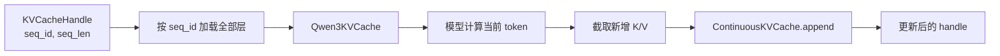
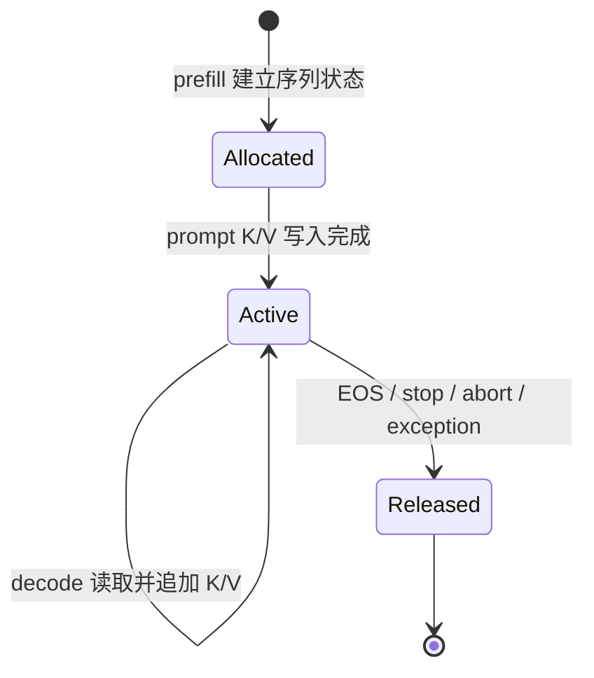

# 第 8 章：自回归推理中的 KV Cache

大语言模型按照自回归方式生成文本：模型根据已有 token 预测下一个 token，将新 token 加入上下文，再执行下一次预测。若每次预测都重新处理整个上下文，前面位置上的大部分计算会反复出现。KV Cache（Key-Value Cache，键值缓存）保存各层注意力模块已经得到的 key 和 value，使后续步骤只需为新输入计算一次投影。

这一机制改变的不只是一次矩阵运算。启用 KV Cache 后，模型调用开始依赖跨步骤保存的状态；服务系统必须知道状态属于哪个序列、已经覆盖多少个 token、占用多少设备内存，以及何时释放。本章从单层因果注意力出发，推导缓存内容、张量形状、计算量和容量，再分析课程工程中的连续 KV Cache。分页分配、跨请求前缀共享和调度策略将在后续章节建立在这些结论之上。

本章默认读者已经了解 Transformer 的基本结构和缩放点积注意力，但不要求具备推理引擎实现经验。完成本章后，应能够根据模型配置计算 KV Cache 容量，追踪一次 prefill 和多次 decode 中的缓存变化，并判断一个缓存实现是否满足基本正确性条件。

## 8.1 自回归生成中的重复计算

设输入 prompt 的 token 序列为

$$
x_0,x_1,\ldots,x_{L-1}.
$$

模型对这段长度为 $L$ 的序列执行一次前向计算，并利用最后一个位置的 logits 采样第一个输出 token $x_L$。为了继续生成，模型需要计算条件分布

$$
p(x_{L+1}\mid x_0,\ldots,x_L).
$$

不使用缓存时，第二次前向计算的输入是长度为 $L+1$ 的完整序列；再下一次则是长度为 $L+2$ 的完整序列。历史 token 的 embedding、Q/K/V 投影、MLP 和各层注意力因此被反复计算。

以 prompt 长度 1000、输出长度 100 为例。第一次前向计算处理 1000 个输入位置并产生第一个输出 token；为了得到其余 99 个输出 token，还要依次处理长度为 1001 至 1099 的完整前缀。累计处理的 token 位置数为

$$
\sum_{i=0}^{99}(1000+i)=104{,}950.
$$

这里的“token 位置数”只统计有多少位置进入模型，并不等同于 FLOP 数，因为长度为 $n$ 的完整 self-attention 还包含 $n\times n$ 的分数矩阵计算。

使用 KV Cache 后，第一次 prefill 仍然处理 1000 个 prompt token；随后 99 次模型调用各输入一个新 token。累计进入模型的 token 位置数降为

$$
1000+99=1099.
$$

之所以是 99 而不是 100，是因为 prefill 返回的最后一个 logits 已经用于产生第一个输出 token。工程文档若把“输出 token 数”“decode 调用次数”和“送入模型的新 token 数”混为一谈，便容易产生一位偏差。

KV Cache 并未消除历史上下文的全部代价。每个新 query 仍需读取历史 key 和 value 并完成注意力计算；被消除的是对历史 token 表示及其 K/V 投影的重复计算。[Hugging Face 的缓存说明](https://huggingface.co/docs/transformers/cache_explanation)也将这两部分分别表述为“复用历史 K/V”和“当前步骤仍在历史长度上执行注意力”。

## 8.2 因果注意力允许复用历史 K/V

考虑 Transformer 第 $\ell$ 层。该层输入记为

$$
H^{(\ell)}\in\mathbb{R}^{B\times S\times d_{\text{model}}},
$$

其中 $B$ 是 batch size，$S$ 是本次输入的 token 数，$d_{\text{model}}$ 是隐藏维度。注意力模块通过三个线性投影得到

$$
Q^{(\ell)}=H^{(\ell)}W_Q^{(\ell)},\qquad
K^{(\ell)}=H^{(\ell)}W_K^{(\ell)},\qquad
V^{(\ell)}=H^{(\ell)}W_V^{(\ell)}.
$$

对一个 query head，缩放点积注意力为

$$
\operatorname{Attn}(Q,K,V)
=\operatorname{softmax}\left(\frac{QK^\mathsf{T}}{\sqrt{d_h}}+M\right)V,
$$

其中 $d_h$ 是 head dimension，$M$ 是因果掩码。缩放点积注意力及因果掩码的原始定义见 [Attention Is All You Need](https://arxiv.org/abs/1706.03762)；[PyTorch `scaled_dot_product_attention` 文档](https://docs.pytorch.org/docs/stable/generated/torch.nn.functional.scaled_dot_product_attention)给出了当前 API 中 query、key、value 与掩码的 shape 约定。

因果掩码保证位置 $i$ 只能读取不晚于 $i$ 的位置。向序列末尾追加 token 不会改变旧位置能够看到的前缀。因此，在模型参数固定、推理模式关闭 dropout 且输入前缀不变时，旧位置在每一层产生的 key 和 value 可以直接复用。

对于新位置 $t$，该层只需计算

$$
q_t=h_tW_Q,\qquad k_t=h_tW_K,\qquad v_t=h_tW_V,
$$

然后将 $k_t,v_t$ 追加到历史缓存：

$$
K_{0:t}=[K_{0:t-1};k_t],\qquad
V_{0:t}=[V_{0:t-1};v_t].
$$

新位置的注意力输出为

$$
o_t=\operatorname{softmax}\left(
\frac{q_tK_{0:t}^{\mathsf{T}}}{\sqrt{d_h}}
\right)V_{0:t}.
$$

只有 $q_t$ 参与当前输出的计算。历史 query 对应的输出在过去步骤中已经产生，下一步不会再次查询它们，所以缓存历史 query 没有作用。缓存完整 hidden state 也不能替代缓存投影后的 K/V：若只保留 hidden state，后续步骤仍需重新执行每层的 $W_K$ 和 $W_V$ 投影。

这一复用结论依赖于自回归因果结构。双向编码器会在追加 token 后改变旧位置可见的上下文；训练阶段还需要保存用于反向传播的激活，并可能启用 dropout。因而本章讨论的 KV Cache 是推理状态，不能直接套用到训练过程。

## 8.3 每一层分别保存缓存

Transformer 的第 $\ell+1$ 层以第 $\ell$ 层输出为输入，各层投影矩阵也不同。即使 token 位置相同，第 0 层和第 20 层得到的 key、value 也不是同一组向量。因此缓存的逻辑索引至少包含

```text
(sequence, layer, token_position, kv_head, head_dimension)
```

对常见的 decoder-only 模型，一层缓存可以表示为

```text
K_layer: [batch, num_kv_heads, cached_tokens, head_dim]
V_layer: [batch, num_kv_heads, cached_tokens, head_dim]
```

全模型则保存 `num_layers` 对 K/V 张量。物理实现可以改变维度顺序，也可以把 batch 拆成独立序列、把 token 位置映射到分页块；无论采用哪一种布局，上述五个逻辑坐标都必须唯一确定一个元素。

课程模型先对 key 应用 Q/K normalization 和 RoPE，再将结果写入缓存。这样历史 key 已经携带其位置编码，decode 时不能用当前 token 的 position 再旋转一次。value 不应用 RoPE。对应执行顺序可在 [`Qwen3Attention.forward`](../../../course_vllm/model/qwen3_torch.py#L206) 中看到：Q/K/V 投影位于缓存拼接之前，RoPE 位于 key 写入缓存之前。

## 8.4 MHA、MQA 与 GQA 对缓存形状的影响

多头注意力（Multi-Head Attention, MHA）为每个 query head 配置独立的 key head 和 value head，此时

$$
H_q=H_{kv}.
$$

多查询注意力（Multi-Query Attention, MQA）让全部 query heads 共享一组 key/value heads，因此 $H_{kv}=1$。分组查询注意力（Grouped-Query Attention, GQA）位于两者之间：query heads 被分成 $H_{kv}$ 组，每组共享一个 key head 和 value head。[GQA 论文](https://arxiv.org/abs/2305.13245)给出了三种结构的定义，并将减少 KV 读取量视为自回归推理的重要收益。

若 $H_q=16$、$H_{kv}=8$，每两个 query heads 共享一组 K/V。decode 时张量 shape 为

```text
q_new:   [B, 16, 1, D]
k_cache: [B,  8, T, D]
v_cache: [B,  8, T, D]
```

注意力计算需要把每个 KV head 与对应的两个 query heads 配对。课程实现中的 `repeat_kv` 使用 view、expand 和 reshape，在计算接口上将 K/V 扩展到 16 个 heads；缓存本身仍只保存 8 个 KV heads。由此得到一个容量计算原则：KV Cache 使用 `num_key_value_heads`，不能误用 `num_attention_heads`。

## 8.5 Prefill 与 Decode 的状态转换

Prefill 处理尚未进入缓存的一段输入，通常是完整 prompt，也可以是 prompt 的一个 chunk。Decode 使用已有缓存处理新生成的少量 token，在线生成的典型 decode 输入长度为 1。

设 prompt 为 `[x0, x1, x2, x3]`。下表追踪生成三个输出 token 时的状态。`cache_len` 表示某次模型调用结束后，缓存已经覆盖的 token 数。

| 模型调用 | 本次输入 | 调用前缓存 | position ids | 调用后 `cache_len` | 此次 logits 的用途 |
| --- | --- | ---: | --- | ---: | --- |
| prefill | `[x0,x1,x2,x3]` | 0 | `[0,1,2,3]` | 4 | 采样 `x4` |
| decode 1 | `[x4]` | 4 | `[4]` | 5 | 采样 `x5` |
| decode 2 | `[x5]` | 5 | `[5]` | 6 | 采样 `x6` |

这个时间线说明，采样出的 token 不会立即出现在 KV Cache 中。`x4` 是 prefill 的输出，但只有在下一次 decode 将 `x4` 送入模型之后，`k_4,v_4` 才写入缓存。于是三个量必须采用一致定义：

```text
模型调用前 past_seq_len = 4
本次输入位置 position_id = 4
模型调用后 cache_len = 5
```

课程模型按照这一定义生成位置编号：

```python
past_seq_len = past_key_values.seq_len if past_key_values is not None else 0
position_ids = torch.arange(
    past_seq_len,
    past_seq_len + seq_len,
    device=input_ids.device,
)
```

完整代码位于 [`Qwen3Model.forward`](../../../course_vllm/model/qwen3_torch.py#L309)。若在构造 position ids 之前提前增加 `seq_len`，RoPE 会使用错误位置；若缓存内容已经增长而 handle 长度没有同步增长，注意力掩码和写入位置也会偏离。此类错误通常不会触发越界，而会表现为 cached decode 的 logits 从某一步开始逐渐偏离完整前向计算。

Chunked prefill 遵循同一规则。假设长度为 10 的 prompt 被分成 `[0:6)` 和 `[6:10)` 两段，第二段调用前 `past_seq_len=6`，输入长度为 4，position ids 必须是 `[6,7,8,9]`；调用结束后缓存长度为 10。分块只改变每次输入的区间，不改变序列位置的定义。

## 8.6 计算复杂度的变化

为了避免把不同计算混在一起，需要分别考察投影与 MLP、注意力分数以及缓存读写。设当前已有 $T$ 个历史 token，新输入长度为 1。

不使用缓存时，模型重新处理长度约为 $T$ 的完整前缀。每层 Q/K/V 投影和 MLP 的工作量都随 $T$ 增长；标准 self-attention 还要计算约 $T^2$ 个 query-key 分数。

使用缓存时，每层只为新 token 执行 Q/K/V 投影和 MLP，这部分相对于上下文长度为常数；但新 query 仍要与 $T+1$ 个 keys 计算点积，并对同样数量的 values 加权求和。因此单个 decode 步骤的注意力计算量和 KV 读取量仍为 $O(T)$。

| 每层、单个 decode 步骤 | 不使用缓存 | 使用 KV Cache |
| --- | --- | --- |
| 本次参与投影和 MLP 的 token 数 | 约 $T$ | 1 |
| query-key 分数数量 | 约 $T^2$ | 约 $T$ |
| 历史 K/V 投影 | 重新计算 | 直接复用 |
| 历史 K/V 读取 | 本次计算结果 | 从缓存读取 |
| 持久化状态 | 无 | 随上下文线性增长 |

所以“KV Cache 使 decode 成为 $O(1)$”是不完整的结论。它只适用于新 token 的投影和逐 token MLP 工作量，不适用于标准全上下文注意力。长上下文 decode 常受到 KV 读取带宽和注意力归约的限制，这也是 GQA、KV 量化、滑动窗口注意力和分页布局持续被研究的原因。

## 8.7 KV Cache 的容量公式

对不使用滑动窗口、压缩或量化的 dense KV Cache，每个 token 的字节数为

$$
C_{\text{token}}
=N_{\text{layer}}\times 2\times H_{kv}\times d_h\times s_{\text{dtype}},
$$

其中：

- $N_{\text{layer}}$ 为 Transformer 层数；
- 因子 2 对应 key 和 value；
- $H_{kv}$ 为 KV head 数；
- $d_h$ 为每个 head 的维度；
- $s_{\text{dtype}}$ 为每个缓存元素占用的字节数。

对于多个活跃序列，理想的有效数据量为

$$
C_{\text{active}}
=C_{\text{token}}\sum_{r=1}^{R}T_r,
$$

其中 $R$ 是活跃序列数，$T_r$ 是第 $r$ 个序列已经进入缓存的 token 数。预分配但尚未使用的空间、allocator 元数据、对齐和碎片需要另行计算，不能包含在“有效 KV 数据量”中。

课程默认模型 Qwen3-0.6B 的[官方配置](https://huggingface.co/Qwen/Qwen3-0.6B/raw/main/config.json)给出 28 层、16 个 query heads、8 个 KV heads 和 128 的 head dimension。若缓存采用 BF16，每个元素 2 bytes，则

$$
\begin{aligned}
C_{\text{token}}
&=28\times 2\times 8\times 128\times 2\\
&=114{,}688\ \text{bytes}\\
&=112\ \text{KiB}.
\end{aligned}
$$

一个有效长度为 4096 的序列需要 448 MiB KV 数据；若达到模型配置中的 40,960 token 上限，则需要约 4.375 GiB。这些数字不包括模型权重、临时激活、CUDA workspace 和内存分配器保留空间。容量规划必须先从 GPU 可用显存中扣除这些部分，再决定能够容纳的 token slots。

公式还揭示了几个容易混淆的边界：vocabulary size 不影响 KV 容量；query head 数只有通过模型结构与 KV head 数的关系间接影响容量；tensor parallel 是否降低单卡 KV 容量取决于 KV heads 的实际分片方式，不能只用并行度机械相除。

## 8.8 连续缓存的两种分配方式

最直接的动态缓存把 token 维作为可增长维度。每次得到 `new_k,new_v` 后执行

```python
key = torch.cat([past_key, new_key], dim=-2)
value = torch.cat([past_value, new_value], dim=-2)
```

[Transformers 缓存说明](https://huggingface.co/docs/transformers/cache_explanation#cache-storage-implementation)以 `DynamicLayer` 展示了这种结构。它的优点是语义直接且只保存实际长度；代价是 `torch.cat` 不会扩展原 tensor，而会返回能够容纳新旧数据的结果。若初始长度为 $L$，连续追加 $G$ 个 token，仅旧数据的累计复制规模就与

$$
L+(L+1)+\cdots+(L+G-1)
$$

同阶，随生成长度呈二次增长。

另一种方式是在请求开始时预分配 `[max_length]`，通过位置索引原地写入：

```python
key[..., cache_position, :] = new_key
value[..., cache_position, :] = new_value
```

静态 shape 避免逐步扩容，也更容易配合编译和 CUDA Graph；但系统必须预先确定容量。若所有请求都按最大上下文长度预留，短请求会占据大量未使用空间。[Transformers 的 cache strategies](https://huggingface.co/docs/transformers/en/kv_cache)将动态、静态、滑动窗口、offloaded 和 quantized cache 列为不同策略，说明“是否使用 KV Cache”与“怎样分配 KV Cache”是两个层次的问题。

连续动态缓存和最大长度预分配分别暴露了复制成本与空间浪费。第 10 章的 paged KV Cache 将 token 空间划分为固定大小的物理块，目标是在不要求单请求连续大块预留的条件下支持按需增长。

## 8.9 课程工程中的缓存数据流

课程代码有意保留一个容易验证的 dense 路径，用于建立正确性基线。它由模型内部缓存、服务端 handle 和缓存管理器三类对象组成。

### 8.9.1 模型内部的 `Qwen3KVCache`

[`Qwen3KVCache`](../../../course_vllm/model/qwen3_torch.py#L51)保存所有层的 `(key,value)` 对以及统一的 `seq_len`：

```python
@dataclass(slots=True)
class Qwen3KVCache:
    key_values: list[tuple[torch.Tensor, torch.Tensor]]
    seq_len: int
```

在每一层中，当前 K/V 与历史 K/V 沿 token 维拼接；模型循环结束后，所有层的结果被装入新的 `Qwen3KVCache`。这里的 `seq_len` 是模型语义的一部分，它决定下一次调用的 position ids。

### 8.9.2 服务边界上的 `KVCacheHandle`

Engine 不直接携带所有层的大张量，而是保存 [`KVCacheHandle`](../../../course_vllm/engine/kv_cache.py#L8)：

```python
@dataclass(frozen=True, slots=True)
class KVCacheHandle:
    seq_id: int
    seq_len: int
```

`seq_id` 标识缓存所有权，`seq_len` 描述有效长度。handle 是对服务端状态的引用，不是缓存副本；handle 存活也不等于底层资源一定有效。缓存已经释放后继续使用旧 handle，应当被视为生命周期错误。

### 8.9.3 `ContinuousKVCache` 的物理保存

[`ContinuousKVCache`](../../../course_vllm/engine/kv_cache.py#L20)以 `(seq_id, layer_id)` 为字典键保存每层 K/V。首次写入使用 `clone` 建立独立 storage，后续写入使用 `torch.cat` 沿倒数第二维追加。`release(seq_id)` 删除该序列的全部层。

Backend 在 prefill 后把模型缓存写入管理器并返回 handle；decode 时执行相反方向的数据转换：



[`_store_cache`](../../../course_vllm/model/qwen3_continuous_backend.py#L175)使用 `append_from=handle.seq_len` 截取模型返回缓存中的新增区间，避免把历史 K/V 再作为“新增数据”写入管理器。然而，当前模型层已经用一次 `torch.cat` 形成完整 `present_key_value`，管理器又用一次 `torch.cat` 形成自己的完整张量。因此该路径可能在一次 decode 中复制两次历史 K/V。它的设计目标是代码透明和 reference 对齐，不代表生产推理引擎的高效实现。

## 8.10 不等长序列与 batch 组织

Dense tensor 的 batch 维要求其他维度相同。若三个请求的缓存长度分别为 128、512 和 129，直接沿 batch 维 `torch.cat` 会失败，因为 token 维不同。常见处理方式有三类：

| 方式 | 处理方法 | 主要代价 |
| --- | --- | --- |
| Padding | 补齐到 batch 内最大长度并配合 mask | 无效存储和无效读取随长度差增大 |
| Length bucketing | 只合并相同或相近长度的序列 | batch 被拆小，调度机会减少 |
| Paged/ragged metadata | 分别保存序列长度，通过索引读取物理 KV | kernel 寻址和元数据管理更复杂 |

课程的 dense backend 选择严格的 length bucketing。[`_bucket_decode_handles`](../../../course_vllm/model/qwen3_continuous_backend.py#L223)按 `handle.seq_len` 分组，而 [`_load_batch_cache`](../../../course_vllm/model/qwen3_continuous_backend.py#L199)明确拒绝不同长度的 handles。分组之后，各序列同一层的 K/V 才能沿 batch 维拼接。

这一实现还说明了 batch 与 sequence 的边界：batch 只是某一次模型调用的执行集合，缓存所有权仍属于独立 sequence。请求 A 与 B 本轮可以一起 decode；A 到达 EOS 后应立即释放 A 的缓存，B 的 `seq_id`、有效长度和 K/V 内容不应受影响。

## 8.11 生命周期与正确性不变量

一个服务端 KV Cache 至少经历创建、追加、读取和释放四类状态变化：



实现正确性不能只用“生成文本看起来正常”判断。以下不变量应当分别验证。

**长度一致性。** 对每个 sequence，handle 中的 `seq_len`、每层 K/V 的 token 维长度、下一次调用的起始 position 和 attention 使用的有效 context length 必须一致。

**层完整性。** 一个有效 handle 应能得到模型要求的全部层，并保持 layer id 顺序。缺层或层顺序互换可能保持 shape 合法，却会产生完全错误的 logits。

**追加单调性。** decode 写入只能扩展新位置；历史 K/V 不得被覆盖。若实现采用固定容量，还必须保证写入位置小于已分配容量。

**所有权隔离。** 一个 sequence 的追加和释放不能改变其他 sequence 的内容。仅使用可复用整数作为 handle 时，还应考虑释放后重新分配导致的陈旧 handle 问题；课程实现尚未加入 generation counter，因此属于教学简化。

**设备与数值类型一致。** query、key、value 应位于兼容设备并使用 kernel 支持的 dtype。缓存量化属于显式转换方案，不能由隐式类型转换代替。

**终止路径释放。** EOS、长度上限、stop sequence、客户端取消和模型异常都会终止请求。release 若只位于正常返回分支，异常和取消会造成显存泄漏。可靠的服务实现需要在统一的生命周期清理路径中释放缓存。

## 8.12 验证缓存语义

最重要的端到端验证是比较完整前向与缓存前向。给定固定 token 序列 `[x0,x1,x2,x3]`，构造两条路径：

1. 对完整序列执行一次 forward，记录各位置 logits；
2. prefill `[x0,x1]`，再依次输入 `x2`、`x3` 执行 cached decode；
3. 比较路径 2 每次最后位置的 logits 与路径 1 对应位置的 logits。

低精度 kernel、不同归约顺序或不同 attention backend 会产生有限浮点误差，因此应使用与 dtype 和实现相匹配的绝对、相对容差，而不是要求逐 bit 相同。若误差随 decode 步数持续扩大，应优先检查 position ids、因果 mask、cache length 和 K/V 的层/head/token 维顺序。

缓存管理器还需要结构化单元测试。课程的 [`tests/test_kv_cache.py`](../../../tests/test_kv_cache.py)分别检查 token 维追加、按 sequence 释放和 layer 顺序。这些测试验证了容器行为，但不能替代模型 logits 对齐；两类证据覆盖的错误范围不同。

容量测试同样应区分“有效数据量”和“进程实际显存”。公式适合验证有效 token 数与模型配置的线性关系，实际 GPU memory 还受 allocator caching、临时张量及 `torch.cat` 峰值影响。在动态追加中，新旧 tensor 可能在复制期间同时存活，所以峰值显存可以显著高于追加完成后的缓存大小。

## 8.13 KV Cache 的适用边界

本章建立的是 decoder-only、全上下文因果注意力下的基本 KV Cache。其他结构会改变缓存内容或增长规律。

- 滑动窗口注意力只保留最近固定数量的 token；达到窗口长度后，部分层的缓存不再增长。
- Encoder-decoder 模型同时涉及 decoder self-attention cache 和对 encoder 输出的 cross-attention cache，生命周期与 shape 不完全相同。
- KV 量化以额外量化/反量化和潜在精度损失换取容量与带宽下降。
- Prefix cache 让不同请求共享相同前缀对应的 K/V；它需要内容标识、引用计数和淘汰策略，不等同于单请求 decode 的 KV Cache。
- Paged KV Cache 改变物理分配与寻址方式，但不会改变“每层、每个有效 token、每个 KV head 都有 K/V 状态”这一逻辑语义。

这些方案首先是状态表示或内存管理策略，其次才是 kernel 优化。若缓存长度、位置和所有权不正确，更快的 attention kernel 只会更快地产生错误结果。

## 8.14 本章小结

KV Cache 的理论依据是因果注意力中的历史位置不会因追加未来 token 而改变。模型为新 token 计算 query、key 和 value，复用每层历史 key/value，并将新 key/value 追加到状态中。它把历史 token 的投影和 MLP 从每次 decode 中移除，也把单步标准 attention 从完整前缀的二次计算降为新 query 对历史 K/V 的线性扫描；后者并未变成常数时间。

缓存容量由层数、KV head 数、head dimension、dtype 和所有活跃序列的有效长度共同决定。GQA 减少的是实际保存与读取的 KV heads。课程工程使用按 sequence、layer 保存的动态连续缓存，结构清楚但会因 `torch.cat` 复制历史数据，并要求等长序列才能直接合批。这些限制构成后续学习请求生命周期、paged KV Cache 和 continuous batching 的必要前提。

## 8.15 思考题

1. 对一个 32 层、8 个 KV heads、head dimension 为 128、KV dtype 为 FP16 的模型，单 token KV 容量是多少？四个有效长度分别为 512、1024、2048、4096 的请求共需多少有效 KV 数据？
2. 为什么因果掩码能够保证历史 K/V 可复用？若把 self-attention 改为双向注意力，这一论证在哪一步失效？
3. 对 prompt 长度 $L$、输出长度 $G$，分别写出无缓存与有缓存时进入 Q/K/V 投影的 token 位置总数。说明第一次输出 token 与 decode 调用次数之间的关系。
4. 课程模型为什么在 RoPE 之后缓存 key？若缓存 RoPE 之前的 key，decode 路径还需要保存或重建哪些信息？
5. `KVCacheHandle` 只有 `seq_id` 与 `seq_len`。为了可靠检测陈旧 handle、跨设备误用和容量溢出，还可以加入哪些字段或检查？
6. 当前课程 dense 路径为什么可能在一次 decode 中复制两次历史 K/V？请沿 `Qwen3Attention.forward`、`_store_cache` 和 `ContinuousKVCache.append` 给出调用链。
7. Padding、length bucketing 与 paged metadata 分别把复杂性放在了存储、调度还是 kernel 寻址的哪一侧？

## 8.16 参考资料

- Vaswani 等：[Attention Is All You Need](https://arxiv.org/abs/1706.03762)
- Ainslie 等：[GQA: Training Generalized Multi-Query Transformer Models from Multi-Head Checkpoints](https://arxiv.org/abs/2305.13245)
- Hugging Face Transformers：[Caching](https://huggingface.co/docs/transformers/cache_explanation)
- Hugging Face Transformers：[Cache strategies](https://huggingface.co/docs/transformers/en/kv_cache)
- Qwen：[Qwen3-0.6B configuration](https://huggingface.co/Qwen/Qwen3-0.6B/raw/main/config.json)
- Kwon 等：[Efficient Memory Management for Large Language Model Serving with PagedAttention](https://arxiv.org/abs/2309.06180)
- 课程工程：[`qwen3_torch.py`](../../../course_vllm/model/qwen3_torch.py)、[`qwen3_continuous_backend.py`](../../../course_vllm/model/qwen3_continuous_backend.py) 与 [`kv_cache.py`](../../../course_vllm/engine/kv_cache.py)
