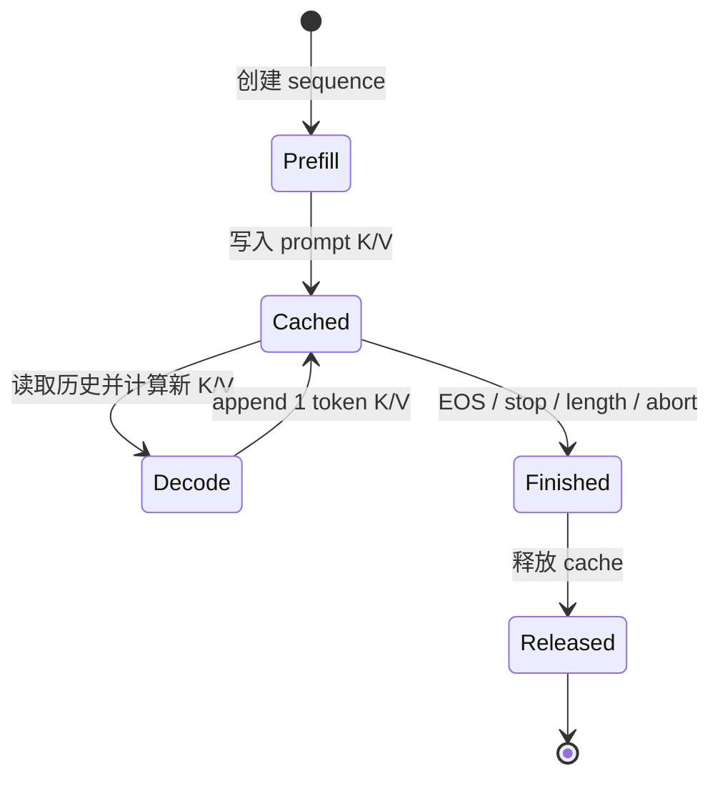
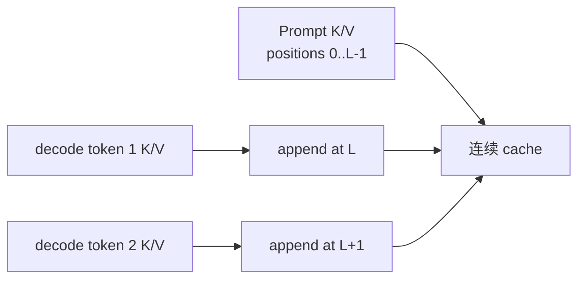
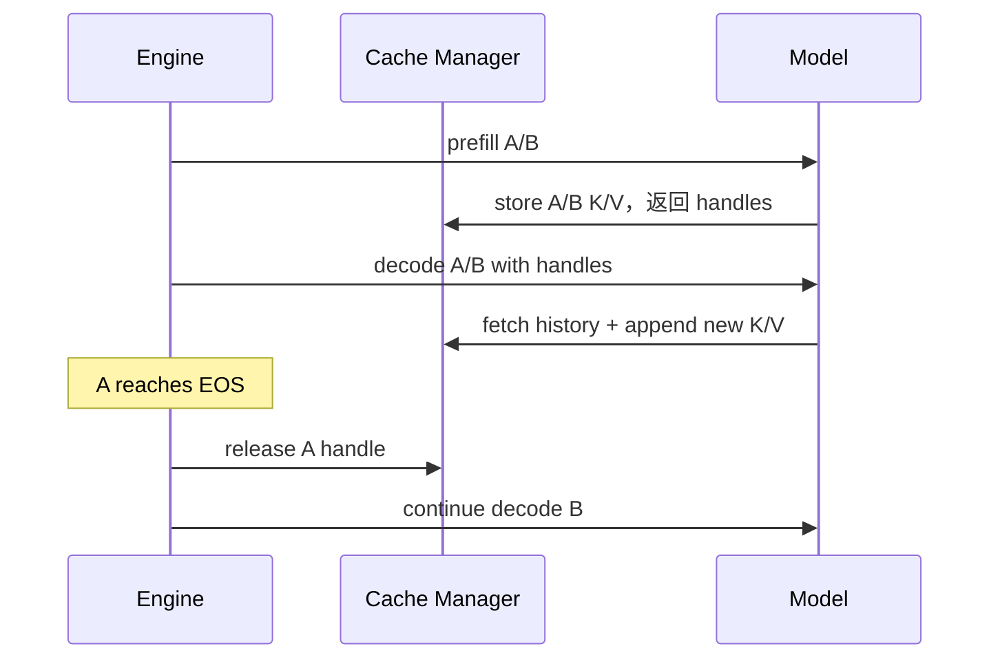

# Week 08：KV Cache，把重复计算换成可管理的状态

## 没有 Cache 时，模型会重复算什么

假设 prompt 长度 `L=1000`，接下来生成 100 个 token。

如果每一步都把完整上下文重新送进模型：

```text
第 1 步处理 1000 tokens
第 2 步处理 1001 tokens
...
第 100 步处理 1099 tokens
```

总 token-forward 数：

```text
1000 + 1001 + ... + 1099
= 100 * (1000 + 1099) / 2
= 104,950
```

其中绝大多数是历史 token 的重复计算。

使用 KV cache 后：

```text
prefill: 1000 tokens
后续 decode: 每步只计算 1 个新 token
总计约 1099 token-forwards
```

注意，decode 的 Attention 仍要读取历史 K/V，所以成本不会变成常数；省掉的是历史 token 的 Q/K/V projection、MLP 等重复 forward。

KV cache 不是单纯的模型优化。它把原本无状态的 forward 变成了有状态服务：每个请求都拥有会增长、必须被追踪和释放的 GPU 数据。这正是后面分页管理和调度问题的起点。

---

## 一、为什么缓存 K 和 V，不缓存整个 Hidden State

Decode 新 token 的 query 要与所有历史 key 打分，并用权重汇总历史 value：

```text
score = q_new K_history^T / sqrt(D)
out   = softmax(score) V_history
```

历史 token 的 K/V 在生成过程中不再变化，适合复用。旧 query 只服务于旧位置当时的查询，下一步会产生新 query，因此不需要缓存。

缓存完整 hidden states 并不能直接替代 K/V：Attention 仍需重复执行 K/V projection。缓存投影后的 K/V 正好位于 decode 所需边界。

## 二、每层都需要自己的 KV Cache

Transformer 第 0 层和第 20 层产生的 K/V 不相同。每层 attention 都要读取该层自己的历史，所以 cache 带有 layer 维。

概念形状：

```text
K [num_layers, num_kv_heads, seq_len, head_dim]
V [num_layers, num_kv_heads, seq_len, head_dim]
```

实现中也可能把 batch/sequence、token、head 的维度调整顺序，以适应 kernel 访问。Shape 布局可以变化，语义不能变化：给定 sequence、layer、token position、KV head 和 head_dim，必须找到唯一 K/V。

### MHA 与 GQA 的影响

KV cache 使用 `num_kv_heads`，不是 `num_q_heads`。GQA/MQA 通过减少 KV heads 降低存储与带宽。

如果 Q heads=32，KV heads=8，则四个 Q heads 共享一个 KV head；cache 只保存 8 组 K/V。

## 三、显存公式再算一次，但这次关注变量

单 token KV bytes：

```text
bytes_per_token
= num_layers * 2 * num_kv_heads * head_dim * dtype_bytes
```

总占用：

```text
KV_total
= bytes_per_token * sum(sequence_context_lengths)
```

这里没有 `num_q_heads`，也没有 vocab size。最敏感变量是：

- layers；
- KV heads；
- head dimension；
- dtype；
- 所有活跃请求的总上下文 token 数。

### 为什么平均长度不够

两个系统都平均 2k context：

```text
系统 A：所有请求都约 2k
系统 B：大量 128-token 请求 + 少数 32k 请求
```

总 token 相同则理论 KV 总量相近，但调度、公平性、单请求 block 数和尾延迟可能完全不同。容量规划既要看总量，也要看长度分布。

## 四、KV Cache 的四段生命周期



### Prefill：创建

模型一次处理 prompt，得到每层 K/V。Cache manager 创建 handle，把这批 K/V 与 sequence ID 关联。

### Decode：读取

Backend 根据 handle 取得历史 K/V 和有效长度，构造当前 token 的 position，执行 attention。

### Decode：Append

新 token 的 K/V 写到逻辑位置 `current_length`，然后长度加 1。

### Finish：Release

无论正常 EOS、长度限制、客户端取消还是异常，请求终止后都要释放。只在正常返回路径 release 会造成异常请求泄漏。

## 五、Handle 与 Metadata 为什么必要

上层 engine 不应该持有巨大 K/V tensor 并了解布局细节。它可以持有轻量 handle：

```text
sequence_id
current_length
capacity 或 block metadata
cache backend identity
```

Backend 根据 handle 找到真实 cache。

这种分离带来两个好处：

- Engine 管理请求生命周期，不依赖 K/V 具体布局；
- Dense cache 可以在 Week 10 替换为 paged cache，而上层接口变化较小。

但 handle 不是普通整数就万事大吉。必须防止：

```text
使用已释放 handle
把 A 请求 handle 传给 B
长度 metadata 与实际写入不一致
跨 device/backend 混用
```

## 六、连续 KV Cache 的最直观实现

单 sequence、单层：

```text
K [Hkv, current_len, D]
V [Hkv, current_len, D]
```

Prefill 写入 `[0:L)`，decode 每步在末尾 append。



连续布局的优点是容易理解、dense attention 读取方便；缺点是增长和不同长度 batch 的管理不灵活。

## 七、每步 torch.cat 为什么隐藏了 O(T²) 搬运

朴素 append：

```python
cache = torch.cat([cache, new_kv], dim=token_dim)
```

`cat` 通常需要分配新 tensor，再复制全部旧数据和新数据。

生成 T 个 token 时，复制历史长度：

```text
L + (L+1) + ... + (L+T-1)
```

又形成随 T 二次增长的搬运。虽然没有重复模型计算，却在重复搬 cache。

### 预分配

可以预先分配 `[max_len]`，每步原地写：

```text
cache[..., current_len, :] = new_kv
current_len += 1
```

这样避免历史搬运，但要决定预留多大：

- 太小会溢出或扩容；
- 按最大长度预留会浪费；
- 多请求连续大块会产生碎片。

Paged KV 正是在“避免 concat”与“避免最大长度连续预留”之间寻找更好的管理方式。

## 八、Position ID 必须与 Cache 长度一致

Decode 新 token 的 position 通常是历史有效长度：

```text
position_id = current_len
```

如果 prompt 长 100，新 token 应使用 position 100（从 0 开始）。Cache 写入位置、RoPE position 和 context_len 必须一致。

常见 off-by-one：

```text
先 length++ 再取 position
采样 token 已 append 到 token list，但 K/V 尚未写入
prefill 是否包含最后 prompt token 的定义不一致
```

这类错误不会总是崩溃，而会让生成逐步偏离 reference。

## 九、不同历史长度为什么难以 Dense Batch

三个请求：

```text
A context=128
B context=512
C context=129
```

若 K/V 以 dense batch tensor 拼接，需要统一 token dimension。可以 padding 到 512：

```text
A/C 大量无效位置
```

还要提供 mask/context_len，保证 attention 不读取 padding。

另一种教学方案是按历史长度分桶：

```text
bucket 128: A
bucket 129: C
bucket 512: B
```

同长度容易 stack，但会产生许多小 batch，降低合批效率。

Paged decode 可以通过 block table 和 context_lens 让同一 batch 中的序列拥有不同历史长度，但 kernel 寻址更复杂。

## 十、Cache 与 Batch 的边界

Engine 可能一次 prefill/decode 多个 sequence，但每个 sequence 仍需独立状态：

```text
seq_id
effective length
K/V ownership
finish state
```

不能因为当前合成一个 batch，就把多个请求永久绑定成一个 cache。A 提前结束时应释放 A，不影响 B/C 继续增长。



## 十一、正确性怎样验证

### Full Forward 与 Cached Decode 对齐

对 token 序列：

```text
[x0,x1,x2,x3]
```

路径 A：一次 full forward。

路径 B：prefill `[x0,x1]`，再 cached decode `x2`、`x3`。

比较对应位置 logits。浮点执行顺序可能产生小误差，但结果应在合理容差内。

### Cache 内容检查

使用小 shape 和可识别值，确认：

- prefill 写入正确 token 位置；
- append 只改变新位置；
- 旧 K/V 未被覆盖；
- K/V、layer、head 没有互换；
- length 与实际内容一致。

### Release

释放后 fetch 应明确失败；重复 release 的语义要定义清楚，不能静默释放其他请求资源。

## 十二、异常路径与资源安全

实际请求可能在任何阶段失败：

```text
tokenizer error
prefill OOM
客户端断开
stream consumer 取消
sampling exception
decode kernel error
```

Cache release 应放在可靠的 finally/生命周期管理中。资源泄漏测试可以反复创建、生成、取消请求，并确认 cache usage 回到基线。

## 十三、KV Cache 不等于 Prefix Cache

- **KV cache**：单个活跃 sequence 在 decode 中复用自己的历史 K/V；
- **Prefix cache**：不同请求之间复用相同完整前缀的 KV block。

前者是自回归生成的基础，后者是跨请求复用优化。Prefix caching 还需要 hash、引用计数和 eviction，留到 Week 10/15。

## 十五、常见误区

### KV Cache 让 Decode 变成 O(1)

它省掉历史 token 的重复 forward，但当前 query 仍要读取历史 K/V；Attention 成本随 context 增长。

### Cache 只需保存最后一层

每层 attention 都需要自己的历史 K/V。

### torch.cat 只是修改指针

通常要分配并复制完整旧 tensor，每步 cat 会造成大量搬运。

### Batch 中可以共享一个 length

不同请求历史长度不同，必须独立维护有效长度。

### 请求返回后 Python 对象销毁就一定释放 GPU Cache

显式 cache manager 可能仍持有引用或物理块；生命周期必须明确 release。

### KV Cache 与 Prefix Cache 是同一个概念

KV cache 是请求内历史复用，prefix cache 是请求间前缀复用。

## 十六、学完本周，应能回答

1. KV cache 省掉了哪些重复计算？
2. 为什么缓存 K/V 而不是 Q？
3. 每 token KV bytes 由哪些模型参数决定？
4. Cache handle 需要哪些 metadata？
5. 每步 cat 为什么产生二次增长的搬运？
6. Position ID、cache length 和写入 slot 为什么必须一致？
7. 不同历史长度为什么让 dense batch decode 困难？
8. Cache release 应覆盖哪些异常路径？
9. KV cache 与 prefix cache 有何区别？

## 参考与素材说明

- 猛猿：[vLLM V1：KV Cache 初始化](https://zhuanlan.zhihu.com/p/1900932850829730567)
- 猛猿：[PagedAttention 原理](https://zhuanlan.zhihu.com/p/691038809)
- 猛猿：[再读 MLA](https://zhuanlan.zhihu.com/p/19585986234)
- 课程工程：ContinuousKVCache、Qwen3 continuous backend 与 Week 08 grader

本文的复杂度计算、生命周期图、连续缓存例子和实验均为课程原创组织。Paged KV 和 prefix caching 只作为后续动机出现，不提前替代本周的连续缓存主线。
