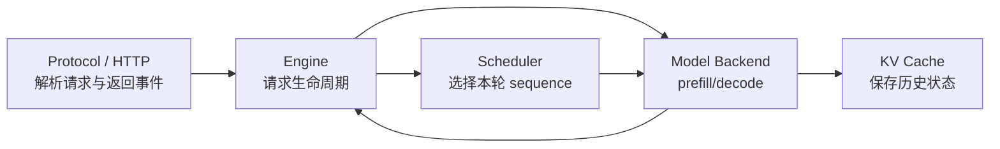
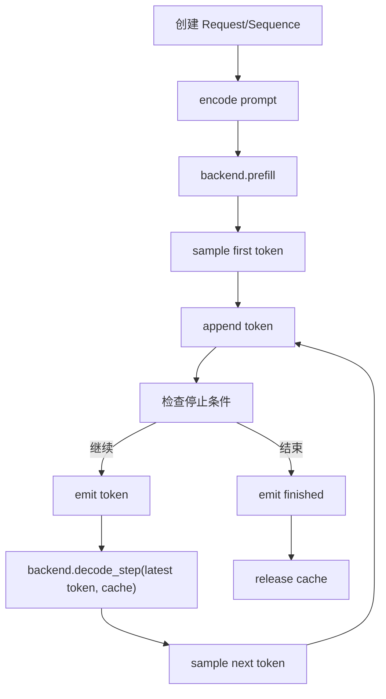
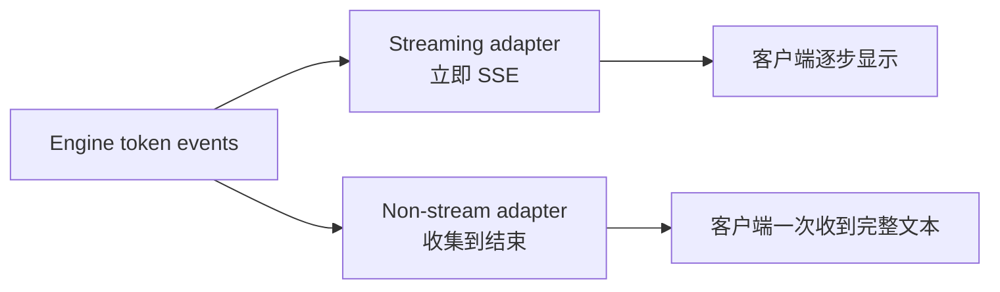

# Week 09：Engine 如何把一次生成组织成可靠状态机

## 模型 Backend 不应该管理整个请求

模型 backend 最擅长回答：

```text
给定 token IDs 和 cache，如何运行 prefill/decode 并返回 logits？
```

但一个在线请求还包含：

```text
prompt 文本与 chat template
sampling 参数
生成 token 列表
EOS / stop / max_tokens
streaming
取消与错误
cache release
请求 ID 与返回顺序
```

如果这些逻辑散落在 HTTP route、模型类和客户端中，单请求可能勉强运行，一旦加入 batch、streaming 和取消，状态很容易互相矛盾。

Engine 的职责是把模型的一步计算组织成完整请求生命周期。它不是“更大的模型”，而是模型与服务系统之间的编排层。

---

## 一、先划清四个边界



### Protocol 层

负责 JSON schema、HTTP 状态、SSE 格式、chat messages 等外部契约。它不应实现 token-by-token 模型循环。

### Engine

负责编码 prompt、创建请求状态、调用 backend、sampling、检查结束、发出 token/finished event 和清理资源。

### Scheduler

决定本轮哪些 sequence prefill/decode。Week 09 先关注单请求状态；Week 11 再展开多请求调度。

### Backend

封装模型与 cache 的数值执行：

```text
encode/decode text
prefill
decode_step / decode_batch
release_cache
```

边界清晰后，reference backend 与 course backend 可以替换，而 Request 语义不必重写。

## 二、Request 与 Sequence 为什么分开

### Request

表示用户提交的一次任务：

```text
request_id
prompt / messages
sampling_params
arrival metadata
```

### Sequence

表示某一条候选 token 路径：

```text
prompt_token_ids
generated_token_ids
next_token_id
cache_handle
prefill progress
status
finish_reason
```

当前课程一次 request 通常只有一条 sequence，但分开仍有价值：beam search、parallel sampling 或 best-of 可能让一个 request 派生多条候选 sequence；scheduler 更关心 sequence 的长度、cache 和状态，而 HTTP 更关心 request。

### 不要把 Prompt Tokens 与 Generated Tokens 混成一份

停止长度通常指生成 token 数，不是总上下文长度；输出给用户也通常只包含 generated 部分。分开存储能避免：

```text
max_tokens 误把 prompt 算进去
返回文本重复 prompt
位置与 cache length 计算混乱
```

总上下文可按需得到：

```text
context = prompt_token_ids + generated_token_ids
```

## 三、Prompt 进入 Engine 前后发生什么

### 普通 Prompt

```text
string -> tokenizer.encode -> prompt_token_ids
```

### Chat Messages

```text
messages
-> apply_chat_template
-> rendered prompt string or token IDs
-> model input
```

Engine 必须明确 tokenizer/backend 边界：不同模型可能需要不同 chat template、BOS/EOS 处理和特殊 token。

### 空 Prompt 与超长 Prompt

应定义：

- 空字符串是否允许；
- tokenizer 后为空怎样处理；
- prompt 超过上下文上限时拒绝还是截断；
- 截断方向和用户可见提示。

静默截断可能改变问题语义，在线服务通常更适合明确报错或由调用者选择策略。

## 四、Prefill 后为什么已经能产生第一个 Token

Prefill 处理整个 prompt，并返回最后位置 logits。Sampling 这份 logits 就得到第一个生成 token。

因此主循环不是：

```text
prefill
-> decode
-> first token
```

而是：

```text
prefill
-> sample first token
-> append/check/emit
-> 如果未结束，再用 first token 做 decode
```

这个顺序直接影响 `max_tokens=1`：合理行为是返回 prefill logits 采出的一个 token，然后结束；如果 prefill 后先检查 generated length，可能错误返回空结果。

## 五、单请求主循环逐步展开



伪代码：

```python
handle = None
try:
    prompt_ids = backend.encode(prompt)
    logits, handle = backend.prefill(prompt_ids)

    while True:
        token = sampler.sample(logits, params)
        sequence.append(token)

        reason = sequence.check_finish(token, params)
        if reason:
            yield finished_event(reason)
            break

        yield token_event(token)
        logits, handle = backend.decode_step(token, handle)
finally:
    if handle is not None:
        backend.release_cache(handle)
```

真实实现可能在 finished 前仍发送最后 token，也可能 event schema 不同，但状态顺序必须自洽。

## 六、Token Append 与 Stop Check 的细节

### EOS

EOS 是模型词表中的特殊 token。是否把 EOS 文本返回给用户要由协议定义，通常它只作为结束标记，不显示。

### Stop Token IDs

用户或模型配置可以指定多个 stop token。采样到其中之一后结束。

### max_tokens

通常限制 generated token 数：

```text
len(generated_token_ids) >= max_tokens
```

`max_tokens=None` 表示不按生成长度停止，但仍受 EOS、stop、上下文上限、超时和资源保护约束。生产服务不应允许完全无界请求破坏容量。

### Stop String 与 Stop Token 的区别

字符串可能跨多个 token；只检查最新 token ID 无法识别任意 stop string。课程核心协议使用 stop token IDs，若扩展字符串停止，需要维护增量解码缓冲和跨 token 匹配。

### Finish Reason

至少区分：

```text
stop       EOS 或 stop token
length     达到 max_tokens/context limit
cancelled  客户端取消
error      执行失败
```

调用者需要知道回答是否被截断。

## 七、Streaming Event 怎样设计

Token event：

```json
{"event":"token","request_id":"r1","token_id":42,"text":"..."}
```

Finished event：

```json
{"event":"finished","request_id":"r1","finish_reason":"stop"}
```

最后协议层可以发送：

```text
data: [DONE]
```

### 增量 Decode 文本并不总是独立

一个 token 可能是单词片段或字节片段。单独 decode 每个 token 再拼接，可能与一次 decode 完整 token 列表不同，尤其涉及空格、Unicode 和 tokenizer cleanup。

可靠方式之一是维护已解码前缀：

```text
new_full_text = decode(all_generated_ids)
delta = new_full_text[len(previous_text):]
```

代价是重复 decode；更高效实现使用 tokenizer 的增量解码能力。课程应明确当前选择和边界。

### 最后一个 Token 是否发送

如果 token 同时触发长度结束，它通常仍是有效生成结果，应先产生 token delta，再 finished。EOS/stop token 是否隐藏则由协议定义。顺序必须测试。

## 八、Non-streaming 不是另一套生成算法

Engine 可以内部产生相同 token events：

- streaming consumer 逐个转成 SSE；
- non-streaming consumer 收集 token，最后组装 response。



这样停止条件和模型逻辑只有一份，减少两种接口行为不一致。

## 九、取消为什么是正常路径，不是异常边角

用户关闭页面、客户端超时、上游取消请求都很常见。若服务端继续生成：

- 浪费 GPU 时间；
- KV cache 继续增长；
- 占用 batch 位置；
- 最终结果无人消费。

取消需要从协议层传播到 engine/scheduler，并最终 release cache。

### 取消发生在不同阶段

```text
waiting：从队列删除，不应分配 cache
prefill 中：当前 GPU 工作可能无法立刻中断，完成后不再继续
decode 间：下一调度迭代移除并释放 cache
stream write：客户端断开时触发上游取消
```

状态转换应幂等：重复收到取消不能释放其他请求资源或发送多个 finished。

## 十、异常安全与 finally

Cache 可能在 prefill 成功后创建，随后 sampling、detokenize 或网络发送失败。只在正常循环末尾 release 会泄漏。

资源管理应遵循：

```text
谁创建，谁保证最终释放
```

或由统一 owner 管理，并在所有终止路径调用幂等 release。

测试可以注入异常：

```text
prefill 后 sampler 抛错
第 3 个 token 时取消
stream consumer 抛错
backend decode 抛错
```

每次都确认 cache usage 和 sequence registry 回到基线。

## 十一、Batch 中每条 Sequence 必须独立结束

Batch A/B/C 输出长度不同：

```text
A 第 2 轮 EOS
B 第 10 轮 length
C 第 5 轮 cancelled
```

不能等全部结束后才释放 A，也不能因 A 结束而终止 B/C。

Batch result 还要恢复原请求顺序。Scheduler 为效率可能重排、按长度分桶，但 API response 必须通过 request ID 或原始 index 对齐。

## 十二、状态机应单调推进

一种简单状态：

```text
WAITING -> PREFILL -> RUNNING -> FINISHED
                       |            |
                       -> CANCELLED -
                       -> ERROR -----
```

合法性规则：

- FINISHED 不再 append token；
- release 后不能 decode；
- prefill 只发生一次，除非明确支持 chunk/resume；
- generated length 只增加；
- finish_reason 一旦设置不随意覆盖。

显式状态能让错误尽早暴露，而不是依赖多个布尔值的偶然组合。

## 十三、Engine 与 Scheduler 的边界

单请求 `generate_stream` 可以自己循环；多请求 continuous batching 时，scheduler 每轮选择一组 sequences，engine 执行 batch step 并更新每条状态。

稳定接口可以是：

```text
schedule() -> batch metadata
execute(batch) -> logits/cache updates
sample/update sequences
release finished
```

Week 09 要把 sequence 状态做正确，Week 11 才能安全地改变选择顺序。

## 十四、Profiler Baseline 应打在哪些边界

本周建立单请求基线：

```text
encode
prefill
first sampling
each decode step
detokenize/event
release
```

不要为了计时在每个 CUDA op 后同步。可以用 profiler range 标注阶段，再观察真实异步 timeline。

基线要固定 prompt、output tokens、dtype、backend 和 sampling，作为 Week 10/11 更换 cache/调度后的对照。

## 十五、测试矩阵

### 正常结束

- 第一个 token EOS；
- 多步后 EOS；
- stop token；
- max_tokens=1；
- max_tokens=N。

### Streaming

- token event 顺序；
- finished 恰好一次；
- `[DONE]` 在 finished 后；
- 最后 token 的 delta 正确。

### 错误/取消

- prefill 异常；
- decode 异常；
- consumer 取消；
- release 恰好且幂等。

### Batch

- 不同结束轮次；
- 输出恢复输入顺序；
- A 结束不影响 B；
- 每条 finish_reason 正确。

## 十七、常见误区

### Prefill 后必须 decode 一次才有首 token

Prefill 最后位置 logits 已能采样首 token。

### Streaming 与 non-streaming 应写两套循环

共享 event 生成逻辑更容易保持语义一致。

### max_tokens 应限制总上下文

API 中通常指生成 token 数；模型上下文上限是另一约束。

### 客户端断开后 GPU 会自动停止

不会。取消必须传播到 engine/scheduler。

### Python generator 退出后 cache 一定释放

只有资源 owner 在 finally 或统一生命周期中明确 release 才可靠。

### Batch 结束条件可以统一

每条 sequence 都有独立 EOS、长度和取消状态。

## 十八、学完本周，应能回答

1. Protocol、Engine、Scheduler、Backend 各负责什么？
2. Request 与 Sequence 为什么分开？
3. Prefill 后首 token 的采样顺序是什么？
4. max_tokens=1 应怎样工作？
5. Stop token 与 stop string 有何区别？
6. Streaming 增量文本为什么可能跨 token？
7. 取消如何传播并保证 cache release？
8. Batch 重排后怎样恢复原请求顺序？
9. 哪些测试能证明状态机没有泄漏？

## 参考与素材说明

- 猛猿：[vLLM V1：整体流程](https://zhuanlan.zhihu.com/p/1900126076279160869)
- 猛猿：[vLLM 旧版整体架构](https://zhuanlan.zhihu.com/p/691045737)
- 猛猿：[vLLM V1：使用 AsyncLLM 做异步推理](https://zhuanlan.zhihu.com/p/1916187125931554299)
- 课程工程：Engine、Request/Sequence、protocol 与 Week 09 grader

本文状态机、事件示例、异常路径和实验均为课程原创组织。参考文章用于建立 vLLM offline/online 共用推理内核的系统视角，具体类名以课程指定实现为准。
