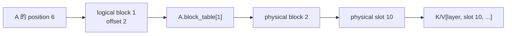
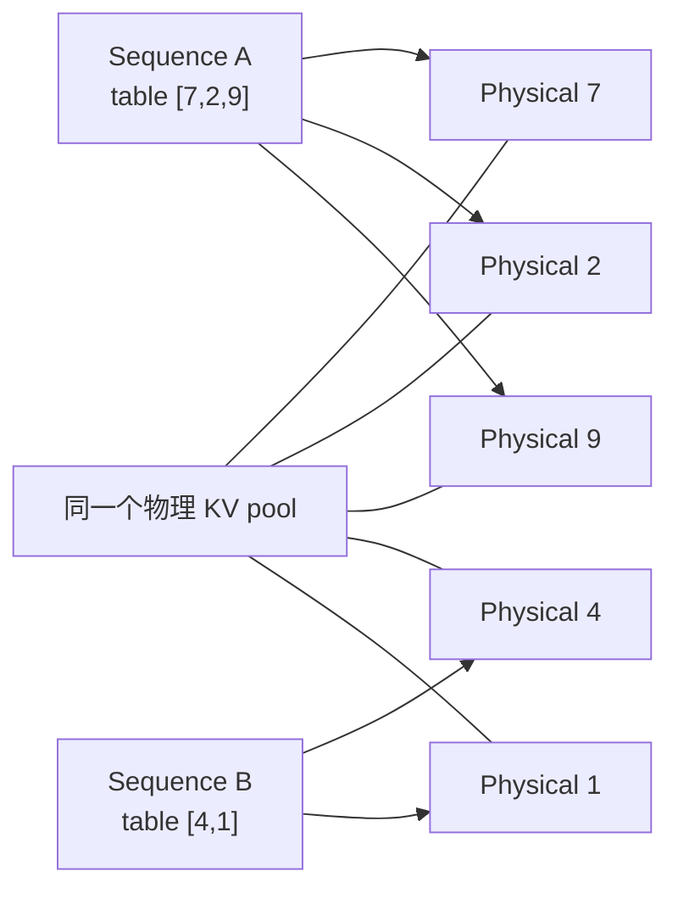
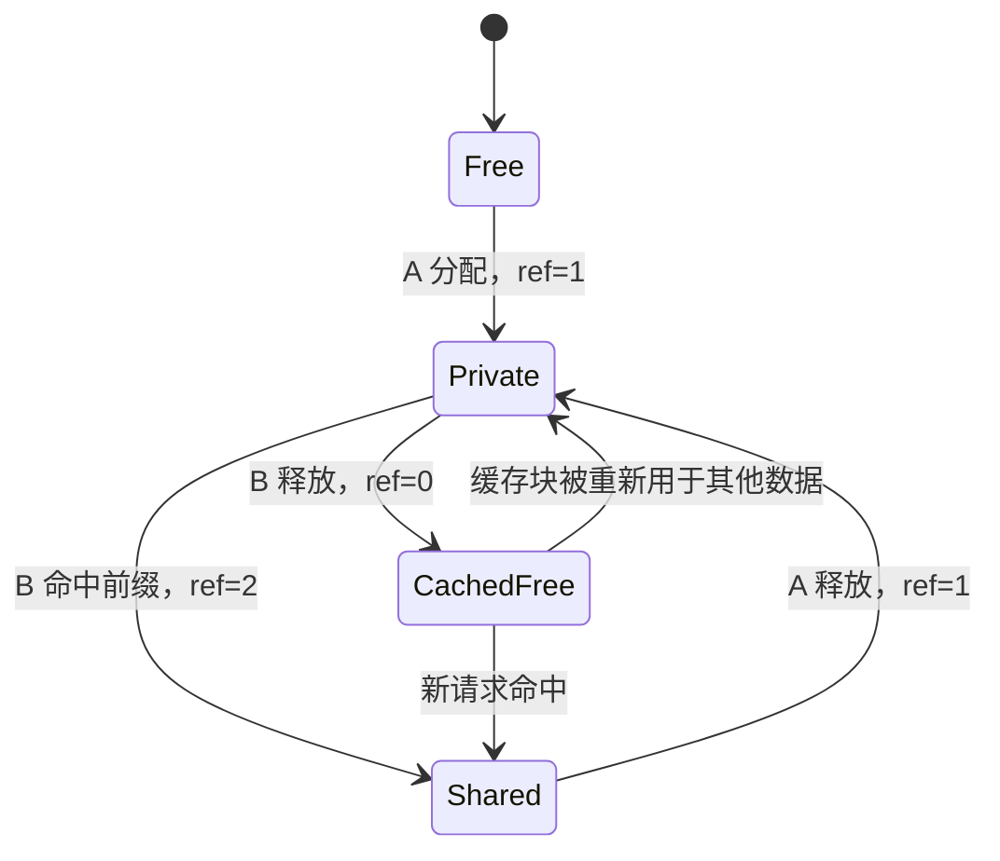

# 第 10 章：Paged KV Cache 的地址映射与内存管理

自回归生成要求系统保留此前所有 token 的 key 和 value，KV cache 因而随序列长度动态增长。PagedAttention 论文指出，按最大长度预留连续空间会造成内部碎片，而动态变化的请求长度和释放顺序还会增加内存管理难度；这些浪费会限制可同时进入 batch 的请求数量。[Kwon et al., 2023：Efficient Memory Management for Large Language Model Serving with PagedAttention](https://arxiv.org/abs/2309.06180)

考虑同时到达服务端的两条请求：

```text
请求 A：当前 37 token，最多可能生成到 4096 token
请求 B：当前 11 token，最多也可能生成到 4096 token
```

按最大长度分别预留连续空间可以简化寻址，但会在请求开始时就为 A、B 各保留 4096 个位置。实际长度若远小于上限，大部分显存不存放有效 K/V；若改为随序列增长重新申请连续空间，则可能需要重新分配并搬运历史缓存。

上述问题来自在线请求长度不可预知以及请求到达、结束时间不同，而非 Attention 数学公式本身。

PagedAttention 借鉴操作系统分页思想，将 KV cache 划分为固定 token 数的逻辑块，并通过 block table 映射到不必连续的物理块。论文把这种映射用于动态分配 KV cache，并由专用 attention kernel 按块读取历史状态。[PagedAttention 论文，第 4.1–4.3 节](https://arxiv.org/abs/2309.06180)

```text
逻辑上：sequence 的 token 仍按 0, 1, 2, ... 排列
物理上：固定大小的 KV block 可以来自显存池的任意位置
映射层：每条 sequence 的 block table 负责地址翻译
```

本章以 A、B 两条请求为例，说明逻辑 token 到物理 slot 的地址转换，并对照课程工程中的 [BlockManager](../../../course_vllm/engine/block_manager.py) 和 [PagedKVCache](../../../course_vllm/engine/paged_kv_cache.py) 分析分配、写入、共享和释放过程。

## 10.1 连续分配的空间开销

以下采用简化配置进行计算。假设每个请求最大长度为 16，当前 A 有 9 个 token，B 有 5 个 token。

按最大长度预留：

```text
A: [#########.......]  9 个有效位置，7 个空位
B: [#####...........]  5 个有效位置，11 个空位
```

两条请求共占 32 个位置，只有 14 个位置有效。这里的空位不能轻易交给别的请求，因为它们位于 A、B 各自预留的连续区域内，并且可能在未来 decode 时被使用。

如果只按当前长度申请，则 A 从 9 增长到 10、11、12……时，需要找到更大的连续区域，或者依赖内存分配器原地扩展。高并发下，请求不断加入和释放，空闲空间会散成大小不同的洞。即使总空闲量足够，也未必存在一个足够大的连续区间。

固定大小 block 改变了分配单位。假设 `block_size=4`：

```text
A 长度 9  -> 3 blocks -> 12 slots
B 长度 5  -> 2 blocks ->  8 slots
```

只需分配 20 个位置，最后一个 block 分别浪费 3 个 slot。请求继续增长时，只有跨过 block 边界才申请新块，不必搬动已有 K/V。

Paged KV cache 并未消除全部空间开销，而是将连续大块预留和外部碎片转换为尾块内部碎片与映射元数据。PagedAttention 论文的测量显示，早期 serving 系统用于保存实际 token 状态的 KV cache 空间占比可能只有 20.4% 至 38.2%；该结果属于论文特定系统与 workload，不能直接作为本课程工程的测量值。[PagedAttention 论文，第 3 节](https://arxiv.org/abs/2309.06180)

## 10.2 地址空间中的基本对象

分页寻址涉及以下五个对象。课程中统一使用这些名称，以避免将逻辑块、物理块和 CUDA thread block 混为一谈。vLLM 的设计文档也明确区分 KV cache block 与 GPU thread block。[vLLM：Paged Attention](https://docs.vllm.ai/en/latest/design/paged_attention/)

### 10.2.1 Logical Token Position

Token 在某条 sequence 中的位置。A 的第 6 个 token 和 B 的第 6 个 token 都可以叫 position 6，但它们属于不同 sequence。

### 10.2.2 Logical Block

将逻辑位置按 `block_size` 分组：

```text
logical_block = position // block_size
```

### 10.2.3 Offset in Block

Token 在逻辑块内的位置：

```text
offset = position % block_size
```

### 10.2.4 Physical Block

KV pool 中真正拥有存储空间的块，由一个整数 ID 标识。Logical block 2 不必存入 physical block 2。

### 10.2.5 Physical Slot

物理块中的具体 token 位置：

```text
slot = physical_block * block_size + offset
```

注意 logical block 只在一条 sequence 内有意义，而 physical block 来自整个缓存池。两条 sequence 可以映射到不同 physical block，也可能因共享前缀而指向同一个 physical block。

## 10.3 地址转换实例

设：

```text
block_size = 4
A.block_table = [7, 2, 9]
```

这个表表示：

```text
A 的 logical block 0 -> physical block 7
A 的 logical block 1 -> physical block 2
A 的 logical block 2 -> physical block 9
```

现在读取 A 的 position 6：

```text
logical_block  = 6 // 4 = 1
offset         = 6 % 4  = 2
physical_block = A.block_table[1] = 2
physical_slot  = 2 * 4 + 2 = 10
```



若 kernel 直接将 position 6 作为 physical slot 6，访问仍可能落在合法显存范围内，但读取的是其他请求或其他逻辑位置的数据。这类错误未必触发越界异常，却会产生 shape 正确而数值错误的 Attention 输出。

课程实现中的 `slot_mapping` 正是上述公式：

```python
def slot_mapping(self, seq_id: int, positions: list[int]) -> list[int]:
    table = self.tables[seq_id]
    slots = []
    for position in positions:
        if position < 0 or position >= table.length:
            raise IndexError(...)
        block_index = position // self.block_size
        block_offset = position % self.block_size
        slots.append(
            table.block_ids[block_index] * self.block_size + block_offset
        )
    return slots
```

该函数定义了 BlockManager 与实际 K/V tensor 之间的地址映射契约。

## 10.4 Sequence 级 Block Table

考虑：

```text
A.block_table = [7, 2, 9]
B.block_table = [4, 1]
```

A 和 B 都有 logical block 0，但分别映射到 physical block 7 和 4。因此，logical block ID 只有与 sequence ID 组合时才能唯一确定映射。



每张表还必须记录当前有效长度。最后一个 block 往往未填满，Attention 只能读取 `0..length-1` 对应的 slot，不能将尾部未写入位置作为历史 token。PagedAttention 论文将 block table 定义为每个请求的逻辑块到物理块映射，并记录块内已填充位置。[PagedAttention 论文，第 4.2 节](https://arxiv.org/abs/2309.06180)

在课程工程中，`BlockTable` 保存：

```python
@dataclass(slots=True)
class BlockTable:
    block_size: int
    block_ids: list[int]
    owned_block_ids: set[int]
    length: int
```

`block_ids` 给出逻辑到物理的顺序，`length` 给出有效 token 边界，`owned_block_ids` 则用于区分本 sequence 私有块和复用的共享块。

## 10.5 Prefill 与 Decode 的按需分配

长度为 `L` 的 sequence 需要：

```text
required_blocks = ceil(L / block_size)
```

如果 `L=9`、`block_size=4`，需要三个 block：

```text
logical block 0: positions 0..3
logical block 1: positions 4..7
logical block 2: position 8，有 3 个空 slot
```

Prefill 一次建立初始长度，Manager 从 free list 取出三块并生成 table。Model backend 再把每层 K/V 写入这些物理位置。

Decode 无需为每个新 token 分配 block。当前长度为 7 时，新 token 占 position 7，仍落在已有 logical block 1 的 offset 3；当前长度为 8 时，新 token 占 position 8，此时才需要 logical block 2 和一个新物理块。

课程实现把规则集中在 `ensure_capacity`：

```python
required = ceil(new_length / block_size)
missing = required - len(table.block_ids)

for _ in range(missing):
    block_id = self._allocate_fresh_block()
    table.block_ids.append(block_id)
    table.owned_block_ids.add(block_id)
```

Prefill 和 decode 因而可以复用同一分配逻辑，只在不同时间传入不同的 `new_length`。PagedAttention 的原始设计同样在每轮调度中先确定新逻辑块的需求，再分配相应物理块。[PagedAttention 论文，第 4.3 节](https://arxiv.org/abs/2309.06180)

## 10.6 元数据管理与 KV 数据存储

`BlockManager` 与 `PagedKVCache` 分别承担元数据管理和数据存储职责。

`BlockManager` 维护元数据：

```text
free_block_ids
seq_id -> BlockTable
physical block -> ref_count
prefix hash -> physical block
```

它确定 sequence 可使用的 physical slot，但不计算也不保存 K/V 数值。

`PagedKVCache` 持有实际 tensor：

```text
key_cache:
[num_layers, num_blocks * block_size, num_kv_heads, head_dim]

value_cache:
[num_layers, num_blocks * block_size, num_kv_heads, head_dim]
```

采用以下简化配置：

```text
num_layers  = 2
num_blocks  = 8
block_size  = 4
num_kv_heads = 2
head_dim    = 8
```

每个 K 或 V tensor 的 shape 是 `[2, 32, 2, 8]`。中间的 32 不是某条 sequence 的最大长度，而是整个物理池拥有的 slot 总数。

写入时，PagedKVCache 先问 Manager 得到 slots，再执行 scatter：

```python
slots = self.block_manager.slot_mapping(seq_id, positions)
self.key_cache[layer_id, slots] = key_tokens
self.value_cache[layer_id, slots] = value_tokens
```

教学版的 `get_dense` 按逻辑顺序收集 slots，再通过 `index_select` 构造连续 K/V，以便和 reference 对齐。vLLM 的 Paged Attention kernel 则面向分块存储直接读取 K/V，避免先构造完整的 dense 中间 tensor。[vLLM：Paged Attention kernel design](https://docs.vllm.ai/en/latest/design/paged_attention/)

分页改变的是地址获得方式，而不是 Attention 的数学定义。对于同一条逻辑 K/V 序列，dense 与 paged 实现应产生容差内一致的输出。

## 10.7 内部碎片与 Block Size

内部碎片是已经分配给请求、但未存放有效 token 的尾部 slot：

```text
allocated_slots = number_of_blocks * block_size
wasted_slots    = allocated_slots - current_length
```

对 length 17：

| block size | blocks | allocated slots | wasted slots | table entries |
| ---: | ---: | ---: | ---: | ---: |
| 16 | 2 | 32 | 15 | 2 |
| 8 | 3 | 24 | 7 | 3 |
| 4 | 5 | 20 | 3 | 5 |

小 block 减少尾部浪费，却让 block table 更长，分配、hash、引用计数和 kernel 间接寻址次数更多。大 block 降低元数据开销，却增加短请求的内部碎片。

外部碎片则是总空闲空间足够，但被切成无法满足连续大块申请的小洞。固定大小 block 让所有空闲块可互换，大幅减轻这种问题。

因此，Paged KV cache 仍存在尾块内部碎片。它以固定粒度的内部碎片和元数据成本，换取按需物理分配，并减少连续预留。原始论文还指出，增大 block size 可以提高块内并行度，但同时增加内存碎片；其最佳取值依赖 workload 和实现。[PagedAttention 论文，第 4.3 与 7.2 节](https://arxiv.org/abs/2309.06180)

## 10.8 完整前缀块的共享

许多请求拥有相同 system prompt。设 `block_size=4`：

```text
A tokens: [1,2,3,4,5,6,...]
B tokens: [1,2,3,4,9,...]
```

第一个完整 block `[1,2,3,4]` 可以复用。A、B 的 block table 都指向同一个 physical block，而分叉后的 token 使用各自的新块。

课程实现按完整 block 计算链式 hash。当前 block 的 hash 同时依赖前一个 prefix hash，避免“局部 token 相同但更早前缀不同”被误认为同一状态。

课程实现只缓存完整 block。这样共享块在复用期间可以保持只读，分叉后的 token 从新块开始，不需要在同一物理块中同时管理共享区域和私有写入区域。

共享带来新的所有权问题。若 physical block 7 同时被 A、B 引用：

```text
ref_count[7] = 2
```

A 结束时只能减到 1，不能把它归还为可覆盖的普通空闲块。B 结束后引用数归零，这块才不再被活跃 sequence 使用。



当前教学实现保留已释放完整前缀块的 token hash，使后续请求仍可能命中；分配新块时优先使用没有缓存内容的 free block。vLLM 当前的 prefix caching 设计还维护 block pool、free block queue、hash 到 block ID 的映射和引用计数，并支持对缓存块的淘汰。[vLLM：Automatic Prefix Caching](https://docs.vllm.ai/en/latest/design/prefix_caching/) 课程实现没有完整的 LRU、租户隔离或显存压力下的生产级 eviction。

## 10.9 Prefix Cache Key 的构成

KV 是模型内部状态。能够共享，至少要求参与状态计算的条件一致：

```text
token IDs 和顺序
model / adapter identity
position 与 RoPE 配置
KV dtype 和 layout
可能影响输入表示的多模态信息
```

只 hash 原始文本并不充分。Chat template 或 tokenizer 不同，文本相同也可能产生不同 token；模型权重不同，即使 token 相同，K/V 也完全不同。

课程实现为了突出核心机制，只对 token block 和 prefix hash 建 key。vLLM 官方设计还讨论了 LoRA、多模态输入和 per-request cache salt 等附加条件，其中 cache salt 用于限制共享域并降低跨租户时序侧信道风险。[vLLM：Prefix caching hash 与 cache isolation](https://docs.vllm.ai/en/latest/design/prefix_caching/) 因此，课程实现属于教学近似，不应外推为跨模型、跨租户安全的缓存协议。

## 10.10 容量不足与职责边界

当 free block 不足，BlockManager 只能报告事实：

```text
需要 missing 个 block，当前只有 free 个
```

Scheduler 再决定等待、抢占、淘汰可缓存块或拒绝请求。内存管理器不得覆盖仍被引用的 block，否则容量不足会转化为静默的数值错误。

需要区分接口应有的性质与当前代码能力。普通 `ensure_capacity` 会先检查 `missing > num_free_blocks`，因此在循环分配前即可失败。但教学版的前缀缓存分配逐块进行，尚未提供完整事务回滚：若长请求在中途耗尽 block，已经取得的块和新建 table 需要额外清理。

这是课程实现的边界，而非分页原理本身的要求。完整实现需要通过预检查、事务式提交或异常回滚，保证失败后 free list、table、hash index 和 refcount 仍一致。

## 10.11 正确性不变量

分页系统的地址错误未必触发进程异常，因此测试需要验证状态不变量，而不只是最终 tensor shape。

### 10.11.1 地址不变量

对任意有效 position：

```text
logical_block < len(block_table)
slot = block_table[logical_block] * block_size + offset
0 <= slot < num_blocks * block_size
```

采用 `[7,2,9]` 这类非顺序 table，可以识别直接使用 logical block ID、绕过映射的错误；顺序 table `[0,1,2]` 无法覆盖这一情形。

### 10.11.2 容量不变量

每个活跃 table 的块都有正引用；每个可普通分配的 free block 引用数为 0；同一 block 不能在 free list 中重复出现。

### 10.11.3 生命周期不变量

释放一个共享者只能减少引用，不能破坏其他 sequence；最后一个引用释放后，容量统计必须恢复。不同释放顺序应得到同样的最终状态。

### 10.11.4 数值不变量

给每个逻辑 position 写入可识别的 K/V，经 paged 地址读取后，逻辑顺序必须与 dense reference 一致。进一步把同一 Q 与两种 K/V 表示送入 Attention，输出应在容差内一致。

### 10.11.5 边界测试集合

```text
length = 0
length = 1
length = block_size - 1
length = block_size
length = block_size + 1
```

这些值分别覆盖空表、首 slot、尾块最后一项、恰好填满和跨块增长。随机长序列不能替代这些有目的的边界。

## 10.12 间接寻址开销与系统收益

连续 K/V 可以从基址按 stride 读取。Paged Attention 每跨一个逻辑块，就要查询 block table 并计算物理地址。它还需要维护 table、length、refcount、hash 和 free list。

因此，分页寻址本身不会降低单次 load 的地址计算成本，其收益来自系统层面的内存利用：

- 不按最大长度为每条请求预留连续大区间；
- 请求跨块增长时不搬运已有历史 K/V；
- 请求结束后固定大小块可立即组合给其他请求；
- 完整前缀块可以在多请求间共享；
- 更高的有效容量可能允许更多并发 sequence。

原始论文报告其 PagedAttention kernel 因 block table、额外分支和变长序列处理而具有额外开销；论文所测 attention kernel 延迟比对照实现高 20% 至 26%，但更高的内存利用率仍改善了端到端吞吐。[PagedAttention 论文，第 7.1 节](https://arxiv.org/abs/2309.06180) 该数据用于说明 kernel 局部开销与系统整体收益可能同时存在，不应直接外推到当前版本 vLLM 或本课程 kernel。

最终吞吐和延迟取决于节省的显存和增加的并发能否覆盖寻址与元数据成本。Block size 因而需要结合请求长度分布、Attention kernel 和 SLO 选择，不能仅依据碎片率确定。

## 10.13 本章小结

Paged KV cache 通过 block table 将 sequence 的逻辑 token 顺序映射到固定大小的物理块。BlockManager 维护地址映射、所有权和容量元数据，PagedKVCache 保存实际 K/V tensor，Attention kernel 根据映射读取历史状态。

实现必须同时维持三类不变量：逻辑 position 到 physical slot 的地址映射正确；独占块和共享块的引用关系正确；有效 token、已分配 slot 和空闲块的容量统计一致。三者共同保证分页只改变物理布局而不改变 Attention 数学结果。

## 10.14 思考题

1. `block_size=8`、`block_table=[5,1,7]` 时，position 18 对应哪个 physical slot？
2. 两条 sequence 的 logical block 0 为什么可以映射到不同物理块？
3. 长度从 15 增长到 16 和从 16 增长到 17，哪一步需要新 block？为什么？
4. 对长度分布 `[1, 7, 8, 9, 31]`，分别计算 block size 4 和 8 的内部碎片。
5. 为什么使用 `block_table=[0,1,2]` 的测试可能漏掉实现错误？
6. 共享前缀块为什么需要引用计数？只记录 owner set 是否也可以？
7. 当前教学实现的 prefix key 缺少哪些生产环境上下文？
8. 为什么分配函数抛出异常不自动意味着状态具有事务性？
9. Paged Attention 数学结果不变，性能却可能变化，变化来自哪些系统因素？
10. 如果 block size 减半，至少列出两项收益和三项成本。

## 10.15 参考资料

- [Kwon et al., Efficient Memory Management for Large Language Model Serving with PagedAttention, SOSP 2023](https://arxiv.org/abs/2309.06180)：PagedAttention、block table、内存管理和系统评测。
- [vLLM：Paged Attention](https://docs.vllm.ai/en/latest/design/paged_attention/)：当前 Paged Attention kernel 的设计说明。
- [vLLM：Automatic Prefix Caching](https://docs.vllm.ai/en/latest/design/prefix_caching/)：block hash、引用计数、free queue 和 cache isolation。
- [vLLM 项目文章：PagedAttention](https://vllm-project.github.io/2023/06/20/vllm.html)：逻辑块到物理块映射的概览。
- 工程源码：[block_manager.py](../../../course_vllm/engine/block_manager.py)、[paged_kv_cache.py](../../../course_vllm/engine/paged_kv_cache.py) 与 [paged attention CUDA 接口](../../../course_vllm/kernels/cuda_ops.py)。
