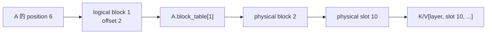
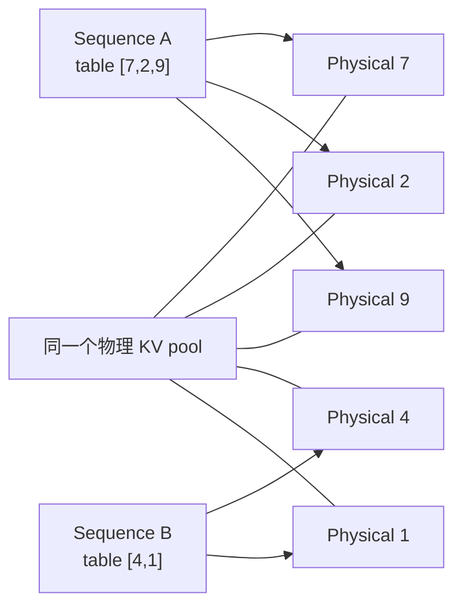
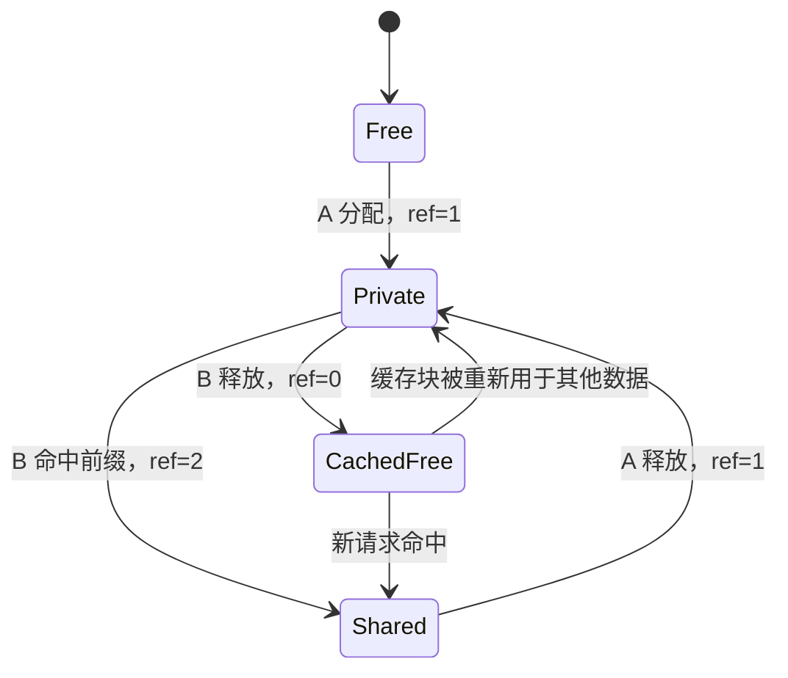

# 第 10 章：Paged KV，把一条序列放进不连续的显存块

假设两条请求同时到达服务端：

```text
请求 A：当前 37 token，最多可能生成到 4096 token
请求 B：当前 11 token，最多也可能生成到 4096 token
```

最直接的 KV cache 管理方式，是按最大长度分别预留连续空间。这样寻址简单，却在请求刚开始时就为 A、B 各保留 4096 个位置。真实长度如果远小于上限，大部分显存始终没有存放有效 K/V；如果不预留而在每次增长时重新申请连续空间，又可能需要搬运全部历史缓存。

问题的根源不是 Attention 公式，而是一个在线系统事实：请求的最终长度事先未知，请求还会以不同时间到达和结束。

Paged KV 的做法，是把“token 位置连续”和“显存地址连续”拆开：

```text
逻辑上：sequence 的 token 仍按 0, 1, 2, ... 排列
物理上：固定大小的 KV block 可以来自显存池的任意位置
映射层：每条 sequence 的 block table 负责地址翻译
```

本章沿着 A、B 两条请求的生命周期，建立从逻辑 token 到物理 slot 的完整模型，再对照课程工程中的 [BlockManager](../../../course_vllm/engine/block_manager.py) 和 [PagedKVCache](../../../course_vllm/engine/paged_kv_cache.py)。重点不是记住“分页”这个名字，而是理解每一次分配、写入、共享和释放怎样改变系统状态。

## 10.1 连续预留浪费在哪里

先看一个缩小的例子。假设每个请求最大长度是 16，目前 A 有 9 个 token，B 有 5 个 token。

按最大长度预留：

```text
A: [#########.......]  9 个有效位置，7 个空位
B: [#####...........]  5 个有效位置，11 个空位
```

两条请求共占 32 个位置，只有 14 个位置有效。这里的空位不能轻易交给别的请求，因为它们位于 A、B 各自预留的连续区域内，并且可能在未来 decode 时被使用。

如果只按当前长度申请，则 A 从 9 增长到 10、11、12……时，需要找到更大的连续区域，或者依赖内存分配器原地扩展。高并发下，请求不断加入和释放，空闲空间会散成大小不同的洞。即使总空闲量足够，也未必存在一个足够大的连续区间。

固定大小 block 改变了分配单位。假设 `block_size=4`：

```text
A 长度 9  -> 3 blocks -> 12 slots
B 长度 5  -> 2 blocks ->  8 slots
```

只需分配 20 个位置，最后一个 block 分别浪费 3 个 slot。请求继续增长时，只有跨过 block 边界才申请新块，不必搬动已有 K/V。

Paged KV 没有消灭浪费，而是把难处理的“大块连续预留与外部碎片”，换成可控的“尾块内部碎片与映射元数据”。

## 10.2 五个对象不能混用

分页寻址涉及五个不同对象。把它们都简称为“block”是最常见的理解障碍。

### Logical token position

Token 在某条 sequence 中的位置。A 的第 6 个 token 和 B 的第 6 个 token 都可以叫 position 6，但它们属于不同 sequence。

### Logical block

将逻辑位置按 `block_size` 分组：

```text
logical_block = position // block_size
```

### Offset in block

Token 在逻辑块内的位置：

```text
offset = position % block_size
```

### Physical block

KV pool 中真正拥有存储空间的块，由一个整数 ID 标识。Logical block 2 不必存入 physical block 2。

### Physical slot

物理块中的具体 token 位置：

```text
slot = physical_block * block_size + offset
```

注意 logical block 只在一条 sequence 内有意义，而 physical block 来自整个缓存池。两条 sequence 可以映射到不同 physical block，也可能因共享前缀而指向同一个 physical block。

## 10.3 用 position 6 完成一次地址翻译

设：

```text
block_size = 4
A.block_table = [7, 2, 9]
```

这个表表示：

```text
A 的 logical block 0 -> physical block 7
A 的 logical block 1 -> physical block 2
A 的 logical block 2 -> physical block 9
```

现在读取 A 的 position 6：

```text
logical_block  = 6 // 4 = 1
offset         = 6 % 4  = 2
physical_block = A.block_table[1] = 2
physical_slot  = 2 * 4 + 2 = 10
```



如果 kernel 直接把 position 6 当作物理 slot 6，程序可能仍能读取一块合法显存，却读到其他请求或其他逻辑位置的数据。分页错误不一定越界；它可能产生形状正确、数值错误的 Attention 输出，因此更难发现。

课程实现中的 `slot_mapping` 正是上述公式：

```python
def slot_mapping(self, seq_id: int, positions: list[int]) -> list[int]:
    table = self.tables[seq_id]
    slots = []
    for position in positions:
        if position < 0 or position >= table.length:
            raise IndexError(...)
        block_index = position // self.block_size
        block_offset = position % self.block_size
        slots.append(
            table.block_ids[block_index] * self.block_size + block_offset
        )
    return slots
```

这段代码短，但它定义了 BlockManager 与实际 K/V tensor 之间最重要的契约。

## 10.4 Block table 为什么属于 sequence

考虑：

```text
A.block_table = [7, 2, 9]
B.block_table = [4, 1]
```

A 和 B 都有 logical block 0，但分别映射到 physical block 7 和 4。映射不能只按 logical block 建一个全局表，因为“第 0 个逻辑块”必须先回答“属于哪条 sequence”。



每张表还必须记录当前有效长度。最后一个 block 往往没有填满，Attention 只能读取 `0..length-1` 对应的 slot，不能把尾部未写入位置当作历史 token。

在课程工程中，`BlockTable` 保存：

```python
@dataclass(slots=True)
class BlockTable:
    block_size: int
    block_ids: list[int]
    owned_block_ids: set[int]
    length: int
```

`block_ids` 给出逻辑到物理的顺序，`length` 给出有效 token 边界，`owned_block_ids` 则用于区分本 sequence 私有块和复用的共享块。

## 10.5 Prefill 分配与 Decode 增长是同一条规则

长度为 (L) 的 sequence 需要：

```text
required_blocks = ceil(L / block_size)
```

如果 `L=9`、`block_size=4`，需要三个 block：

```text
logical block 0: positions 0..3
logical block 1: positions 4..7
logical block 2: position 8，有 3 个空 slot
```

Prefill 一次建立初始长度，Manager 从 free list 取出三块并生成 table。Model backend 再把每层 K/V 写入这些物理位置。

Decode 并不是每生成一个 token 就分配一次。如果当前长度为 7，新 token 占 position 7，仍落在已有 logical block 1 的 offset 3；如果当前长度为 8，新 token 占 position 8，才需要 logical block 2 和一个新物理块。

课程实现把规则集中在 `ensure_capacity`：

```python
required = ceil(new_length / block_size)
missing = required - len(table.block_ids)

for _ in range(missing):
    block_id = self._allocate_fresh_block()
    table.block_ids.append(block_id)
    table.owned_block_ids.add(block_id)
```

这样 prefill 和 decode 不需要各写一套分配逻辑。它们只是在不同时间请求不同的 `new_length`。

## 10.6 BlockManager 管所有权，PagedKVCache 管数据

这两个类容易被混为一谈。

`BlockManager` 维护元数据：

```text
free_block_ids
seq_id -> BlockTable
physical block -> ref_count
prefix hash -> physical block
```

它回答“谁可以使用哪些 slot”，但不计算也不保存 K/V 数值。

`PagedKVCache` 才拥有 tensor：

```text
key_cache:
[num_layers, num_blocks * block_size, num_kv_heads, head_dim]

value_cache:
[num_layers, num_blocks * block_size, num_kv_heads, head_dim]
```

以一个很小的配置为例：

```text
num_layers  = 2
num_blocks  = 8
block_size  = 4
num_kv_heads = 2
head_dim    = 8
```

每个 K 或 V tensor 的 shape 是 `[2, 32, 2, 8]`。中间的 32 不是某条 sequence 的最大长度，而是整个物理池拥有的 slot 总数。

写入时，PagedKVCache 先问 Manager 得到 slots，再执行 scatter：

```python
slots = self.block_manager.slot_mapping(seq_id, positions)
self.key_cache[layer_id, slots] = key_tokens
self.value_cache[layer_id, slots] = value_tokens
```

教学版的 `get_dense` 会按逻辑顺序收集 slots，再 `index_select` 成连续 K/V，便于和 reference 对齐。生产级 Paged Attention 通常直接在 kernel 内根据 block table 读取，避免额外构造完整 dense 中间 tensor。

分页因此改变了地址获得方式，却不改变 Attention 的数学语义。对于同一条逻辑 K/V 序列，dense 与 paged 实现应产生容差内一致的输出。

## 10.7 碎片从哪里转移到哪里

内部碎片是已经分配给请求、但未存放有效 token 的尾部 slot：

```text
allocated_slots = number_of_blocks * block_size
wasted_slots    = allocated_slots - current_length
```

对 length 17：

| block size | blocks | allocated slots | wasted slots | table entries |
| ---: | ---: | ---: | ---: | ---: |
| 16 | 2 | 32 | 15 | 2 |
| 8 | 3 | 24 | 7 | 3 |
| 4 | 5 | 20 | 3 | 5 |

小 block 减少尾部浪费，却让 block table 更长，分配、hash、引用计数和 kernel 间接寻址次数更多。大 block 降低元数据开销，却增加短请求的内部碎片。

外部碎片则是总空闲空间足够，但被切成无法满足连续大块申请的小洞。固定大小 block 让所有空闲块可互换，大幅减轻这种问题。

因此“Paged KV 没有碎片”是错误说法。更准确的判断是：它用固定粒度的内部碎片和元数据成本，换取更灵活的物理分配与更小的连续预留。

## 10.8 两条请求怎样共享完整前缀

许多请求拥有相同 system prompt。设 `block_size=4`：

```text
A tokens: [1,2,3,4,5,6,...]
B tokens: [1,2,3,4,9,...]
```

第一个完整 block `[1,2,3,4]` 可以复用。A、B 的 block table 都指向同一个 physical block，而分叉后的 token 使用各自的新块。

课程实现按完整 block 计算链式 hash。当前 block 的 hash 同时依赖前一个 prefix hash，避免“局部 token 相同但更早前缀不同”被误认为同一状态。

为什么只缓存完整 block？因为共享半个块后，另一半由谁写入会变得复杂。完整块可以在共享期间保持只读，分叉从新块开始，不需要在同一个物理块内管理“前半共享、后半私有”。

共享带来新的所有权问题。若 physical block 7 同时被 A、B 引用：

```text
ref_count[7] = 2
```

A 结束时只能减到 1，不能把它归还为可覆盖的普通空闲块。B 结束后引用数归零，这块才不再被活跃 sequence 使用。



当前教学实现会保留已释放完整前缀块的 token hash，使后来的请求仍可能命中；分配新块时优先使用没有缓存内容的 free block。它没有实现完整的 LRU、租户隔离或显存压力下的生产级 eviction。

## 10.9 Prefix key 为什么不能只看原始字符串

KV 是模型内部状态。能够共享，至少要求参与状态计算的条件一致：

```text
token IDs 和顺序
model / adapter identity
position 与 RoPE 配置
KV dtype 和 layout
可能影响输入表示的多模态信息
```

只 hash 原始文本并不充分。Chat template 或 tokenizer 不同，文本相同也可能产生不同 token；模型权重不同，即使 token 相同，K/V 也完全不同。

课程实现为了突出核心机制，只对 token block 和 prefix hash 建 key。这是教学近似，不应外推为跨模型、跨租户安全的缓存协议。

## 10.10 容量不足时，谁做决定

当 free block 不足，BlockManager 只能报告事实：

```text
需要 missing 个 block，当前只有 free 个
```

Scheduler 再决定等待、抢占、淘汰可缓存块或拒绝请求。内存管理器不应偷偷覆盖仍被引用的块，因为那会把容量问题变成静默数值错误。

还要区分理想接口性质与当前代码能力。普通 `ensure_capacity` 会先检查 `missing > num_free_blocks`，因此在循环分配前即可失败。但教学版的前缀缓存分配逐块进行，尚未提供完整事务回滚：如果一个很长请求在中途耗尽 block，已经取得的块和新建 table 需要额外清理。

这不是分页原理的要求，而是当前实现边界。生产实现通常需要预检查、事务式提交或异常回滚，保证失败后 free list、table、hash index 和 refcount 仍一致。把这一点写入设计，比假定“抛异常就天然原子”更重要。

## 10.11 怎样证明分页实现正确

分页系统的错误常常不会崩溃，所以测试要验证状态不变量，而不只是最终 shape。

### 地址不变量

对任意有效 position：

```text
logical_block < len(block_table)
slot = block_table[logical_block] * block_size + offset
0 <= slot < num_blocks * block_size
```

使用 `[7,2,9]` 这类非顺序 table 比使用 `[0,1,2]` 更容易发现绕过映射的错误。

### 容量不变量

每个活跃 table 的块都有正引用；每个可普通分配的 free block 引用数为 0；同一 block 不能在 free list 中重复出现。

### 生命周期不变量

释放一个共享者只能减少引用，不能破坏其他 sequence；最后一个引用释放后，容量统计必须恢复。不同释放顺序应得到同样的最终状态。

### 数值不变量

给每个逻辑 position 写入可识别的 K/V，经 paged 地址读取后，逻辑顺序必须与 dense reference 一致。进一步把同一 Q 与两种 K/V 表示送入 Attention，输出应在容差内一致。

### 边界集合

```text
length = 0
length = 1
length = block_size - 1
length = block_size
length = block_size + 1
```

这些值分别覆盖空表、首 slot、尾块最后一项、恰好填满和跨块增长。随机长序列不能替代这些有目的的边界。

## 10.12 Paged Attention 付出了什么代价

连续 K/V 可以从基址按 stride 读取。Paged Attention 每跨一个逻辑块，就要查询 block table 并计算物理地址。它还需要维护 table、length、refcount、hash 和 free list。

因此单看一次 load，分页寻址不会比连续寻址更便宜。收益来自系统层面：

- 不按最大长度为每条请求预留连续大区间；
- 请求跨块增长时不搬运已有历史 K/V；
- 请求结束后固定大小块可立即组合给其他请求；
- 完整前缀块可以在多请求间共享；
- 更高的有效容量可能允许更多并发 sequence。

是否最终改善吞吐和延迟，取决于节省的显存和增加的并发能否覆盖寻址与元数据成本。这也是为什么 block size 必须结合请求长度分布、Attention kernel 和 SLO 选择，不能只看碎片率。

## 章末小结

Paged KV 的核心是地址解耦：sequence 保持逻辑顺序，物理 KV 存入固定大小 block，block table 在两者之间翻译。BlockManager 管所有权与容量，PagedKVCache 管实际数值，Attention kernel 消费映射后的历史状态。

理解这一机制时，应始终同时看三本账：

1. **地址账**：position 最终映射到哪个 physical slot；
2. **所有权账**：哪个 sequence 独占或共享哪个 block；
3. **容量账**：有效 token、已分配 slot、内部碎片和元数据各是多少。

这三本账一致，分页只改变布局而不改变数学；任何一本账出错，都可能产生难以定位的静默错误。

## 思考题

1. `block_size=8`、`block_table=[5,1,7]` 时，position 18 对应哪个 physical slot？
2. 两条 sequence 的 logical block 0 为什么可以映射到不同物理块？
3. 长度从 15 增长到 16 和从 16 增长到 17，哪一步需要新 block？为什么？
4. 对长度分布 `[1, 7, 8, 9, 31]`，分别计算 block size 4 和 8 的内部碎片。
5. 为什么使用 `block_table=[0,1,2]` 的测试可能漏掉实现错误？
6. 共享前缀块为什么需要引用计数？只记录 owner set 是否也可以？
7. 当前教学实现的 prefix key 缺少哪些生产环境上下文？
8. 为什么分配函数抛出异常不自动意味着状态具有事务性？
9. Paged Attention 数学结果不变，性能却可能变化，变化来自哪些系统因素？
10. 如果 block size 减半，至少列出两项收益和三项成本。

## 延伸阅读

- vLLM PagedAttention 与 KV cache manager 的设计资料。
- 工程源码：[block_manager.py](../../../course_vllm/engine/block_manager.py)、[paged_kv_cache.py](../../../course_vllm/engine/paged_kv_cache.py) 与 [paged attention CUDA 接口](../../../course_vllm/kernels/cuda_ops.py)。
