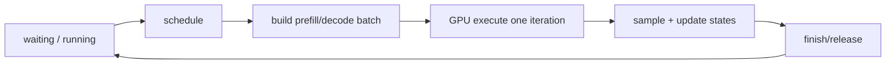
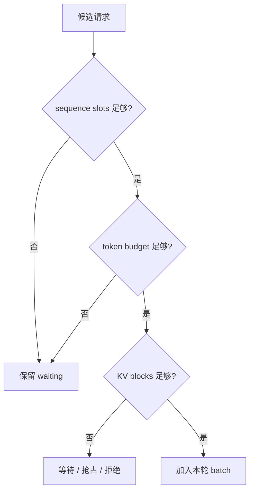
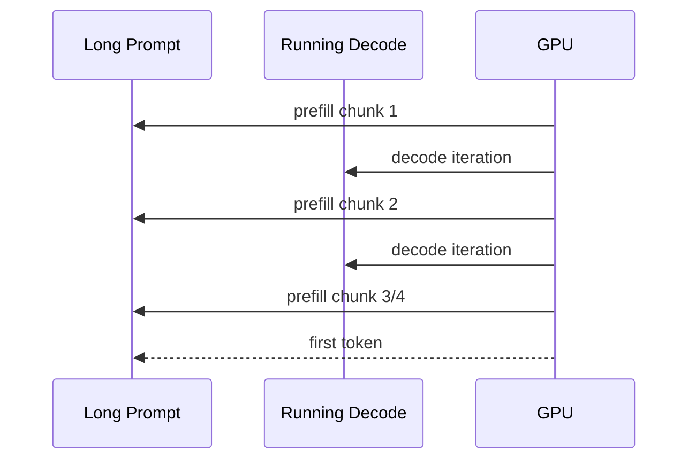

# Week 11：Continuous Batching，GPU 下一轮该算谁

## Fixed Batch 为什么不适合逐 Token 生成

图像分类中，一批图片通常执行一次模型就全部完成。LLM 请求却有不同 prompt 长度和输出长度：

```text
A: prompt 128，输出 4
B: prompt 2048，输出 64
C: prompt 32，输出 8
```

如果 A/B/C 组成固定 batch，必须等 B 生成 64 token 后整批结束。A 在第 4 轮完成，后面 60 轮都留下空位；C 也长期等待 B。

Continuous batching 的核心是把“batch 生命周期”从整条请求缩短到一次模型迭代：

```text
每轮重新选择 sequence
完成的立即退出
新请求可以进入后续轮次
```

这样 GPU 不是一次接管某批请求直到全部完成，而是不断执行调度器给出的下一步工作。

---

## 一、Iteration-Level Scheduling

一次迭代通常包含：

1. 调度器查看 waiting/running；
2. 根据预算选择 prefill/decode 工作；
3. BlockManager 确认 KV 容量；
4. Backend 执行一个 batch step；
5. Sampler 产生 token；
6. 更新每条 sequence；
7. 释放 finished，进入下一轮。



迭代边界是重新组织 batch 的机会，也是调度开销出现的位置。

## 二、Waiting 与 Running

### Waiting

已经进入系统，但尚未完成可运行 prefill 的请求。Chunked prefill 时，也可能包含只处理了部分 prompt 的 sequence。

### Running

已经拥有运行状态和 KV，通常正在 decode，或在 chunked prefill 中已占用部分资源。

### Finished

达到 EOS/stop/length/cancel，离开调度并释放资源。

生产系统可能还有 swapped、preempted 等队列。名称不重要，关键是每个状态回答：

```text
是否占 KV？
下一轮能否执行？
还欠多少 prefill token？
恢复需要什么成本？
```

## 三、调度器面对三种预算

### Sequence Budget

```text
max_num_seqs
```

限制一轮或运行集合最多多少 sequences。

### Token Budget

```text
max_num_batched_tokens
```

限制本轮处理的 token 总数。Prefill 请求可能贡献数百/数千 token；decode sequence 通常贡献 1。

### KV Capacity

即使 token budget 允许，本轮工作也可能需要新 KV blocks。BlockManager 必须确认容量。



只设置 max batch size 无法保护系统，因为 8 个 8k prompt 与 8 个 decode token 成本完全不同。

## 四、Prefill 与 Decode 为什么互相干扰

Prefill 可能一次处理长 prompt，耗时较长；decode 每个 sequence 只有一个 token，但用户希望稳定地看到输出。

优先 prefill：

- 新请求更快开始，TTFT 可能改善；
- 大 prefill 可能让 running 请求长时间没有新 token，TPOT 恶化。

优先 decode：

- 正在回答的用户更流畅；
- 新请求可能长期等不到 prefill，TTFT 恶化。

调度策略是在新用户与正在生成用户之间分配 GPU 时间，没有脱离 workload/SLO 的绝对最优。

## 五、Head-of-Line Blocking

FIFO waiting：

```text
L: 8192-token prompt
S1: 64-token prompt
S2: 32-token prompt
```

若 L 必须一次完整 prefill，S1/S2 会被队首长任务阻塞。这叫 head-of-line blocking。

可以采取：

- chunked prefill；
- 长短任务分队列；
- size-aware scheduling；
- admission/length limit。

但短任务优先也可能让长任务饥饿，需要 aging 或公平性约束。

## 六、Chunked Prefill 怎样工作

设长 prompt 4096 tokens，本轮 token budget 1024。可以拆成四个 chunk：

```text
iteration 1: prefill 0..1023
iteration 2: prefill 1024..2047
iteration 3: prefill 2048..3071
iteration 4: prefill 3072..4095，得到首 token
```

每轮之间可穿插 decode：



### Chunked Prefill 需要新增状态

```text
prompt_len
num_computed_prompt_tokens
remaining_prefill_tokens
已写入的 KV blocks
```

下一 chunk 的 position 和 KV 写入必须从正确 offset 继续。

### 代价

- 更多调度/launch 次数；
- 可能降低单次 GEMM 规模；
- 状态管理更复杂；
- TTFT 可能因被切开而增加；
- 但 decode stall 和尾延迟可能改善。

作者的 [chunked-prefills](https://zhuanlan.zhihu.com/p/710165390) 从 Orca iteration scheduling、selective batching 到 Sarathi-Serve 逐步解释这种权衡。

## 七、Selective Batching 的概念

不同请求可能在不同阶段，甚至同一 Transformer block 的算子是否适合合批也不同。

Iteration-level scheduling 决定“哪些 sequences 本轮参与”；selective batching 进一步考虑某些计算可以合并、某些状态操作需独立。

课程不实现完整生产 selective batching，但要避免把 continuous batching 简化为“把 token 拼起来调用一次模型”。Batch metadata 还需描述：

```text
每条 sequence 的阶段
token positions
context lengths
block tables
sampling 参数
```

## 八、一轮调度的简化算法

```python
budget = max_batched_tokens
batch = []

# 先保护 running decode 的节奏
for seq in running:
    if budget >= 1 and kv_can_append(seq):
        batch.append(decode_one_token(seq))
        budget -= 1

# 再使用剩余预算接纳 prefill
for seq in waiting:
    chunk = min(seq.remaining_prompt, budget)
    if chunk > 0 and kv_can_reserve(seq, chunk):
        batch.append(prefill_chunk(seq, chunk))
        budget -= chunk

execute(batch)
update_states()
release_finished()
```

这只是教学策略。调换 prefill/decode 顺序、加入优先级、prefix hit 和公平性后会得到不同结果。

## 九、Preemption

当 running sequences 的下一步需要更多 KV，而 free blocks 不足，调度器可能抢占某些请求。

### Recompute

释放被抢占请求 KV，恢复时重新 prefill 已有 tokens。

优点：不需 CPU swap 空间；缺点：重复计算，长 context 代价高。

### Swap

把 KV 换到 CPU/其他层级，恢复时拷回。

优点：避免重算；缺点：占 host memory 和传输带宽，状态复杂。

### 选择谁被抢占

可能依据：

```text
到达时间
优先级
已完成工作
释放 block 数
恢复成本
SLO 风险
```

简单“后来先抢占”便于教学，但不是普适最优。

## 十、抢占必须保持状态一致

Recompute 策略下：

```text
释放 KV
保留 token history
状态回到 waiting/prefill
num_computed_tokens 重置或按可复用前缀设置
```

Swap 策略下：

```text
保留 logical block table 语义
记录 CPU block location
恢复前完成 H2D
```

最危险的是释放了物理 block，却让 sequence 仍以 running 状态 decode，导致读取已被其他请求复用的 KV。

## 十一、Batching Window 与模型调度不是同一层

HTTP batching queue 可能在第一个请求到达后等待 2 ms，收集 sampling 参数兼容的请求，再调用 engine batch API。

这叫请求收集窗口。Continuous batching 则在模型每个迭代重组 sequences。

可能出现：

```text
HTTP 层把 8 个请求一起交给 engine
但 engine 内仍固定 batch 到全部结束
```

这不是完整 continuous batching。

也可能 HTTP 请求分别到达，engine scheduler 在后续迭代将它们合并。

窗口太短合批不足；太长直接增加 TTFT。需要用指标而非经验口号选择。

## 十二、Streaming 并发也不证明内部合批

多个 SSE 连接同时打开，只说明 server 能并发维护连接。若单 model worker 逐请求串行生成，GPU 仍没有 token-level batching。

证据应来自：

- 每轮 batch size；
- total batches 与 requests；
- profiler 中 batch shape；
- scheduler trace。

## 十三、公平性与 Starvation

只优先短请求可改善平均延迟，却可能让长请求永远等待；只优先 running decode 可能让新请求 TTFT 无界增长。

常见公平机制：

```text
FIFO 基线
等待时间 aging
每租户配额
优先级加权
最大连续 decode 轮数
prefill 保留预算
```

公平性不是让所有请求延迟相同，而是在定义的策略下避免某类请求无限饥饿。

## 十四、Prefix Cache 如何影响调度

两个 prompt 长度相同，但一个 prefix hit 90%，另一个完全 miss。它们所需 prefill 工作不同。

Cache-aware scheduling 可以：

- 优先安排共享前缀请求；
- 把 prefix hit 纳入 token budget；
- 减少重复 prefill。

但过度追求 cache locality 也可能破坏 FIFO 公平性。Week 15 再深入。

## 十五、怎样评价调度策略

至少同时观察：

```text
output tokens/s
TTFT p50/p99
TPOT/ITL p50/p99
goodput
queue depth
average/max batch size
preemption count
KV utilization / fragmentation
```

例：策略 X tokens/s 提高 20%，但 p99 TTFT 从 2s 变 15s，不能简单写“性能提升 20%”。应说明适合/不适合的 SLO 和 workload。

## 十六、测试 Scheduler 不应依赖真实大模型

调度逻辑可用小 sequence metadata 测试：

- FIFO 顺序；
- token budget；
- max sequences；
- chunk progress；
- finished removal；
- preemption 状态与 block release；
- 不产生 starvation 的有限场景。

模型集成测试再验证 schedule metadata 能被 backend 正确执行。

## 十八、常见误区

### Continuous batching 就是异步 HTTP

不是。它要求模型迭代级动态重组 sequences。

### Batch 越大越好

更大 batch 可能提高吞吐，也会增加等待和尾延迟，并受 token/KV 预算限制。

### Decode 每条只需 1 token，应永远优先

这样新请求可能无法 prefill，TTFT 无限增长。

### Chunk 越小越公平

过小 chunk 增加调度/launch 开销并降低大 GEMM 效率。

### 抢占后只改队列即可

还必须处理 KV ownership、computed progress 和恢复方式。

### Streaming 客户端同时输出就证明合批成功

连接并发不等于模型 batch。

## 十九、学完本周，应能回答

1. Fixed batching 为什么浪费短请求完成后的槽位？
2. 一次 iteration 包含哪些步骤？
3. Sequence、token 和 KV 三种预算为何都需要？
4. Prefill 优先与 decode 优先分别影响什么指标？
5. Chunked prefill 增加哪些状态和代价？
6. Recompute 与 swap preemption 如何权衡？
7. HTTP batching window 与 continuous batching 有何区别？
8. 如何证明模型内部真实合批？
9. Cache-aware scheduling 为什么可能损害公平性？

## 参考与素材说明

- 猛猿：[vLLM V1：Scheduler](https://zhuanlan.zhihu.com/p/1908153627639551302)
- 猛猿：[vLLM 旧版 Scheduler 深入解析](https://zhuanlan.zhihu.com/p/692540949)
- 猛猿：[chunked-prefills](https://zhuanlan.zhihu.com/p/710165390)
- 课程工程：Scheduler、HTTP batching 与 Week 11 grader

正文、调度算例、图示和实验均为课程原创组织。课程 scheduler 是 teaching approximation；生产系统还需处理多租户、分布式 worker、复杂抢占和长期公平性。
