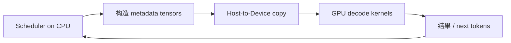
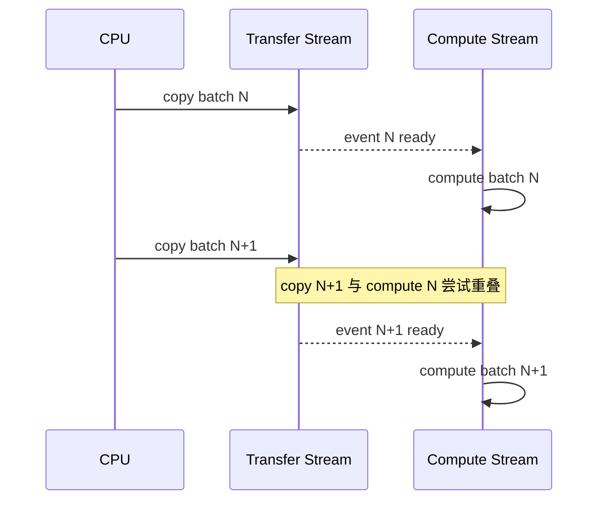
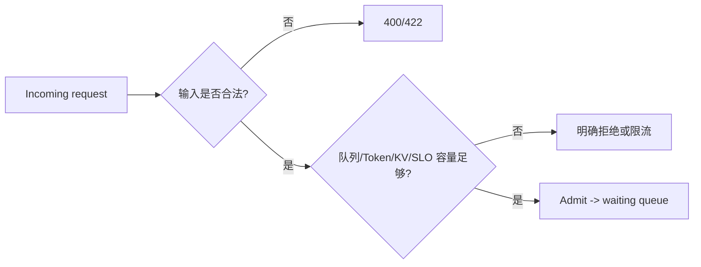

# Week 12：模型之外，数据怎样及时到达 GPU，系统怎样避免过载

## Kernel 已经很快，GPU 为什么仍然会空

Decode step 可能只运行很短的 kernel。若 CPU 还在构造 token tensor、等待队列锁、执行同步 copy，GPU 就会在两轮之间出现空洞。

另一类问题更隐蔽：服务轻载时一切正常，高并发时仍继续接受所有请求，队列越来越长，TTFT 和超时率一起上升。GPU 看起来一直满载，用户却几乎都无法满足 SLO。

Week 12 处理的是模型算子之外的两类系统问题：

```text
数据路径：CPU 准备与 H2D copy 能否和 GPU 计算重叠？
容量保护：系统是否只接纳自己真正能及时完成的请求？
```

---

## 一、一次 Decode 前 CPU 还要做什么

即使模型权重和 KV cache 已在 GPU，每轮仍可能由 CPU 准备：

```text
最新 token IDs
position IDs
context lengths
block tables
slot mappings
sampling metadata
batch offsets
```

这些小 tensor 要传到 GPU。单次 bytes 不大，但 decode 轮数多、kernel 短，固定开销占比会上升。



优化不能只看某次 copy 几微秒，而要看它是否造成 GPU 等待，以及在每 token 循环中累计多少。

## 二、Pageable Memory 与 Pinned Memory

普通 CPU 内存由操作系统虚拟内存管理，物理页可能被换出或移动。GPU DMA 传输需要稳定的物理页地址。

从 pageable memory 向 GPU copy 时，runtime 可能先把数据复制到临时 pinned staging buffer，再发起 DMA：

```text
pageable host
-> pinned staging copy
-> DMA to device
```

如果源本身是 pinned/page-locked memory：

```text
pinned host
-> DMA to device
```

这能减少 staging，并为真正异步 H2D 提供条件。

### Pinned Memory 的代价

页锁定内存不能被系统随意换出。过量使用会减少操作系统可灵活管理的内存，影响整机性能。

因此不应对所有临时对象无界 `pin_memory()`。更合理的是：

- 复用有限 pinned buffers；
- 对高频 H2D 输入使用；
- 监控 host memory；
- 在 workload 下验证收益。

## 三、non_blocking=True 为什么不保证重叠

```python
gpu = cpu.to("cuda", non_blocking=True)
```

想要 copy 与 compute 重叠，至少需要：

```text
源内存适合异步 DMA（通常 pinned）
copy 使用可并发的 stream
硬件支持 copy/compute overlap
数据依赖允许重叠
没有紧随其后的 host/device 同步
目标 tensor 生命周期正确
```

若 copy 后 default stream 立刻使用该 tensor，就必须等待数据就绪。代码调用是 non-blocking 的，不代表 GPU 时间线发生有效重叠。

## 四、CUDA Stream 是有序队列

同一 stream 中操作按提交顺序执行：

```text
copy A -> kernel A -> copy B
```

不同 streams 的操作可以并发，但前提是没有依赖且硬件资源允许。

### Transfer Stream

将下一 batch H2D 放到 transfer stream，同时 compute stream 处理当前 batch：



### Event 建立依赖

Compute stream 不能猜 copy 何时完成。Transfer stream 记录 event，compute stream 等待该 event，再使用 tensor。

这不是全设备同步，只建立必要的局部依赖。

## 五、双缓冲为什么有用

只有一个输入 buffer 时，CPU/GPU 可能要等当前计算结束才能安全覆盖。双缓冲：

```text
buffer 0: compute batch N
buffer 1: prepare/copy batch N+1
```

下一轮交换角色。

但 buffer 复用必须等上一次使用完成。过早覆盖会产生数据竞争；过度同步又失去 overlap。事件和明确 ownership 是关键。

## 六、怎样证明重叠真的发生

不能用“代码创建了 stream”作为证据。Nsight Systems 时间线应看到：

```text
H2D batch N+1 的时间区间
与 compute batch N 的 kernel 区间重叠
```

还应比较：

- GPU idle gap；
- H2D 总时间；
- decode step 间隔；
- 端到端 TPOT/tokens/s。

Timeline 有重叠但端到端没提升也可能合理：copy 原本占比很小，或瓶颈转移到其他部分。

## 七、隐式同步从哪里出现

常见同步源：

```text
torch.cuda.synchronize()
读取 GPU tensor 标量到 CPU，例如 .item()
某些打印/异常检查
跨 stream 缺少正确事件导致保守等待
同步 D2H copy
allocator 或库内部边界
```

不能因为 `.item()` 代码短就忽略它。若在每个 decode step 读取 GPU 标量，CPU 可能每轮等待 GPU。

Sampling token ID 最终可能需要回 CPU 发给客户端，但可以考虑异步路径、批量处理或避免无关中间标量同步。

## 八、Admission Control 解决什么

Admission control 在请求进入昂贵执行路径前判断是否接纳。

没有保护时：

```text
到达率 > 服务率
-> queue 持续增长
-> TTFT 增长
-> 客户端超时但后端继续算
-> 无效工作增加
-> goodput 下降
```

这叫 overload collapse 的一种表现：系统很忙，却很少完成仍有价值的请求。



拒绝一部分请求，可能让更多已接纳请求在 SLO 内完成。

## 九、只限制 Queue Length 为什么不够

100 个请求可能都是 20-token prompt，也可能都是 20k prompt。成本差异巨大。

更合理的 admission 信号包括：

```text
tokenized prompt length
requested max output tokens
当前 queue token work
KV free blocks
running contexts
用户/租户配额
估计完成时间与 deadline
```

### Cost Estimate

简单估算：

```text
prefill_cost ~ prompt_tokens
future_kv_reservation ~ prompt_tokens + max_output_tokens
decode_work ~ max_output_tokens
```

它不精确，但比字符数和请求数更接近真实资源。

## 十、字符限制与 Token 限制

入口可以先用 `max_prompt_chars` 快速拒绝极端请求，避免对巨大文本做昂贵 tokenization。但字符与 token 非一一对应。

更完整流程：

```text
cheap char/body limit
-> tokenize
-> exact token limit
-> capacity estimate
```

中文、代码和罕见字符的 token/char 比不同，不能只依赖字符限制做容量规划。

## 十一、Queue Limit 与 Backpressure

当 queue 满时，服务应快速返回明确错误，而不是无限等待。上游可以重试、退避或转移流量。

Backpressure 意味着下游容量信息向上游传播：

```text
服务拒绝/限流
-> gateway 降低发送或排队
-> client exponential backoff
```

若所有层都无限排队，只会把延迟藏到不同位置。

### 错误语义

- 请求格式/长度非法可返回 4xx；
- 临时容量不足常用 429 或 503，具体取决于 API 契约；
- 可提供 retry hint，但不能保证重试一定成功。

## 十二、Admission 与 Scheduler 的边界

Admission 决定“是否进入系统”；scheduler 决定“已进入的请求下一轮谁执行”。

Admission 使用容量估计，scheduler 使用实时 token/KV budget。两者需要共享统计，但不能互相替代。

如果 admission 过松，scheduler queue 爆炸；过严则 GPU 空闲、吞吐损失。阈值应由 workload 与 SLO 校准。

## 十三、一次只打开一个优化开关

如果同时启用：

```text
pinned memory
transfer stream
chunked prefill
cache-aware scheduling
```

性能变化后无法归因。建议阶梯实验：

```text
baseline
baseline + pinned
baseline + pinned + transfer stream
再单独评估 scheduler 开关
最后组合
```

每步保持模型、prompt 分布、并发、输出长度和端口环境一致。

## 十四、为什么短负载可能看不到收益

若 kernel 计算 100 ms、copy 只需 0.2 ms，即使完全隐藏 copy，理论收益也很小。

若 decode kernel 每步 0.3 ms、CPU 准备和 copy 0.2 ms，重叠可能更明显。

优化是否有用取决于比例。没有显著提升不是实验失败，只要能用 timeline 解释原因。

## 十五、投机解码的方向性理解

Draft model 先提出多个 token，target model 一次验证。接受多个候选时，减少 target model 串行 decode 次数。

收益取决于：

```text
draft 速度
接受率
一次提出 token 数
target verification 效率
两套 KV 的维护成本
```

它不是小模型替代大模型；最终分布由验证算法保障。低接受率或 draft 不够快时可能无收益。

## 十六、量化的方向性理解

量化降低权重、activation 或 KV dtype：

```text
bf16 -> fp8/int8/int4
```

可能收益：

- 权重/KV 容量降低；
- HBM bytes 减少；
- 特定硬件算力更高。

代价：

- scale/zero-point metadata；
- dequant 或专用 kernel；
- 数值误差；
- shape/硬件支持限制。

量化不是修改 dtype 字符串即可获得加速。必须有匹配 kernel，并评估质量与端到端性能。

## 十七、正确性与并发安全

### Pinned Buffer 生命周期

Copy 完成前不能释放或覆盖 host buffer。

### Stream 依赖

Compute 必须等待对应 batch copy event，不能错误等待别的 batch，也不能漏等。

### Admission 原子性

多个请求同时检查 queue size 时，检查与入队需要一致；否则都看到“还有一个空位”并同时进入。

### 取消

已在 transfer 的请求取消后，buffer/event 仍需安全回收；已 admission 但未执行应从 queue 移除。

## 十九、常见误区

### non_blocking=True 就一定异步重叠

还需要 pinned source、合适 stream、依赖和硬件支持。

### Pinned memory 越多越好

它占用不可换出的 host 资源，应限制和复用。

### 创建两个 stream 就会并行

数据依赖、资源竞争和同步可能让时间线仍串行。

### 拒绝请求说明系统不可靠

受控拒绝能保护已接纳请求和 goodput，比所有请求超时更可靠。

### Queue size 能准确表达负载

LLM 请求成本与 token 长度和输出预算强相关。

### 优化后差异小就是实现无效

也可能该 workload 中目标开销占比很小，需要 timeline 和更敏感 workload 判断。

## 二十、学完本周，应能回答

1. Pageable H2D 为什么可能经过 pinned staging？
2. 真正异步 copy 需要哪些条件？
3. Stream 与 event 分别解决什么？
4. 双缓冲怎样让 copy N+1 与 compute N 重叠？
5. 哪些操作可能造成隐式同步？
6. Admission control 为什么能提高过载 goodput？
7. 为什么 queue length 不足以估计 LLM 负载？
8. 如何做逐项 ablation 并证明 overlap？
9. 投机解码和量化的收益分别依赖什么？

## 参考与素材说明

- 猛猿：[chunked-prefills](https://zhuanlan.zhihu.com/p/710165390)
- 猛猿：[DistServe](https://zhuanlan.zhihu.com/p/706761664)
- 猛猿：[Megatron TP 计算通信 overlap](https://zhuanlan.zhihu.com/p/16594218518)
- 课程工程：pinned/transfer paths、HTTP admission 与 Week 12 grader

正文、时间线、过载推导和实验均为课程原创组织。系统优化结论只对给定 workload 和硬件成立，必须通过 ablation 与 timeline 验证。
