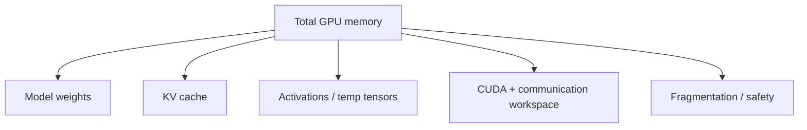
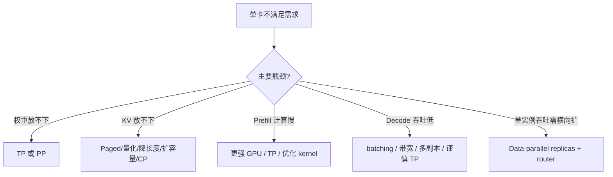
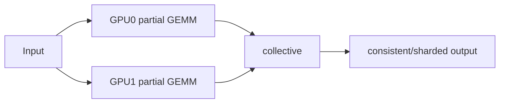

# 第 13 章：推理服务的显存容量、通信成本与并行策略

## 13.1 容量约束与性能约束

一张 24GB GPU，模型权重 2GB，能否说还剩 22GB 全部给 KV cache？不能。

运行时还需要：

```text
临时 activation
CUDA/cuBLAS workspace
通信 buffer
allocator metadata 与碎片
图捕获/编译缓存
安全余量
```

即使显存完全够用，也可能算力、带宽、网络或延迟不满足。容量规划必须分别回答：

1. 能否放下？
2. 能否在目标 SLO 内完成？
3. 瓶颈是权重、KV、计算还是通信？
4. 加卡解决哪一项，又引入什么新成本？

---

## 13.2 GB、GiB 与数据类型字节数

厂商常用十进制 GB：

```text
1 GB = 10^9 bytes
```

系统工具也可能显示二进制 GiB：

```text
1 GiB = 2^30 bytes
```

24 GB 约等于 22.35 GiB。报告中混用会产生约 7% 偏差。课程公式统一标明单位，不把 `GB` 和 `GiB` 当成同义词。

## 13.3 GPU 显存账本



### 13.3.1 模型权重

粗估：

```text
weight_bytes = num_parameters * bytes_per_parameter
```

7B bf16：

```text
7e9 * 2 bytes ≈ 14 GB
```

量化后不能简单按 0.5 bytes/param 结束，还要加 scale、zero point、packing 对齐和某些未量化层。

### 13.3.2 Activation

推理不保存训练反向所需全部 activation，但 prefill 中间 tensor、logits、attention workspace 仍会随 batch/sequence 变化。

### 13.3.3 Workspace、Allocator 与碎片

库算法、NCCL、CUDA Graph、allocator 都可能占用额外空间。规划时使用可用比例和 safety margin，最后以实测峰值校准。

## 13.4 KV Cache 的单 Token 成本

```text
kv_bytes_per_token
= layers * 2 * kv_heads * head_dim * kv_dtype_bytes
```

例：

```text
layers=28
kv_heads=8
head_dim=128
bf16=2 bytes
```

```text
28*2*8*128*2
= 114,688 bytes
= 112 KiB/token
```

4,096-token 请求：

```text
112 KiB * 4096 = 448 MiB
```

16 个满长请求：

```text
448 MiB * 16 = 7 GiB
```

GQA/MQA 减少 `kv_heads`，因此显著影响 serving 容量。

## 13.5 从 KV Budget 到 Token Slots

假设按 GiB：

```text
total_gpu        = 24 GiB
usable_ratio     = 0.90
weight_memory    = 2 GiB
runtime_reserved = 2.2 GiB
```

可用预算：

```text
usable = 24 * 0.90 = 21.6 GiB
kv_budget = 21.6 - 2 - 2.2 = 17.4 GiB
```

单 token 112 KiB：

```text
token_slots ≈ 17.4 GiB / 112 KiB
≈ 162,900 tokens
```

这与课程 planner 的典型结果约 162,896 slots 同量级，block 向下取整会造成少量差异。

## 13.6 Paged KV 的 Block 取整

Block size=16：

```text
block_bytes = 16 * 112 KiB = 1.75 MiB
num_blocks = floor(17.4 GiB / 1.75 MiB)
token_slots = num_blocks * 16
```

Block 取整意味着不能使用最后不足一个 block 的预算；请求最后 block 还有内部碎片。因此公式结果是理想上界附近，不是可承诺并发。

## 13.7 从 Token Slots 到请求并发

如果每个请求都满 2048：

```text
full_length_concurrency = floor(162896/2048) = 79
```

但真实 active context 不同：

```text
请求 A: prompt 128 + 已生成 8
请求 B: prompt 2048 + 已生成 200
请求 C: prompt 32k + 已生成 10
```

并发上限由所有活跃 context 总和决定。还要给未来 decode 增长留余量，否则接纳时能放下，生成中途 OOM。

### 13.7.1 长度分布与平均值风险

用平均 context 估算期望容量可以，但 admission 还需考虑尾部分布和最大请求。少量 32k 请求可能吞掉大量 blocks。

## 13.8 容量上限与 SLO 并发上限

显存允许 79 个满长请求，不代表能同时以可接受 TPOT 服务 79 个请求。

### 13.8.1 Prefill 计算约束

目标：prompt throughput 与 TTFT。长序列 attention、GEMM 和 queueing 共同限制。

### 13.8.2 Decode 带宽与迭代约束

目标：output tokens/s 与 TPOT。每轮 batch、KV bandwidth、kernel launch 和通信共同限制。

容量报告必须配服务 benchmark：

```text
能放下多少
在何种并发下满足 TTFT/TPOT SLO
```

SLO 内的最大并发通常低于纯显存上限。

## 13.9 多卡扩展的触发条件



多副本常被忽略：如果单卡能放下模型，增加独立 replicas 可以分摊不同请求，避免每 token 层内通信。它不加速单请求，却可能是提高总吞吐的更简单方案。

## 13.10 Collective 通信的延迟与带宽模型

NCCL collective 在多个 ranks 之间执行数据交换或归约；不同 collective 的输出分布不同，不能都用“同步”一词代替。[NCCL collective operations](https://docs.nvidia.com/deeplearning/nccl/user-guide/docs/usage/collectives.html)给出了 all-reduce、all-gather、reduce-scatter 与 all-to-all 的 buffer 语义。

通信时间常简化为：

```text
T_comm ≈ latency_alpha + bytes / effective_bandwidth
```

小消息受固定 latency 主导，大消息更受带宽主导。Decode batch 小、每 token collective 频繁时，alpha 很重要；大 prefill tensor 更可能受带宽影响。

理论链路带宽不是 effective bandwidth。拓扑、collective 算法、竞争和软件栈都会降低实际值。

## 13.11 Tensor Parallelism

TP 把同一层矩阵分到多卡。[Megatron-LM](https://arxiv.org/abs/1909.08053)通过 column-parallel 与 row-parallel 线性层组织 Transformer 层内的张量并行，并在相邻算子之间安排必要 collective。本节使用同一分解说明推理通信，不直接采用论文的训练吞吐结果。

### 13.11.1 Column-Parallel Linear

按输出列切 weight：

```text
W = [W0 | W1]
GPU0: Y0 = XW0
GPU1: Y1 = XW1
```

若下一操作可消费分片，暂时无需 gather；否则要 all-gather。

### 13.11.2 Row-Parallel Linear

按输入维切：

```text
X=[X0|X1]
Y_partial0=X0W0
Y_partial1=X1W1
Y=sum(partials)
```

需要 all-reduce 或 reduce-scatter。



### 13.11.3 TP 的容量与计算收益

- 每卡权重下降；
- 单层计算分摊；
- 可能降低单请求计算时间。

### 13.11.4 TP 的 Collective 代价

- 层内频繁 collective；
- 多卡同步，慢卡拖累；
- decode 每 token 每层通信；
- KV/head 切分与 kernel 更复杂。

Batch 很小、模型不大时，计算缩短可能抵不过通信。

## 13.12 TP 通信量的规划估算

若某 all-reduce tensor 有：

```text
num_elements = batch_tokens * hidden_size
bytes = elements * dtype_bytes
```

Ring all-reduce 每 rank 传输量近似与：

```text
2*(p-1)/p * bytes
```

同量级。具体算法与拓扑会改变。

Decode 每轮 `batch_tokens≈active_sequences`；单次 tensor 不一定大，但 layers*steps 次数非常多。应同时报告 bytes/token 和 collectives/token。

## 13.13 Pipeline Parallelism

PP 按层切 stage。[GPipe](https://arxiv.org/abs/1811.06965)使用 micro-batches 填充按层划分的流水线；在线推理的到达过程、decode 迭代和延迟目标与其训练场景不同，因此这里只采用 stage 与 bubble 的基本模型：

```text
GPU0: layers 0..11
GPU1: layers 12..23
```

优点：权重分摊直观，层内一般不需要 TP 式 all-reduce。

代价：

- stage 间 activation 传输；
- 请求必须依次经过 stage；
- microbatch 少时 pipeline bubble；
- 在线动态请求使流水填充更难。

### 13.13.1 Pipeline Bubble 的近似估算

对 p 个 stages、m 个 microbatches，简单流水效率近似：

```text
efficiency ≈ m / (m + p - 1)
bubble_fraction ≈ (p - 1)/(m + p - 1)
```

当 m 很小，bubble 大。Decode 延迟敏感时不能照搬训练中大量 microbatch 的结论。

## 13.14 TP 与 PP 的组合

大模型可能：

```text
TP=4, PP=2 -> 8 GPUs
```

每个 PP stage 内 4 卡做 TP。它同时引入层内 collective 与 stage 间传输，容量增加但调试和性能模型更复杂。

选择前先问单一策略是否足够，避免为了“多种并行都用上”而组合。

## 13.15 Expert Parallelism

MoE 的专家分布到不同 GPU。Router 决定每 token 去哪些 experts。

典型路径：

```text
tokens
-> all-to-all dispatch
-> local expert compute
-> all-to-all combine
```

EP 收益来自只激活少数 experts，并分摊专家权重。风险：

- token 路由不均导致负载失衡；
- all-to-all 对网络要求高；
- 小 batch 时每 expert token 太少；
- capacity/drop/padding 策略影响质量和效率。

Dense 模型没有 experts，不能因 EP 听起来先进就使用。

## 13.16 Context Parallelism

CP 把 sequence/context 维分到多卡，用于超长上下文。

Attention 需要跨 shard 获得足够 K/V 或传递在线 softmax 状态。Ring Attention 是一种让 Q 与 K/V block 轮转、逐步累积结果的思路。

收益：

- 分摊长序列 activation/KV；
- 每卡处理部分 context。

代价：

- attention 期间跨卡通信；
- 算法和 load balance 复杂；
- 短 context 通信可能不划算。

CP 与 TP 切分维度不同，可以组合，但通信拓扑更复杂。

## 13.17 训练并行与推理并行的目标差异

训练：

- 有 forward/backward；
- optimizer states/gradients 占显存；
- microbatch 较稳定；
- 更关注训练吞吐。

推理：

- 无 backward/optimizer；
- KV cache 是动态大户；
- 请求长度和到达不稳定；
- TTFT/TPOT/p99 重要；
- decode 每 token 通信延迟敏感。

训练中高效的并行配置，不一定适合在线推理。

## 13.18 量化对容量模型的影响

### 13.18.1 权重量化

减少 weight memory，可能让单卡放下模型或给 KV 留更多空间。要加入 scale/metadata 与 workspace。

### 13.18.2 KV 量化

直接减少 bytes_per_token，提高 slots，但需支持低精度 cache read/write 和 attention kernel，并验证长上下文质量。

### 13.18.3 容量下降不保证延迟下降

如果硬件/内核不能高效执行量化格式，dequant 成本可能抵消带宽收益。

## 13.19 容量与并行规划流程

### 13.19.1 模型、硬件与 Workload 输入

```text
GPU memory/topology/bandwidth
model params/layers/heads/head_dim
weight/KV dtype
block size
prompt/output length distributions
target concurrency
TTFT/TPOT SLO
```

### 13.19.2 静态显存

权重 + 已知 runtime reserved。

### 13.19.3 KV Budget

使用可用比例和 safety，计算 block/token slots。

### 13.19.4 Workload 并发

用 active context 分布而非只用 max length，给增长留余量。

### 13.19.5 单卡 Benchmark

在目标长度/并发测 TTFT、TPOT、tokens/s、peak memory。

### 13.19.6 瓶颈分类

容量、compute、HBM、queue 或 network。

### 13.19.7 候选方案

降长度/并发、paged/quantized KV、更大 GPU、replicas、TP/PP/CP/EP。

### 13.19.8 通信估算与实测

计算 bytes/collectives/bubble，再用实际拓扑 benchmark 校准。

### 13.19.9 安全余量

避免按理论 100% 运行；考虑流量波动、碎片和版本变化。

## 13.20 容量与并行结论的适用边界

### 13.20.1 标称 24 GB 不等同于 24 GiB 可分配空间

单位不同，runtime 也不能全部用于 tensor。

### 13.20.2 Token Slots 不能直接换算承诺并发

还需考虑碎片、增长、workspace 和 SLO。

### 13.20.3 多卡不保证降低延迟

计算减少同时引入 collective/stage 通信，小 batch decode 可能更慢。

### 13.20.4 单卡容量不足不只存在 TP 方案

也可 PP、量化、更大显存，具体取决于层/矩阵与目标。

### 13.20.5 Replica 与 TP 解决不同扩展目标

若模型单卡可放下，多 replicas 可能避免层内通信并获得更好总吞吐。

### 13.20.6 训练并行配置不能直接移植到推理

推理 KV、动态请求和 latency 约束不同。

### 13.20.7 理论链路带宽不是 Collective 有效带宽

Collective 算法、拓扑和竞争会降低实际性能。

## 13.21 本章小结与思考题

1. 显存账本包含哪些项目？
2. GB/GiB 混用会造成什么问题？
3. 如何从模型结构计算 KV bytes/token？
4. Token slots 为什么不等于请求数？
5. 显存上限与 SLO 并发上限有何区别？
6. TP 的 column/row parallel 分别需要什么通信？
7. Decode 为什么对 TP 固定通信延迟敏感？
8. PP bubble 与 microbatch/stages 有何关系？
9. EP/CP 分别适合什么模型或 workload？
10. 何时多 replicas 比 TP 更合理？

## 13.22 参考资料

- Shoeybi 等：[Megatron-LM: Training Multi-Billion Parameter Language Models Using Model Parallelism](https://arxiv.org/abs/1909.08053)
- Narayanan 等：[Efficient Large-Scale Language Model Training on GPU Clusters Using Megatron-LM](https://arxiv.org/abs/2104.04473)
- Huang 等：[GPipe: Efficient Training of Giant Neural Networks using Pipeline Parallelism](https://arxiv.org/abs/1811.06965)
- NVIDIA：[NCCL Collective Operations](https://docs.nvidia.com/deeplearning/nccl/user-guide/docs/usage/collectives.html)
- vLLM：[Parallelism and Scaling](https://docs.vllm.ai/en/latest/serving/parallelism_scaling/)
- 课程工程：[`capacity_planner.py`](../../../course_vllm/benchmarks/capacity_planner.py) 与 [`week13_capacity_planning_template.md`](../../reports/week13_capacity_planning_template.md)

本章中的通信公式是规划近似，最终结论必须用目标硬件拓扑、collective 库和真实 workload 校准。
