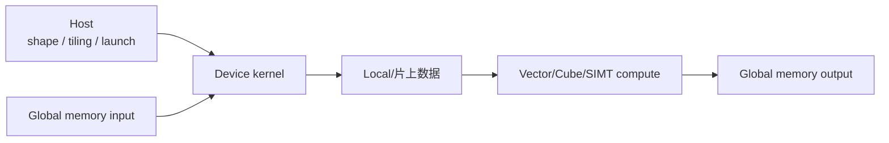
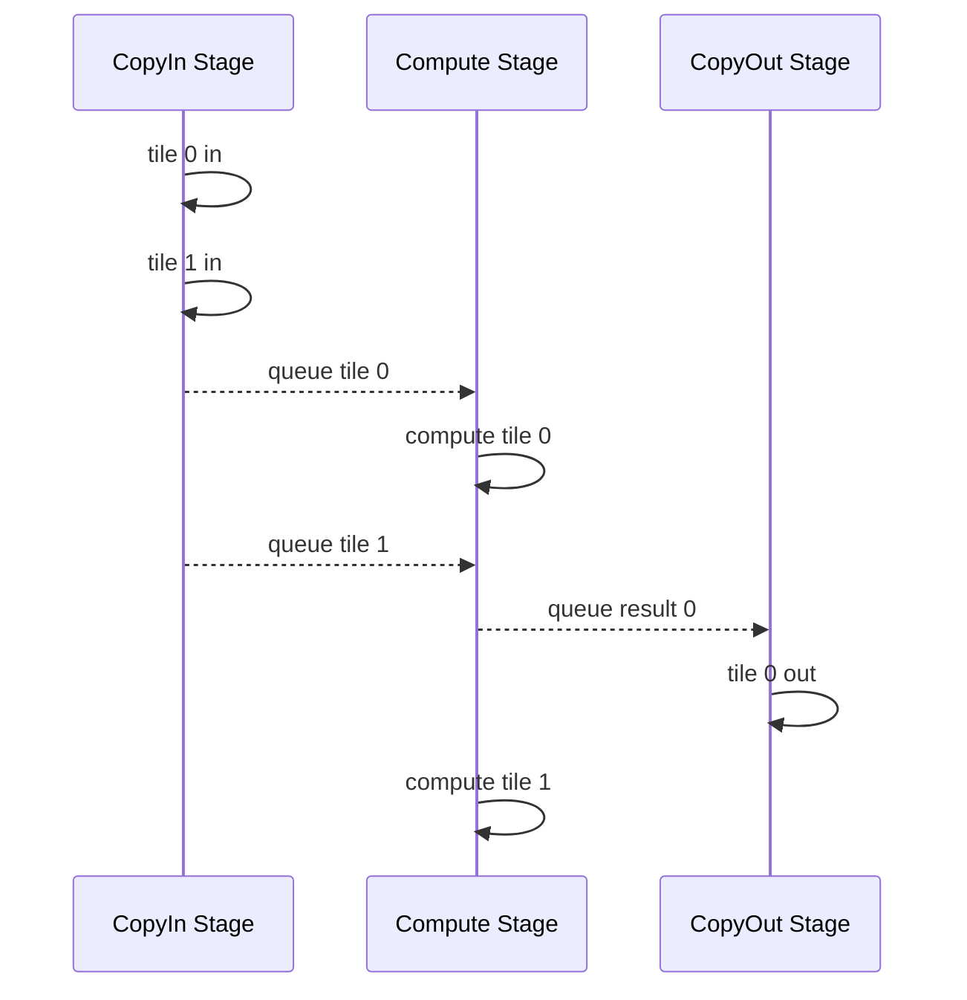

# 第 14 章：从 CUDA 到 Ascend C，换硬件后哪些原则不变

## 本周为什么不强行要求写一个 Ascend Kernel

课程当前没有统一可用的 Ascend 硬件、CANN 版本和 CI。若只复制一段无法运行的样例，学生既不能验证正确性，也不能确认性能与工具链，反而会把“看过 API”误当成“掌握算子开发”。

因此本章只完成 CUDA 与 Ascend C 的编程模型对照，阅读官方 Add 样例的数据流，不安排 Ascend 硬件实验，也不要求运行或提交 Ascend C kernel。等课程统一确定硬件、CANN 版本和验收环境后，再单独开发实验任务书。

这不是降低技术要求，而是坚持前面课程建立的原则：没有可复现环境，就不伪造运行结论。

官方文档会持续演进。当前 CANN 文档已同时组织 SIMD、SIMT、TPipe/TQue、静态 Tensor 和多层级 API 等路径，具体名称和支持范围必须以选定版本为准。[Ascend C 8.5 文档结构](https://www.hiascend.com/document/detail/zh/CANNCommunityEdition/850/opdevg/Ascendcopdevg/atlas_ascendc_map_10_0004.html)、[CANN 9.0 编程指南](https://www.hiascend.com/document/detail/zh/canncommercial/900/programug/Ascendcopdevg/atlas_ascendc_10_0060.html)。

---

## 一、数学不变，执行表达会变

同一个 Add：

```text
z[i] = x[i] + y[i]
```

换成不同加速器后，仍要解决：

```text
数据位于哪里
任务怎样切分
谁执行每一份
片上存储怎样复用
怎样同步
怎样写回
怎样编译、注册、调用和验证
```

CUDA 的 grid/block/thread 不是并行计算的唯一表达。学习新后端时，应该寻找这些本质问题的答案，而不是机械寻找 `blockIdx` 的同名替代品。

## 二、Ascend、CANN 与 Ascend C

### Ascend

华为昇腾 AI 处理器与相关硬件产品体系。

### CANN

面向昇腾的异构计算软件栈，包含编译、运行时、算子库、开发和调试工具等。

### Ascend C

面向自定义算子开发的 C/C++ 风格编程体系。官方文档将其描述为通过编译器和运行时在昇腾 AI 处理器上执行的算子开发语言/接口体系，并提供多层级 API 与调试能力。[官方简介](https://www.hiascend.com/document/detail/zh/CANNCommunityEdition/800alpha001/devguide/opdevg/ascendcopdevg/atlas_ascendc_10_0001.html)

关系可以粗略类比：

```text
CUDA C++ / CUDA runtime  <-> Ascend C / CANN runtime
cuBLAS/cuDNN             <-> 对应的 CANN 高性能算子能力
```

类比只用于建立入口，不能推断 API、线程模型或存储层次一一对应。

## 三、异构程序仍分 Host 与 Device

两类平台都需要 host 侧：

- 解析 shape/dtype；
- 决定 tiling 和并行份数；
- 准备输入输出；
- 编译/加载/启动算子；
- 处理错误与同步。

Device/kernel 侧：

- 取得本核/线程负责的数据；
- 完成搬运和计算；
- 写回结果。



## 四、CUDA 的线程层次回顾

```text
grid -> blocks -> threads -> warps
```

线程用内置索引定位元素；同 block 共享 shared memory，并用 block-level 同步；global memory 由所有线程访问。

高性能实现围绕：

```text
coalescing
shared-memory tiling
warp communication
occupancy/registers
async copy/pipeline
```

## 五、Ascend C 不应简化成“另一套 Thread API”

Ascend C 文档提供不同抽象层次。常见教学路径强调：

- 把大任务切到多个核；
- GlobalTensor 表达全局存储中的数据；
- LocalTensor 表达片上 Local Memory 中的数据；
- 数据先搬入 Local，计算后再搬出；
- TPipe/TQue 组织流水与缓冲；
- API 可分基础与高阶层次。

官方 API 概述说明计算 API 基于 Local Memory 数据工作，数据需要从 Global Memory 搬入、计算、再搬回；API 包含标量、向量、矩阵与高阶 Softmax/Matmul 等能力。[编程 API 概述](https://www.hiascend.com/document/detail/zh/CANNCommunityEdition/80RC2alpha002/devguide/opdevg/ascendcopdevg/atlas_ascendc_10_0017.html)

较新文档还包含 AI Core SIMD、SIMT 及混合编程。课程不把任何一种路径宣称为所有版本唯一模型，而是要求学生记录实际 CANN 版本和所选范式。

## 六、GlobalTensor 与 LocalTensor 的直觉

可以把它们理解为不同存储层级的 tensor view：

```text
GlobalTensor：全局内存中的大数组
LocalTensor：当前核片上内存中的 tile/buffer
```

典型算子：

```text
CopyIn:  Global -> Local
Compute: Local 上调用计算 API
CopyOut: Local -> Global
```

这与 CUDA “global -> shared/register -> compute -> global”在优化原则上相似：高带宽全局存储容量大，片上存储容量小但适合复用。具体硬件、API 和同步方式不同。

## 七、TPipe 与 TQue 为什么出现

算子通常处理很多 tiles。若严格串行：

```text
copy tile 0
compute tile 0
write tile 0
copy tile 1
...
```

搬运和计算单元可能互相等待。

流水思路：



TPipe 管理流水中的内存/阶段，TQue 用队列连接阶段并表达同步。官方流水编程资料强调把单核处理拆为多个流水任务，通过 Queue 通信同步，并由 Pipe 管理通信内存。[流水编程范式](https://www.hiascend.com/document/detail/zh/canncommercial/700/operatordev/Ascendcopdevg/atlas_ascendc_10_0012.html)

不应把 TQue 只理解为普通 CPU 容器；它服务于设备流水与依赖。

## 八、Tiling 解决什么

输入可能远大于单核片上存储。Tiling 决定：

```text
使用多少核
每核负责哪段
每段分多少 tile
tile 长度与对齐
尾核/尾块怎样处理
是否双缓冲
```

Host tiling 根据 shape、dtype 和平台信息计算参数，kernel 根据 tiling data 执行。

这与 CUDA 选择 grid/block/tile size 的本质问题相通，但 Ascend C 的 host/kernel 接口和 API 不同。

## 九、用 Add 对照两套思路

### CUDA 教学版

```text
每 thread 负责 idx
global load x/y
add
global store z
```

### Ascend C 教学思路

```text
把总长度分到多个核
每核循环多个 tiles
CopyIn x/y 到 LocalTensor
调用 Add 计算 API
CopyOut 到 GlobalTensor
```

官方 Add 样例正是用来验证核数、tile、搬运、计算和写回的完整链路。[Add 样例说明](https://www.hiascend.com/document/detail/zh/canncommercial/700/operatordev/Ascendcopdevg/atlas_ascendc_10_0018.html)

两者结果都应对齐同一个 CPU/PyTorch reference。

## 十、边界与对齐仍是核心问题

总长度不一定整除核数或 tile length。需要处理：

```text
尾核实际长度
尾 tile
内存对齐
padding 是否影响输出
CopyIn/Out 合法范围
```

这与 CUDA 的 boundary guard 同源：并行划分通常向规则 tile 对齐，真实数据边缘不规则。

## 十一、Double Buffer 的共同思想

两组 local buffers：

```text
buffer 0 compute tile n
buffer 1 copy tile n+1
```

搬运与计算尝试重叠。CUDA 可用不同 stage、async copy/shared-memory pipeline；Ascend C 可通过流水队列与缓冲表达。

性能收益同样需要 profiler 证据，不能因代码使用 double buffer 就宣布重叠成功。

## 十二、Vector 与 Cube 的方向性理解

昇腾 AI Core 面向不同计算形态提供相应执行能力。Elementwise、reduction 与矩阵计算的适合路径不同。

课程只要求理解：

```text
Add/RMSNorm/softmax 更接近向量/归约问题
Matmul 需要矩阵计算能力与专门 tiling
```

不要把 CUDA thread-level 实现逐句翻译到 Ascend C；应重新选择适合目标硬件的 API 和数据流。

## 十三、基础 API 与高阶 API

官方文档区分基础 API 和高阶 API：

- 基础 API 更直接抽象硬件能力；
- 高阶 API 封装常用算法，如 Matmul、Softmax，提升开发效率与兼容性。

使用高阶 API 不等于“不懂底层”；工程上应在控制力、维护成本、兼容性和性能之间选择。

## 十四、编译、注册与调用链

工程化自定义算子通常包含：

```text
kernel 实现
host tiling / shape 推导
算子原型与注册
编译打包
部署或加载
框架/Runtime 调用
UT/ST/性能调优
```

不同 CANN 版本和调用方式会变化。官方资料提供 Kernel Launch、AscendCL/ACLNN、框架适配等路径。课程若未来落地，必须先固定：

```text
CANN version
hardware model
OS/toolchain
launch integration
reference/test commands
```

## 十五、CPU/NPU 调试与上板验证

官方资料提供 CPU 侧模拟/孪生调试等能力，适合先检查功能；但 CPU 模拟通过不等于 NPU 性能或设备执行全部正确。

证据层次：

```text
静态编译通过
CPU 模拟 correctness
NPU 上板 correctness
真实调用链集成
Profiler 性能证据
```

无硬件时只能完成前面的部分，不应写“Ascend kernel 已验证高性能”。

## 十六、怎样对照 RMSNorm

数学：

```text
sum(x^2) -> rsqrt -> scale * weight
```

CUDA 关注：

```text
thread/warp/block reduction
shared/register
coalesced load
```

Ascend C 关注：

```text
核间 tiling
Global/Local 搬运
向量 API / reduction 组织
流水与 buffer
尾块和对齐
```

相同的是 reduction、累加精度、数据复用和边界；不同的是硬件抽象与表达工具。

## 十七、可移植的性能分析问题

无论后端，都问：

1. 算子 FLOPs 与 bytes？
2. 数据搬了几次？
3. 片上存储是否复用？
4. 搬运与计算是否重叠？
5. 划分是否负载均衡？
6. 尾块浪费多少？
7. 低精度累加是否稳定？
8. Profiler 显示瓶颈在哪？

这套问题比记忆某版 API 更持久。

## 十八、阅读官方样例时应观察什么

阅读 Add 或 RMSNorm 样例时，重点追踪 host/device 分工、核间 tiling、Global/Local 数据搬运、计算阶段、尾块边界和编译调用链。没有统一运行环境时，只讨论代码表达的机制，不根据样例推断真实性能，也不把静态阅读写成设备验证结论。

## 十九、对照表

| 问题 | CUDA 教学路径 | Ascend C 对照路径 |
| --- | --- | --- |
| 并行划分 | grid/block/thread/warp | 多核 tiling + 所选 SIMD/SIMT 范式 |
| 全局数据 | global memory tensor | GlobalTensor |
| 片上数据 | shared/register | LocalTensor/Local Memory |
| 搬运 | load/store/async copy | DataCopy/流水阶段 |
| 同步 | warp/block/event | queue/pipe/API 对应同步 |
| 计算 | CUDA C++/MMA | 基础/高阶 Vector/Matrix API |
| 编译 | host compiler + nvcc | CANN/Ascend C 编译链 |
| 调试 | sanitizer/nsys/ncu | CPU/NPU 调试与 Ascend profiler |

## 二十、常见误区

### Ascend C 是 CUDA 换一套函数名

硬件架构、并行抽象、存储和工具链不同，应重新设计数据流。

### 无 NPU 也能证明性能

只能做静态/模拟与理论分析，不能声称设备性能。

### 使用高阶 API 就没有技术含量

工程需要选择适合的抽象，并理解 tiling、数据和边界。

### 数学相同，kernel 可以直接移植

数学相同只保证目标结果一致，不保证执行映射可复用。

### 某版示例能代表所有 CANN 版本

API 和文档会演进，必须固定版本。

## 二十一、学完本周，应能回答

1. Ascend、CANN 与 Ascend C 是什么关系？
2. 为什么不能机械寻找 blockIdx 的同名替代？
3. GlobalTensor/LocalTensor 分别表达什么？
4. CopyIn/Compute/CopyOut 流水为什么需要队列与 buffer？
5. Host tiling 需要决定哪些参数？
6. CUDA 与 Ascend C Add 的共同性能问题是什么？
7. 无硬件时能提供哪些证据，不能提供哪些？
8. 哪些性能分析问题可以跨后端复用？

## 参考与版本说明

- [Ascend C 8.5 官方文档结构](https://www.hiascend.com/document/detail/zh/CANNCommunityEdition/850/opdevg/Ascendcopdevg/atlas_ascendc_map_10_0004.html)
- [Ascend C 官方编程 API 概述](https://www.hiascend.com/document/detail/zh/CANNCommunityEdition/80RC2alpha002/devguide/opdevg/ascendcopdevg/atlas_ascendc_10_0017.html)
- [官方流水编程范式](https://www.hiascend.com/document/detail/zh/canncommercial/700/operatordev/Ascendcopdevg/atlas_ascendc_10_0012.html)
- [官方 Add 实现样例](https://www.hiascend.com/document/detail/zh/canncommercial/700/operatordev/Ascendcopdevg/atlas_ascendc_10_0018.html)
- [CANN 9.0 Ascend C 编程指南入口](https://www.hiascend.com/document/detail/zh/canncommercial/900/programug/Ascendcopdevg/atlas_ascendc_10_0060.html)

本文以跨硬件原则为主，API 名称只用于建立当前文档中的概念。本章实验暂缓；未来恢复实验时必须选择同一 CANN 版本的成套资料，不混用不同版本代码。
