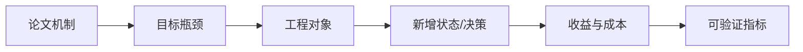
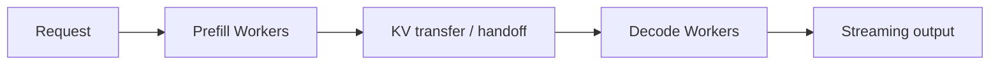
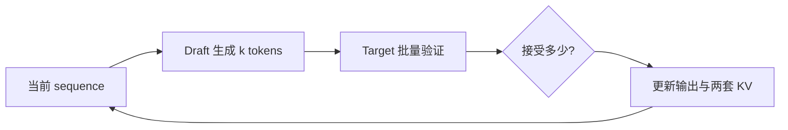

# 第 15 章：前沿 LLM Serving 机制的 Paper-to-System 分析

## 15.1 论文结论的条件与工程适用范围

论文中的性能数字只有在实验条件明确时才具有可比较性。对于“吞吐提升 2 倍”一类结论，至少需要核对：

```text
和谁比？
什么模型、硬件、长度和到达率？
满足什么 TTFT/TPOT SLO？
新增多少显存、网络和复杂度？
机制改变了 request、sequence、KV block、batch 还是 worker？
```

本章的目标不是复刻某个工业系统，而是建立把论文机制映射到既有系统结构的方法。无论新策略采用何种名称，都需要落实到状态、决策、资源和指标。

---

## 15.2 Paper-to-System 分析框架

### 15.2.1 目标瓶颈

例如重复 prefill、prefill/decode 干扰、KV 带宽、尾延迟、公平性或串行 decode。

### 15.2.2 被改变的系统对象

```text
request order
sequence state
KV block ownership
worker placement
batch composition
model execution steps
```

### 15.2.3 新增状态

Prefix hash、refcount、worker location、remaining cost、draft KV、acceptance statistics 等。

### 15.2.4 收益与新增成本

节省计算/显存/IO，可能新增通信、hash、调度、第二个模型或状态同步。

### 15.2.5 评价指标与对照组

```text
TTFT / TPOT / goodput
prefix hit rate / saved prefill tokens
KV transfer bytes/time
preemption/fairness
acceptance rate
GPU utilization / cost
```



## 15.3 Prefix Cache 的跨请求 Prefill 复用

同一 system prompt、工具说明或文档前缀会在许多请求中重复。在模型权重、位置编码、adapter 和推理配置相同的前提下，相同 token 前缀产生相同的 K/V，因而可以跨请求复用。vLLM 的自动前缀缓存以完整 KV block 为复用单位，并用“父 block 的 hash、当前 block 的 token IDs 以及额外输入标识”构造 block hash；这种设计不要求为所有前缀维护显式树结构（[vLLM Automatic Prefix Caching 设计文档](https://docs.vllm.ai/en/latest/design/prefix_caching/)）。

### 15.3.1 可复用工作量

请求 prompt 长 P，共享前缀 H：

```text
需要新 prefill tokens = P - H
reuse_ratio = H / P
```

例：8k prompt 中 6k system+document 前缀已缓存，仅需 prefill 2k。收益不仅是 token 数比例，因为 attention 复杂度和 kernel shape 也随长度变化，但 saved tokens 是可解释的第一指标。

### 15.3.2 命中条件与共享边界

至少需要：

```text
相同 token blocks
相同模型/adapter
兼容位置与 RoPE 配置
兼容 cache dtype/layout
block 尚未淘汰且内容有效
```

原始文本相同不够，必须以实际模型输入为准。

另一个容易忽略的边界是 block 粒度。若 block size 为 16，而两个请求只共享前 30 个 token，则通常只能直接命中第一个完整 block；第 17--30 个 token 所在的不完整 block 仍需按具体实现重新计算或补全。多租户系统还应把租户隔离信息纳入 hash 或 salt，避免不同安全域通过延迟差异推测对方是否访问过某一前缀。

### 15.3.3 命中率、节省 Token 与 TTFT

```text
prefix hit request ratio
cached blocks hit ratio
saved prefill tokens
TTFT reduction
cache memory overhead
eviction rate
```

Hit rate 高不一定收益高：大量只命中一个很短 block 的请求，节省工作可能很少。

## 15.4 Cache-Aware Scheduling

假设请求：

```text
A: prefix X
B: prefix Y
C: prefix X
D: prefix X
```

FIFO 顺序 A,B,C,D 可能让 X blocks 在资源紧张时被 Y 干扰或淘汰；cache-aware 可以把 A,C,D 靠近执行，提高复用。

### 15.4.1 Policy Score

可以概念化：

```text
score = saved_prefill_work
      - waiting_age_penalty
      - fairness_penalty
```

不是只按 shared-prefix 长度排序。否则没有热门前缀的请求可能饥饿。

### 15.4.2 调度器新增状态

```text
request prefix hashes
resident cached blocks
estimated reusable tokens
request age / tenant
```

### 15.4.3 Cache Locality 与公平性的联合评价

教学 demo 可用相邻共享前缀得分说明顺序有变化，但完整服务还要测：

- 实际 cache hit；
- TTFT/goodput；
- p99 等待；
- cache 内存与 eviction；
- 不同租户公平性。

## 15.5 Prefill/Decode Disaggregation

Prefill 与 decode 资源特征不同：

```text
Prefill：大矩阵、长序列、TTFT 相关
Decode：逐 token、读 KV、TPOT 相关
```

共置时，长 prefill 可能打断 decode 节奏。PD 分离把两阶段放到不同 worker 池：



### 15.5.1 阶段独立扩缩容与 SLO 隔离

- 两类 worker 可独立选 batch；
- 可使用不同并行配置或硬件；
- prefill burst 不直接占 decode iteration；
- 独立扩缩容。

### 15.5.2 路由、KV 传输与故障状态

- 请求跨 worker 路由；
- KV cache 传输；
- handoff 状态一致性；
- 两段队列与故障处理；
- worker 比例规划。

## 15.6 Prefill/Decode 分离中的 KV Transfer

Prefill 产生的全部 K/V 必须让 decode worker 可访问。

传输量近似：

```text
KV_transfer_bytes
= prompt_tokens * kv_bytes_per_token
```

沿用第 13 章的例子：若 KV 成本为 112 KiB/token，prompt 长度为 8k，则：

```text
112 KiB * 8192 ≈ 896 MiB
```

如果每请求都跨普通网络搬接近 1 GiB，传输可能吞掉分离收益。

系统可能使用高速互联、RDMA、共享存储层、按 block 流式传输或 cache locality 路由。无论方案如何，必须把 bytes 与时间计入 TTFT/资源成本。

### 15.6.1 分离收益的近似模型

共置完成时间不简单等于 prefill+decode，因为还有排队/干扰。教学估算可比较：

```text
T_colocated ≈ queue_mix + T_prefill + T_decode_with_interference
T_disagg    ≈ queue_p + T_prefill + T_transfer + queue_d + T_decode
```

只有分离减少的干扰/排队超过 transfer 与协调成本时才有收益。

[DistServe](https://www.usenix.org/system/files/osdi24-zhong-yinmin.pdf) 将 prefill 与 decode 分配到不同 GPU 集群，并以满足 TTFT、TPOT SLO 的 goodput 作为核心目标。该工作说明，PD 分离不是简单地把两个函数放到不同设备，而是同时改变资源配置、并行策略、请求路由和 KV 传输路径。

## 15.7 Prefill 与 Decode Worker 比例

若每秒到达请求的平均 prefill 工作为 `W_p`，平均 decode 工作为 `W_d`，需要分别满足两个池的服务率。

Prefill workers 太少：新请求 TTFT queue 爆炸。

Decode workers 太少：handoff 后排队，TPOT/goodput 恶化。

流量长度分布变化时，静态比例可能失效。动态扩缩容又受模型加载、KV locality 和冷启动影响。

## 15.8 Chunked Prefill 的共置折中

Chunked prefill 把长 prompt 拆成 chunks，与 decode iterations 交替或混合。[Sarathi-Serve](https://arxiv.org/abs/2403.02310) 将其用于构造较均匀的迭代，并在尾延迟约束下缓解长 prefill 对正在进行的 decode 的阻塞。

它在单 worker 池内缓解 prefill 阻塞，不需要跨 worker 传整个 KV；但仍共享 GPU 资源，不能做到两池独立配置。

```text
PD disaggregation：空间上分开 worker
chunked prefill：时间/批次上切分工作
```

两者可以组合，但不能把收益直接相加。Chunk size 过大时，单次 prefill 仍会阻塞 decode；过小时，调度次数和 kernel 启动开销上升，矩阵乘法形状也可能无法充分利用 GPU。因此 chunk size 是由延迟约束、batch token budget、模型和硬件共同决定的参数，而不是越小越好。

## 15.9 Attention/FFN Disaggregation

Decode Attention 读取历史 KV，偏带宽；FFN 是大 Linear，计算密度较高。进一步分离两类算子，试图让不同 worker/资源专注适合的工作。

本节把 Attention/FFN 分离作为一种系统设计方向，而不把它描述为已经普遍成立的最佳实践。其必要条件是：异构设备带来的算子执行收益，能够覆盖逐层 activation 传输、流水线气泡、跨设备同步和故障状态管理。若没有端到端测量，仅凭“一个 memory-bound、一个 compute-bound”不能推出分离后一定更快。

### 15.9.1 中间 Activation 传输成本

每层 Attention 与 FFN 之间需要传 activation；模型有很多层，若跨设备往返频繁，通信和同步非常复杂。

分析时要算：

```text
activation bytes per layer/token
cross-worker hops
pipeline/batching 机会
failure/state ownership
```

如果只说“Attention memory-bound，FFN compute-bound，所以分开更好”，论证不完整。

## 15.10 Token-Level Scheduling

Request-level policy 决定请求何时进入；token-level policy 每轮决定哪个 sequence 获得下一 token。

可能利用：

```text
已等待时间
已生成长度
预计剩余长度
deadline/SLO slack
KV 占用
prefix locality
```

### 15.10.1 Shortest Remaining Processing Time

Shortest Remaining Processing Time 可降低平均完成时间，但 LLM 的剩余输出长度未知。可以用用户 max_tokens、历史统计或预测模型估计，预测错误会影响公平性。

### 15.10.2 剩余工作量的近似估计

课程 demo 定义一个简化的 completion cost，优先推进预计更快完成的 sequence，再加入 aging 缓解长请求饥饿。这只是 shortest-remaining-work 思路的教学启发式，不对应某篇论文的完整机制。

Demo 的排序分数不等于完整 scheduler。生产还要结合 KV、batch shape、抢占和多租户。

## 15.11 Speculative Decoding

小 draft model 先提出 `k` 个候选，target model 一次验证。经典 speculative decoding 算法通过接受/拒绝采样和校正分布，使最终输出保持与 target model 原始采样分布一致；因此它不是以改变模型输出质量换取速度（[Fast Inference from Transformers via Speculative Decoding](https://arxiv.org/abs/2211.17192)）。工程实现必须严格遵循相应采样规则，简单地“接受两模型 argmax 相同的 token”只覆盖 greedy decoding 的一个特殊情形。



### 15.11.1 接受率与验证效率

```text
acceptance rate
accepted tokens / target step
draft latency
verify latency
target-step reduction
额外 KV memory
端到端 TPOT/goodput
```

### 15.11.2 期望收益的近似模型

如果一次 target verify 平均接受 `a` 个 tokens，而 draft+verify 时间小于 `a` 次普通 target decode，才可能加速。

接受率取决于 draft 与 target 分布接近程度、任务、temperature 和候选长度。不能只在 greedy、小样本上外推。

### 15.11.3 Draft/Target 状态一致性

被拒绝位置后的 draft KV 可能需回滚；target KV 只保留已接受与校正 token。取消、batch 和不同接受长度让状态管理更复杂。

## 15.12 MLA 与 KV 表示压缩

MLA 通过低秩潜在表示与推理时计算重组，减少需要缓存的中间表示。[DeepSeek-V2](https://arxiv.org/abs/2405.04434) 将 MLA 作为模型架构的一部分引入，因此它不是可无条件附加到任意既有 MHA/GQA 模型上的调度开关，而是模型结构、权重表示与推理 kernel 的共同改变。

分析时区分：

```text
原生模型结构是否就是 MLA
cache 存压缩还是解压表示
投影是否可吸收到权重
prefill/decode 路径是否不同
TP 下怎样切分
```

实现分析应进一步区分缓存解压后的 K/V、缓存压缩 latent，以及把部分投影吸收到查询侧计算等数据路径。这些路径在数学上可以等价，但会产生不同的 cache 容量、内存流量、计算量与张量并行通信，因此必须结合具体模型实现和 kernel 说明性能结论。

## 15.13 多机制组合中的非独立收益

```text
prefix cache + cache-aware scheduling
chunked prefill + PD disaggregation
speculative decoding + paged KV
MLA + TP
```

机制之间会相互影响。例如 prefix hit 减少 prefill，也减少 PD 需要传输的新 KV；speculative decoding 改变每轮 token 数和 KV append；chunked prefill 改变 worker 负载。

不能把各论文独立 speedup 直接相乘。必须在组合系统中重新测量。

## 15.14 前沿机制的公平对照

保持：

```text
模型与质量目标
硬件总资源
输入/输出分布
到达率
SLO
测量时长与 warmup
```

资源不等价的比较应报告成本。例如分离系统用了双倍 GPU，即使吞吐更高，也要报告 tokens/s/GPU 或 cost/request。

### 15.14.1 指标集合

```text
TTFT/TPOT/E2E p50/p99
goodput under SLO
tokens/s and tokens/s/GPU
GPU memory/utilization
network bytes
cache hit/saved tokens
fairness/starvation
error/retry
```

## 15.15 Paper-to-System 映射表

| 项目 | 要回答的问题 |
| --- | --- |
| Bottleneck | 机制针对哪段时间/资源？ |
| Object | request/sequence/block/batch/worker 中谁改变？ |
| State | 新增哪些 metadata？ |
| Decision | schedule、route、evict、verify 中哪个变化？ |
| Fast path | 命中/接受时省掉什么？ |
| Slow path | miss/reject/failure 时发生什么？ |
| Cost | 通信、显存、模型、复杂度？ |
| Metrics | 怎样证明收益且满足 SLO？ |
| Integration | 落到课程哪些模块？ |
| Gap | Demo 与生产系统差什么？ |

## 15.16 从原型机制到服务主路径

```text
真实 request metadata
与 BlockManager/cache 的一致性
并发安全
取消/错误/恢复
持续统计与 observability
多 worker RPC/transport
SLO 与多租户公平
端到端 benchmark
故障注入
```

技术论证必须说明这些能力差距，避免把演示排序策略误认为完整的工业实现。

## 15.17 前沿机制结论的适用边界

### 15.17.1 Prefix Hit Rate 与实际收益的非等价性

还要看命中 token 数、prefill 成本和 cache 开销。

### 15.17.2 PD 分离收益的成立条件

KV transfer、双队列和协调可能抵消收益。

### 15.17.3 Chunked Prefill 与 PD 分离的关系

它在共置资源中切分时间，可与分离组合。

### 15.17.4 短任务优先策略的公平性边界

可能让长请求饥饿，需要 aging/配额。

### 15.17.5 候选长度与投机解码收益

候选更长可能降低接受率、增加 draft/verify 与回滚成本。

### 15.17.6 多机制收益的不可乘性

机制共享资源并相互改变 workload，必须联合测量。

## 15.18 本章小结与思考题

1. 阅读 serving 论文时首先应映射哪五类问题？
2. Prefix cache 的 hit rate 与 saved tokens 有何区别？
3. Cache-aware scheduling 为什么需要公平性项？
4. PD 分离新增的核心成本是什么，如何估算？
5. Chunked prefill 与 PD 分离的边界是什么？
6. Token-level scheduling 为什么难以知道 remaining time？
7. 投机解码的加速由哪些指标共同决定？
8. MLA 改变的是调度还是模型/cache 数据路径？
9. Demo 推进到生产主路径还缺什么？

## 15.19 参考资料

- Kwon et al.：[Efficient Memory Management for Large Language Model Serving with PagedAttention](https://arxiv.org/abs/2309.06180)
- vLLM：[Automatic Prefix Caching 设计文档](https://docs.vllm.ai/en/latest/design/prefix_caching/)
- Zhong et al.：[DistServe: Disaggregating Prefill and Decoding for Goodput-optimized Large Language Model Serving](https://www.usenix.org/system/files/osdi24-zhong-yinmin.pdf)
- Agrawal et al.：[Taming Throughput-Latency Tradeoff in LLM Inference with Sarathi-Serve](https://arxiv.org/abs/2403.02310)
- Leviathan et al.：[Fast Inference from Transformers via Speculative Decoding](https://arxiv.org/abs/2211.17192)
- DeepSeek-AI：[DeepSeek-V2: A Strong, Economical, and Efficient Mixture-of-Experts Language Model](https://arxiv.org/abs/2405.04434)
- 课程工程：policies、cache-aware demo 与 paper-to-system 分析模板

正文、模型、图示和最小实验均为课程原创组织。前沿机制随论文与系统版本变化，报告应引用具体论文/实现版本，并明确教学近似与生产能力的差距。
