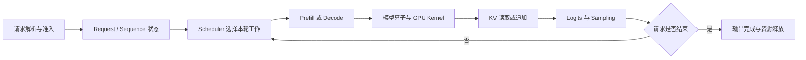
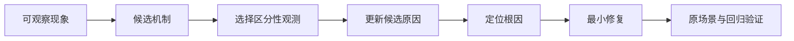

# 第 16 章：LLM Serving 系统优化的证据链与综合推理

前十五章分别讨论了模型执行、GPU kernel、KV cache、请求调度、容量规划和前沿服务机制。本章不再引入一个孤立的新算法，而是研究怎样把这些局部知识组织成可信的系统结论。

“服务能够生成文本”只说明至少有一条执行路径得到了输出。它不能单独证明自定义 kernel 被调用、分页地址映射正确、连续批处理实际发生，也不能证明某项改动提高了目标工作负载下的服务能力。系统优化的核心不是罗列实现细节，而是建立一条可检查的推理链：

```text
技术主张
-> 机制应当引起的内部变化
-> 能够观测该变化的证据
-> 端到端指标结果
-> 反例与替代解释
-> 结论成立的适用边界
```

这条链把“代码已经修改”与“系统因此得到某种性质”区分开来，也是阅读论文、分析生产事故和评价性能优化时共同需要的方法。

---

## 16.1 系统主张的基本结构

技术主张可以写成四元组：

```text
Claim = (对象, 性质, 条件, 比较基准)
```

例如，“Paged KV 提升吞吐”缺少条件和比较基准，无法验证。更完整的表述是：

> 在单张 24 GiB GPU、指定模型与输入/输出长度分布下，相对于为每个请求预留最大上下文长度的连续 KV 分配器，分页按需分配使满足同一 TTFT/TPOT SLO 的并发请求数增加。

其中：

- 对象是分页 KV 管理机制；
- 性质是 SLO 约束下的并发能力增加；
- 条件包括硬件、模型、长度分布和 SLO；
- 比较基准是最大长度预留的连续分配器。

若缺少其中一项，结论很容易被无意扩大。例如，显存占用下降不自动推出吞吐提高；在请求到达率很低时，即使可容纳更多请求，也未必形成更大的 batch。

## 16.2 一次请求的端到端依赖链

LLM Serving 的局部机制通过同一条请求路径发生联系：



每条边都对应一种契约。

| 边界 | 关键契约 | 典型错误 |
| --- | --- | --- |
| API -> Request | token、sampling 参数与取消标识正确 | 输入截断或参数语义不一致 |
| Request -> Scheduler | 状态可判定且不会重复入队 | 请求丢失、重复调度、饥饿 |
| Scheduler -> Model | batch metadata 与 sequence 一致 | position、length、slot 错位 |
| Model -> KV | 写入位置与逻辑 token 对应 | 覆盖其他请求或越界 |
| KV -> Attention | block table 恢复正确历史顺序 | 跨 block 读取错误 |
| Sampling -> State | 新 token、长度和终止条件同步更新 | 多生成、少生成或状态滞后 |
| Finish -> Allocator | 所有独占资源恰好释放一次 | 泄漏、重复释放或悬空引用 |

端到端问题往往表现于链条末端，根因却位于更早的契约。例如输出 token 错误可能来自 sampling，也可能来自 KV slot 映射；显存持续增长可能来自 allocator，也可能是取消路径没有触发 release。系统分析应沿数据和状态依赖定位，而不是仅按目录查找代码。

## 16.3 六类证据及其不可替代性

一个完整系统结论通常需要数值正确性、路径分派、系统集成、性能、容量和可靠性六类证据。它们回答不同问题，不能互相替代。

### 16.3.1 数值正确性证据

数值正确性说明实现与定义一致。常见比较包括：

```text
CUDA kernel       vs PyTorch reference
cached decode     vs full-prefix forward
paged attention   vs 按逻辑顺序 gather 后的 dense attention
本地模型执行      vs Transformers logits
```

浮点运算需要同时给出容差、dtype、shape 和归约规模。仅报告 `allclose=True` 不够，因为宽松容差可能掩盖错误；仅报告最大绝对误差也不够，因为接近零的参考值需要相对或混合误差判断。PyTorch 的[数值准确性说明](https://docs.pytorch.org/docs/stable/notes/numerical_accuracy.html)指出，浮点加法与乘法不满足实数运算中的结合律，不同计算顺序和批处理形式可能产生位级差异。因此正确性判定应以算法允许的误差为基础，而不是要求所有后端逐位相同。

### 16.3.2 路径分派证据

路径分派证据回答“目标实现是否真正执行”。假设服务配置为 `kernel_impl=auto`，自定义 CUDA 扩展失败后退回 PyTorch，端到端结果仍可能正确。此时 correctness test 证明的是 fallback，而不是 CUDA kernel。

较强的分派证据包括：

```text
关闭 fallback 的 strict 模式仍能执行
profiler timeline 出现预期 kernel 名称
运行时计数器记录目标实现的调用次数与 shape
故意破坏或禁用目标实现后测试按预期失败
```

最后一种属于负向对照。它验证测试确实能够区分“目标路径存在”与“不存在”，可以减少测试只覆盖外围代码的风险。

### 16.3.3 系统集成证据

集成证据说明组件在真实生命周期中满足契约。一个 paged attention 函数在离线张量上正确，不代表它能处理请求加入、跨 block 追加、抢占、取消和释放。

集成测试应覆盖状态迁移，而不只是组件入口：

```text
WAITING -> RUNNING -> FINISHED
WAITING -> REJECTED
RUNNING -> PREEMPTED -> RUNNING
RUNNING -> CANCELLED -> RELEASED
```

需要检查的不仅是输出，还包括 block 所有权、引用计数、队列成员关系和统计量。输出正确但资源未释放，仍然是集成失败。

### 16.3.4 性能证据

性能证据描述时间和资源消耗。服务层常用 TTFT、TPOT、端到端延迟、吞吐与 goodput；kernel 层常用延迟、带宽、吞吐、occupancy 和 stall 分类。两层之间必须建立联系。

例如，kernel 延迟下降 20% 并不意味着服务吞吐也下降同样比例。若该 kernel 只占请求总时间的 5%，按照 Amdahl 定律，理想端到端加速上界为：

```text
S_total = 1 / ((1 - p) + p / S_kernel)
```

令 `p=0.05`、`S_kernel=1.25`，则 `S_total` 约为 1.01。约 1% 的端到端收益可能被排队和测量噪声覆盖。因此 kernel benchmark 与服务 benchmark 各自必要，但回答的问题不同。

### 16.3.5 容量证据

容量证据回答目标工作负载是否能放入系统。其基本账本是：

```text
M_total
= M_weights
 + M_runtime
 + M_workspace
 + M_KV
 + M_communication
 + M_fragmentation
 + M_safety_margin
```

其中 KV 容量还需要由请求长度分布映射为 blocks 或 token slots。仅用 `free_memory / bytes_per_token` 得到的是理论 token 上界，没有考虑权重、临时 workspace、分配器保留和并行通信 buffer。容量结论还必须经过负载验证：显存放得下不等于计算能力能满足 SLO。

### 16.3.6 可靠性证据

可靠性证据研究非理想路径：过载、非法输入、客户端取消、worker 异常和超时。正确的系统不要求永不失败，而要求失败模式有界、可观察且不破坏后续请求。

例如队列已满时，明确拒绝通常优于无限排队。前者把过载变成可测量的 admission decision，后者可能使尾延迟无限增长，最终造成更多超时和重试。取消请求后还需验证 KV block、sequence 状态和流式输出任务都被回收；只停止发送 token 并不代表资源生命周期已经结束。

## 16.4 Claim-Evidence Matrix

Claim-Evidence Matrix 用于检查一项结论是否缺少关键环节：

| 技术主张 | 机制证据 | 结果证据 | 主要边界 |
| --- | --- | --- | --- |
| RMSNorm CUDA 数值正确 | strict dispatch 与 kernel trace | 多 dtype/shape 对齐 reference | 仅覆盖已测 layout 与 GPU 架构 |
| Paged KV 不改变 logits | block table 手算与 slot trace | paged/dense logits 对齐 | 不覆盖未实现的 eviction 路径 |
| Continuous batching 提高服务能力 | 同轮 batch size 与调度 trace | 同一 SLO 下 goodput 增加 | 依赖长度与到达过程 |
| H2D overlap 隐藏传输时间 | timeline 中 copy 与 compute 重叠 | 端到端延迟或吞吐改善 | copy 必须有可重叠窗口 |
| 目标并发可由 24 GiB 承载 | 显存账本与 block 数 | 峰值显存和 SLO 压测 | 依赖 safety margin 与流量分布 |

“结果证据”不能代替“机制证据”。如果吞吐上升但 timeline 中没有预期 overlap，改进可能来自 batch shape、warmup 或随机波动。“机制证据”也不能代替“结果证据”。如果 overlap 确实发生但 copy 原本只占极小比例，端到端收益可以不显著。

## 16.5 自定义 CUDA Kernel 性能主张的证据链

以“自定义 RMSNorm kernel 优于基线”为例，分析过程可分为五层。

### 16.5.1 运算语义与参考实现

首先固定公式、归约维度、epsilon、输入 dtype 和输出 dtype。参考实现应直观表达数学定义，并避免与目标 kernel 共享同一段可疑逻辑。测试至少覆盖非整齐维度、不同 batch token 数、极值输入和常用 dtype。

### 16.5.2 编译与分派

记录 GPU compute capability、CUDA/PyTorch 版本和编译参数。在 strict 模式下运行，并用 profiler 确认目标符号出现。否则基准可能测到的是框架 fallback 或旧缓存二进制。

### 16.5.3 微基准设计

微基准需要 warmup、同步和多次重复。CUDA launch 是异步的，若计时边界没有 event 或显式同步，CPU 侧时间不能代表 kernel 完成时间。输入 shape 应来自实际模型，而不是只选有利于实现的尺寸。

### 16.5.4 性能机制解释

RMSNorm 通常包含读输入、归约平方和、计算缩放、再次读或保留输入以及写输出。可根据实际 bytes 和 FLOPs 估计算术强度，再结合 [CUDA Best Practices Guide](https://docs.nvidia.com/cuda/cuda-c-best-practices-guide/)和 Nsight Compute 指标判断瓶颈是内存流量、归约同步、occupancy 还是指令开销。

### 16.5.5 端到端影响

最后检查该 kernel 在 prefill/decode 各出现多少次、占总执行时间多少、融合是否改变调用频率。只有从 kernel 变化传导到请求指标，才能形成完整的系统优化结论。

## 16.6 Paged KV 容量与吞吐主张的证据链

Paged KV 的核心不变量是：逻辑 token 顺序不变，物理 block 可以不连续。设 block size 为 `B`，sequence 的逻辑 token 位置为 `t`，则：

```text
logical_block = floor(t / B)
offset        = t mod B
physical_block = block_table[sequence_id][logical_block]
slot          = physical_block * B + offset
```

### 16.6.1 地址正确性

构造跨越 block 边界的短序列，手算每个 slot，并与实际写入位置比较。随后把分页存储按逻辑顺序 gather 成连续 K/V，与 dense attention reference 对齐。该步骤证明地址映射没有改变注意力语义。

### 16.6.2 生命周期正确性

地址公式正确仍不足以证明 BlockManager 正确。还需覆盖 allocate、append、share、copy-on-write、preempt、free 和 eviction，并在每次状态迁移后检查：

```text
free_blocks + uniquely_owned_blocks + shared_blocks 的会计关系
同一物理 block 的 refcount 与持有者集合一致
释放后的 block 不再出现在活动 block table
新分配不会覆盖仍被引用的 block
```

### 16.6.3 容量收益

连续最大长度预留的内部浪费近似为 `max_context - actual_tokens`；分页按需分配的尾部浪费小于一个 block。PagedAttention 论文将分页思想用于降低 KV cache 的碎片与冗余，并通过更灵活的共享和调度提高服务吞吐（[PagedAttention](https://arxiv.org/abs/2309.06180)）。但实际容量还受 block metadata、未满 block、allocator reserve 和 workspace 影响，应报告实测峰值而非只引用理论比例。

### 16.6.4 服务收益

容量增加只有在并发或 batch 能利用这些 slots 时才转化为吞吐。需要在相同请求分布和 SLO 下比较 admission、batch size、preemption、goodput 与尾延迟。若负载很低，分页主要表现为显存余量，而不是吞吐提升。

## 16.7 Continuous Batching Goodput 主张的证据链

多个客户端同时连接不等于 continuous batching。异步服务器可以并发接收请求，但 model worker 仍逐请求串行执行。证明连续批处理需要观察调度轮次。

设第 `i` 轮选择的活动 sequence 集合为 `S_i`。若系统支持 iteration-level scheduling，则请求可以在已有请求完成前加入后续轮次：

```text
S_0 = {A, B}
S_1 = {A, B, C}
S_2 = {A, C}
```

这里 B 在第二轮后结束，C 在 A 尚未结束时加入。相反，静态 batching 通常要等待整个 batch 完成后才能重组。

机制证据可以是 scheduler trace、每轮 batch size、sequence ID 集合和 batch tensor shape。结果证据应使用真实到达过程测量 TTFT、TPOT、吞吐和 goodput。Orca 的 iteration-level scheduling 说明了为什么生成阶段需要细粒度重组 batch，而不能沿用请求级静态批处理（[Orca](https://www.usenix.org/conference/osdi22/presentation/yu)）。

吞吐提高与延迟改善也不是同一结论。更积极的 batching 可能提高 tokens/s，却因等待凑批增加 TTFT。若目标是在线服务，应在 SLO 下比较 goodput，而不是只比较离线最大吞吐。

## 16.8 故障定位中的假设与证据更新

系统故障诊断可以视为逐步排除替代解释：



假设“测试全部通过，但 CUDA 测试被 skip，服务仍能生成文本”。至少存在以下解释：

```text
当前进程不可见 GPU
PyTorch 为 CPU build
CUDA extension 编译失败后走 fallback
测试选择条件或 marker 配置错误
```

`nvidia-smi` 只能证明驱动层能看到设备，不能证明当前 Python 环境可用；`torch.cuda.is_available()` 不能证明自定义扩展已编译；服务输出正确也不能证明目标 kernel 执行。需要组合环境版本、skip reason、strict dispatch 和 profiler trace 才能区分这些假设。

修复后必须重现原失败条件，并运行邻近模块的回归测试。例如修正 block release 时，除验证取消路径外，还要验证正常完成和共享前缀释放，因为三条路径可能共用引用计数逻辑。

## 16.9 相关性、因果性与 A/B 对照

优化开关打开后吞吐上升是一种相关性观察。要把它解释为因果作用，需要控制其他变量并观测中间机制。

理想 A/B 对照只改变一个目标因素，保持：

```text
模型权重、dtype 与后端
硬件、功耗和进程放置
prompt/output 长度分布
到达率或并发模型
sampling 参数
warmup、测量窗口和随机种子
```

现实中完全控制所有变量并不总是可行，因此应记录已知差异。例如启用 tensor parallel 后每张卡的 batch shape、通信和可用显存都改变，不能把差异简单归因于“多一张 GPU”。

机制观测用于增强因果解释：

```text
启用 pinned memory / transfer stream
-> timeline 显示 copy 与 compute 出现重叠
-> exposed copy time 减少
-> 在 copy 占比足够的 workload 中端到端指标改善
```

若第二步没有发生，说明实现或依赖关系有问题；若第二步发生而第三步不明显，可能是 copy 占比过小。后者是有效的负结果，不应改写为“显著加速”。

## 16.10 局部优化与端到端优化的边界

局部最优可能破坏全局目标。常见例子包括：

- 增大 batch 提高 GPU 利用率，却增加请求等待和 p99 TTFT；
- 缩小 KV block 减少尾部浪费，却增加 block table、调度与 kernel 地址计算开销；
- 使用 tensor parallel 减少单卡计算，却增加每层 collective 通信；
- 把 prefill 和 decode 分离以隔离干扰，却引入 KV transfer 和双队列等待；
- 使用更激进的 speculative candidate length，减少 target step 的机会增加，但 draft 成本和拒绝回滚也增加。

因此优化目标必须在层级上明确：kernel latency、model-step latency、request latency、tokens/s、SLO goodput 和成本效率不是同一个目标。较低层指标用于解释机制，较高层指标用于判断系统价值。

## 16.11 工作负载、硬件与版本的适用范围

性能数字必须绑定上下文。至少应记录：

| 类别 | 关键条件 |
| --- | --- |
| 模型 | 架构、参数量、层数、KV heads、head dim、dtype |
| 请求 | prompt/output 分布、共享前缀、sampling、到达过程 |
| 服务 | batch/token budget、KV 配额、抢占与准入策略 |
| 硬件 | GPU、互联、CPU、NUMA、内存与功耗状态 |
| 软件 | driver、CUDA、PyTorch、编译器、commit 与配置 |
| 测量 | warmup、持续时间、重复次数、同步和统计方法 |

同一机制可能在不同区域产生相反结果。长 prompt、高共享率工作负载适合 prefix cache；短而互不相同的 prompt 可能只承担 hash 和 metadata 开销。PD 分离在高速互联和明显阶段干扰下可能有效，在低速网络和巨大 KV transfer 下可能更差。

[MLPerf Inference](https://mlcommons.org/benchmarks/inference-datacenter/)通过规定场景、质量目标与提交规则增强结果可比较性；vLLM 的[性能基准文档](https://docs.vllm.ai/en/latest/benchmarking/dashboard/)也把硬件、模型和测试配置与结果共同呈现。这类规范的价值不在于提供唯一正确的 workload，而在于防止脱离条件引用数字。

## 16.12 可复现性作为工程证据

可复现性不是报告末尾的形式要求，而是证据链能否被独立检查的前提。一个可复现实验应使另一位开发者能够确定：运行了哪份代码、使用了什么环境、输入是什么、指标如何计算、原始产物在哪里。

必要信息通常包括：

```text
git commit 与未提交差异
Python/PyTorch/CUDA/driver/compiler 版本
GPU 型号、数量、拓扑和关键环境变量
model ID 与固定 snapshot
服务启动参数与优化开关
请求数据、到达模型和 sampling 配置
warmup、重复次数与测量窗口
原始 JSON、日志和 profiler 产物
测试结果以及 skip / xfail 原因
```

汇总表应由原始数据生成，并保留计算公式。例如 TPOT 是 token 间隔的均值、去掉首 token 后的每 token 延迟，还是 `(E2E-TTFT)/(output_tokens-1)`，必须明确。指标名称相同并不保证计算口径相同。[NVIDIA AI Performance Metrics Reference](https://docs.nvidia.com/aiperf/dev/reference/ai-perf-metrics-reference)展示了 TTFT、inter-token latency、request latency 等指标的具体定义，可用于理解“固定口径”对比较的重要性。

## 16.13 证据冲突与负结果

实际分析中，证据可能不一致：

```text
微基准更快，端到端不变
平均延迟下降，p99 上升
显存容量增加，goodput 不变
profiler 显示 overlap，GPU utilization 下降
```

这些现象不应通过选择性报告消除。它们往往表明优化影响了多个阶段，或者测量目标不一致。处理方法是回到依赖链，确定每项证据对应的层级和条件。

以“微基准更快、端到端不变”为例，可能原因包括目标算子占比小、调用之间有同步、调度开销主导、batch shape 不同或测量噪声较大。结论可以是“kernel 在指定 shape 下加速，但尚未观察到统计显著的服务收益”，而不是把局部数字直接外推。

负结果同样具有工程价值。它限定机制的有效区域，并帮助避免在不敏感 workload 上增加复杂性。严谨的负结果需要证明目标路径确实执行、实验具有区分能力，且不是由明显配置错误造成。

## 16.14 系统边界与未覆盖能力

教学系统的结论必须与实现范围一致。典型边界包括：

```text
单进程或单 model worker
有限的 dtype、shape 与 GPU 架构
简化的 prefix eviction 和多租户隔离
未实现跨节点故障恢复
理论分析而非实测的多卡 collective
有限持续时间和请求分布的 benchmark
暂缓的 AscendC 实现与验证
```

边界不是笼统的“未来继续优化”，而应指出缺失能力将影响哪类结论。例如未实现多租户 cache salt，意味着 prefix cache 的功能演示不能外推到互不信任租户的生产环境；只在单卡测量，则不能声称 tensor parallel 扩展效率已经验证。

## 16.15 本章小结

LLM Serving 的系统性来自状态、计算与资源之间的依赖。可信的优化结论需要同时回答六类问题：数值是否正确，目标路径是否执行，组件是否满足生命周期契约，性能如何变化，容量是否覆盖目标负载，以及失败路径是否有界。

完整的证据链可以概括为：

```text
明确条件化主张
-> 推导预期机制变化
-> 选择能够区分替代解释的观测
-> 在受控 workload 下比较端到端结果
-> 检查反例、代价与证据冲突
-> 陈述版本、硬件和实现边界
```

掌握这套方法后，新论文或新框架不再只是若干模块名称。它们可以被还原为对请求状态、KV 所有权、batch 构成、设备放置或执行路径的具体改变，并通过相应证据判断是否适用于目标系统。

## 16.16 思考题

1. “服务能够返回正确文本”为什么不能证明自定义 CUDA kernel 正确执行？
2. 数值正确性证据与路径分派证据分别排除了哪些错误？
3. Paged KV 的地址正确性、生命周期正确性和容量收益为何需要分别验证？
4. 怎样从调度 trace 区分异步请求处理与 continuous batching？
5. Kernel 微基准加速但端到端无变化时，应优先检查哪些解释？
6. 为什么显存能够容纳更多请求不必然提高 SLO goodput？
7. A/B 对照中无法保持完全相同的变量应如何处理？
8. 负结果在什么条件下仍构成可信的工程结论？
9. 多卡理论容量估算为何不能替代 collective 的实测？
10. 选择本课程任一机制，为它写出对象、性质、条件、基准和六类证据。

## 16.17 参考资料

- Kwon et al.：[Efficient Memory Management for Large Language Model Serving with PagedAttention](https://arxiv.org/abs/2309.06180)
- Yu et al.：[Orca: A Distributed Serving System for Transformer-Based Generative Models](https://www.usenix.org/conference/osdi22/presentation/yu)
- Zhong et al.：[DistServe: Disaggregating Prefill and Decoding for Goodput-optimized Large Language Model Serving](https://www.usenix.org/system/files/osdi24-zhong-yinmin.pdf)
- NVIDIA：[CUDA C++ Best Practices Guide](https://docs.nvidia.com/cuda/cuda-c-best-practices-guide/)
- PyTorch：[Numerical Accuracy](https://docs.pytorch.org/docs/stable/notes/numerical_accuracy.html)
- MLCommons：[MLPerf Inference: Datacenter](https://mlcommons.org/benchmarks/inference-datacenter/)
- vLLM：[Performance Dashboard](https://docs.vllm.ai/en/latest/benchmarking/dashboard/)
- NVIDIA：[AI Performance Metrics Reference](https://docs.nvidia.com/aiperf/dev/reference/ai-perf-metrics-reference)
- 课程工程：kernel reference tests、paged KV tests、scheduler traces、profiling scripts 与 capacity planner

本章的证据分类、示例和推理结构为课程原创组织。所有性能结论均应绑定实际代码版本、运行环境和工作负载，不得用讲义中的示例数字代替实测结果。
