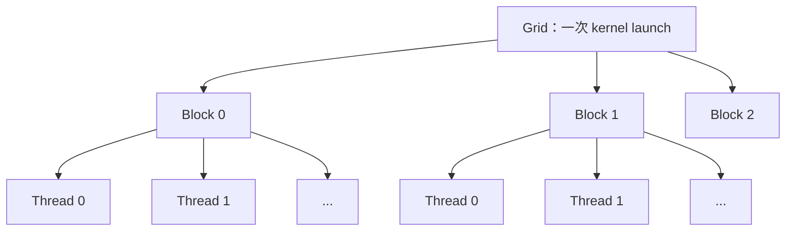
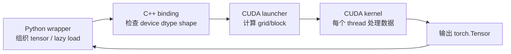

# Week 03：一个 PyTorch Tensor 怎样走进 CUDA Kernel

## 为什么第一段 CUDA 代码只做向量加法

后续课程会实现 RMSNorm、RoPE、softmax、matmul 和 attention。它们的数学和数据访问都比向量加法复杂。如果第一次接触 CUDA 就同时处理归约、共享内存、半精度和复杂 shape，出错后很难判断问题来自数学、索引、并行还是绑定层。

向量加法只有一条公式：

```text
out[i] = a[i] + b[i]
```

正因为数学没有悬念，我们才能把注意力放在更基础的问题上：

```text
谁启动 kernel？
一个线程负责什么？
线程编号怎样映射到 tensor 下标？
数据存在哪里？
Python 如何把 torch.Tensor 交给 C++/CUDA？
kernel 结束前 CPU 在做什么？
怎样证明结果正确且确实来自 CUDA？
```

Week 03 的交付物不是“会写加法”，而是建立此后每个 CUDA 实验都会复用的闭环。

---

## 一、CPU 与 GPU 为什么需要不同的编程方式

CPU 擅长低延迟、复杂控制流和少量强线程。GPU 拥有大量相对轻量的执行单元，适合让许多线程执行相似工作。

假设有一百万个彼此独立的元素要相加。CPU 可以用循环：

```text
for i in range(1_000_000):
    out[i] = a[i] + b[i]
```

GPU 的思路不是把这个循环原样交给一个更快的核心，而是创建大量线程，让每个线程处理一个或多个元素。

这是一种数据并行：相同程序作用于不同数据下标。

### Host 与 Device

CUDA 语境中：

- **host** 通常指 CPU 及其内存；
- **device** 指 GPU 及其显存；
- **host code** 负责准备参数、分配 tensor 和启动 kernel；
- **device code** 在 GPU 上并行执行。

GPU 不会自己发现 Python 中出现了一个 tensor。必须由 host 发起 kernel launch，并告诉 GPU 使用多少线程、输入地址在哪里。

## 二、Kernel、Grid、Block 与 Thread

### Kernel 是什么

Kernel 是由许多 GPU 线程并行执行的函数。每个线程运行相同的 kernel body，但拥有不同的内置索引。

一次 launch 会创建一个 grid；grid 由多个 block 组成；block 由多个 thread 组成：



一维数据最常用的全局下标是：

```cpp
int idx = blockIdx.x * blockDim.x + threadIdx.x;
```

其中：

```text
threadIdx.x  当前线程在 block 内的位置
blockIdx.x   当前 block 在 grid 内的位置
blockDim.x   每个 block 的线程数
idx          当前线程对应的全局元素位置
```

### 用 n=1000 算一次 Launch

设每个 block 使用 256 个线程：

```text
num_blocks = ceil(1000 / 256) = 4
```

实际创建：

```text
4 * 256 = 1024 threads
```

前 1,000 个线程处理数据，最后 24 个线程没有合法元素。因此 kernel 必须检查：

```cpp
if (idx < n) {
    out[idx] = a[idx] + b[idx];
}
```

边界检查不是可选优化。越界读可能得到错误数据，越界写还可能破坏其他显存区域，错误不一定立刻在当前 Python 行报出。

## 三、Warp 与 SIMT

程序员组织的是 thread，GPU 调度的基本执行组通常是 warp。在 NVIDIA GPU 上，一个 warp 通常包含 32 个线程。

SIMT 是 Single Instruction, Multiple Threads。一个 warp 中的线程通常在同一时刻执行同一条指令，但每个线程处理自己的数据。

### 分支发散

如果同一 warp 中一部分线程走 `if`，另一部分走 `else`，硬件可能需要分批执行两条路径：

```cpp
if (idx % 2 == 0) {
    path_a();
} else {
    path_b();
}
```

这叫 warp divergence。它不是说 CUDA 不能写分支，而是分支模式会影响并行效率。

向量加法末尾的边界检查也会让最后一个 warp 的部分线程失活，但只影响边缘少量线程，通常是必要且可接受的。

### Block 为什么存在

同一个 block 内的线程可以：

- 使用 shared memory 交换数据；
- 用 `__syncthreads()` 做 block 内同步；
- 被安排到同一个 SM 上执行。

不同 block 不能在普通 kernel 内使用 `__syncthreads()` 互相同步。因此需要全局同步的多阶段算法，常常要拆成多个 kernel launch。

## 四、GPU 内存层次

只知道“GPU 有显存”远远不够。不同存储层次的作用域、容量和速度不同：

| 存储 | 谁能访问 | 生命周期 | 典型用途 |
| --- | --- | --- | --- |
| Registers | 单个线程 | 线程执行期间 | 索引、累加器、临时值 |
| Shared memory | 同一 block | block 执行期间 | tile 复用、block 内 reduction |
| Global memory | 所有线程 | 显存分配期间 | tensor 主体、模型权重、KV cache |
| Constant memory | 所有线程只读 | 模块期间 | 少量广播常量 |

Registers 最接近计算单元，但数量有限。Shared memory 很快且可编程，但容量也有限。Global memory 容量大，却有更高延迟。

### Vector Add 为什么主要看带宽

每个 float32 元素：

```text
读取 a:   4 bytes
读取 b:   4 bytes
写出 out: 4 bytes
计算:     1 次加法
```

数据几乎没有复用。把 `a[i]` 搬到 shared memory 后也只使用一次，反而增加步骤。因此 vector add 不需要 shared memory；重点是让相邻线程访问相邻地址。

### Coalesced Access

当一个 warp 的线程访问连续 global memory 地址时，硬件可以把请求合并为较少的内存事务：

```text
thread 0 -> a[0]
thread 1 -> a[1]
thread 2 -> a[2]
...
```

如果线程以很大的 stride 或混乱顺序访问，可能需要更多内存事务。Coalescing 是后续所有 kernel 都要考虑的基础。

## 五、从 Python 到 CUDA 的完整调用链

课程不是编写一个独立 CUDA 可执行文件，而是让 PyTorch 模型调用自定义算子。链路因此跨越四层：



### Python Wrapper

Python 层负责：

- 接收 `torch.Tensor`；
- 加载或缓存编译后的 extension；
- 创建输出或调用 C++ 导出函数；
- 把底层不可用转换成清晰异常；
- 在 `auto` 模式下决定是否 fallback。

### C++ Binding

C++ 层不应盲目信任输入。至少检查：

```text
tensor 是否在 CUDA device
dtype 是否被 kernel 支持
shape 是否兼容
内存是否 contiguous
多个输入是否位于同一 device
```

通过 PyTorch C++ API，可以取得 tensor 的 data pointer、维度和 dtype，再交给 launcher。

### CUDA Launcher

Launcher 在 host 侧计算启动参数：

```cpp
int threads = 256;
int blocks = (n + threads - 1) / threads;
vector_add_kernel<<<blocks, threads>>>(...);
```

向上取整公式：

```text
ceil(n / threads) = (n + threads - 1) / threads
```

### CUDA Kernel

Kernel 只处理并行计算本身：定位下标、边界检查、读取、计算和写回。

把职责拆开后，错误更容易定位：Python 参数错误、C++ shape 检查错误、launch 配置错误和 kernel 索引错误不再混成一团。

## 六、JIT 编译发生了什么

PyTorch extension 可以在运行时调用编译工具链：

```text
.cpp / .cu sources
-> host C++ compiler + nvcc
-> object files
-> shared library
-> Python importable module
```

第一次运行可能花数秒甚至更久；后续运行通常使用缓存的编译产物。修改源码、编译选项、PyTorch/CUDA 版本或 extension 名称，都可能让缓存失效。

因此必须区分：

- compile latency：开发和冷启动成本；
- kernel latency：编译完成后的执行时间。

用 `time pytest ...` 比较第一次和第二次运行，只能帮助观察 JIT 影响，不能替代精确 kernel benchmark。

## 七、CUDA 是异步的，错误也可能延迟出现

Host 发起 kernel launch 后通常立即继续。Kernel 中的非法访问可能直到下一次同步 API 才被报告，于是 Python traceback 看起来指向后面的无关操作。

调试时可以在小范围使用同步或 CUDA 调试环境变量，让错误更接近真实发生位置。但正式性能路径不能到处同步。

常见错误来源：

```text
idx 越界
错误解释 dtype 指针
输入不 contiguous
shape 乘积计算溢出或不一致
错误 device
launch 参数超过硬件限制
```

## 八、正确性验证不能只看“没有报错”

为 CUDA kernel 写测试时，PyTorch 实现是 correctness oracle：

```python
expected = a + b
actual = cuda_vector_add(a, b)
torch.testing.assert_close(actual, expected)
```

测试至少覆盖：

- `n` 小于一个 block；
- `n` 等于 block size；
- `n` 不是 block size 整数倍；
- 较大 `n`；
- 支持的不同 dtype；
- 非法 device/dtype/shape 是否明确报错。

Vector add 对相同 dtype 理论上结果很直接，但后续 reduction 和 matmul 会因累加顺序不同产生浮点差异，所以课程统一建立 `assert_close` 思维，而不是期待逐 bit 相等。

## 九、Block Size 应该怎样理解

`block_size=256` 不是神奇常数。它影响：

- 每个 block 包含多少 warp；
- block 使用多少 registers/shared memory；
- 一个 SM 能同时驻留多少 block；
- 边缘浪费多少线程；
- 调度和延迟隐藏能力。

对极简单的 vector add，128、256、512 都可能工作，性能差异还会受输入大小和 GPU 影响。实验目的不是找到全世界最好的 block size，而是学会：

```text
修改 launch 参数
-> 保持数学与 workload 不变
-> warmup
-> 正确计时
-> 解释差异而不是只报最快值
```

## 十、主路径 Dispatch 为什么要区分 torch、auto、cuda

课程使用三种模式：

```text
torch  始终使用 PyTorch reference
auto   条件满足时尝试 CUDA，失败可回退
cuda   强制使用课程 CUDA，失败直接报错
```

`auto` 适合让系统在不同环境可运行，但也会掩盖接入错误：自定义 kernel 编译失败后，程序可能回退 PyTorch，测试仍然得到正确输出。

因此正确性有两个层次：

1. 输出是否正确；
2. 指定 CUDA 路径是否真实执行。

第二个问题必须用强制模式、profiler 中的 kernel 名称或严格 CUDA smoke 验证。

## 十一、本周实验

### 实验 1：画出线程覆盖

对 `n=1000, blockDim=256`，列出：

```text
block 0: idx 0..255
block 1: idx 256..511
block 2: idx 512..767
block 3: idx 768..1023，其中 1000..1023 被 guard 排除
```

### 实验 2：边界输入

测试：

```text
n = 1, 255, 256, 257, 1000, 1024, 1025
```

说明为什么这些值比只测 1024 更容易发现错误。

### 实验 3：JIT 冷热对比

记录第一次编译运行和缓存命中后的时间。报告中明确区分 compile time 与 execution time。

### 实验 4：Block Size

比较 64、128、256、512 threads/block。每个配置都需要 warmup 和多次重复。不要根据一次测量下结论。

### 实验 5：严格 CUDA 证据

提交：

- correctness 输出；
- 当前 GPU、CUDA、PyTorch 版本；
- profiler 或严格测试证明 kernel 被调用；
- 没有 CUDA 时明确写 skip，不把 skip 当 pass。

## 十二、常见误区

### 线程越多越快

线程数量要足以覆盖数据和隐藏延迟，但资源限制、调度开销和数据规模都会影响结果。无限增加线程不等于无限加速。

### Shared memory 总是比 global memory 好

只有数据会在 block 内复用时，搬进 shared memory 才可能值得。Vector add 没有这种复用。

### 测试通过就说明 CUDA 接入成功

`auto` fallback 可能让 PyTorch reference 通过测试。必须验证真实 dispatch。

### 第一次运行就是 kernel 性能

第一次可能包含 JIT、context 和 allocator 初始化。

### Python traceback 指向的位置就是 kernel 出错位置

CUDA 异步执行会延迟报告错误。要检查之前的 kernel launch 和索引。

## 十三、学完本周，应能回答

1. Grid、block、thread 和 warp 分别是什么？
2. `blockIdx.x * blockDim.x + threadIdx.x` 为什么得到全局索引？
3. 为什么 `n=1000, block=256` 需要边界检查？
4. Vector add 为什么不适合使用 shared memory？
5. Python tensor 经过哪些层到达 CUDA kernel？
6. JIT 编译时间为什么不能算进稳态 kernel latency？
7. `auto` fallback 为什么可能掩盖错误？
8. 什么证据能证明自定义 kernel 真实运行？

## 参考与素材说明

- 猛猿：[从啥也不会到 CUDA GEMM 优化](https://zhuanlan.zhihu.com/p/703256080)
- 猛猿：[FlashAttention V1：从硬件到计算逻辑](https://zhuanlan.zhihu.com/p/669926191)
- 课程工程：vector add、CUDA extension harness 与 Week 03 grader

本文只借鉴从硬件执行反推代码结构的讲解方法；全部示例、图示和实验组织均为课程原创。Week 03 只建立最小闭环，复杂共享内存优化留到 Week 05。
