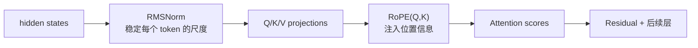
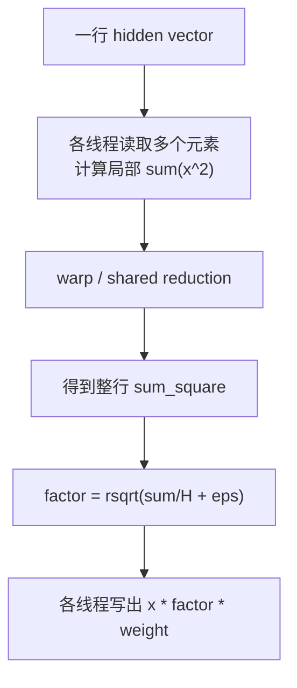
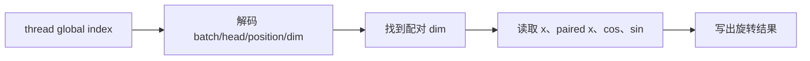

# Week 04：RMSNorm 与 RoPE，稳定数值并让 Attention 看见位置

## 两个算子分别解决什么

Transformer 接收的是 token 向量。经过多层 attention、MLP 和残差相加后，向量的数值尺度可能不断变化；如果尺度失控，训练和推理中的浮点计算都会变得困难。RMSNorm 负责把每个 token 的 hidden vector 拉回稳定尺度。

另一方面，Attention 的核心是 Q 与 K 的相似度。单看向量内容，模型并不知道两个 token 谁在前、谁在后，相距多远。RoPE 通过按位置旋转 Q 和 K，让注意力分数携带相对位置信息。

两者处在不同位置、解决不同问题：



它们适合放在同一周，是因为都能清楚展示“数学公式 -> tensor shape -> CUDA 线程组织 -> 主路径 dispatch”的过程；但它们的 kernel 类型完全不同：RMSNorm 包含归约，RoPE 更接近逐元素变换。

---

## 一、为什么深层网络需要归一化

一个 Transformer block 不断执行：

```text
linear
attention
residual add
MLP
residual add
```

每次线性变换和残差叠加都可能改变激活分布。假设某层 hidden vector 的元素尺度约为 1，经过多次变换后可能变得很大或很小：

- 数值过大时，低精度 dtype 更容易溢出，softmax 也可能过于尖锐；
- 数值过小时，有效精度下降，信号可能被舍入吞没；
- 不同 token 或样本的尺度差异过大，会让后续层面对不断变化的输入条件。

归一化不会替模型学习内容，而是给后续计算提供相对稳定的数值尺度。

### 按哪个维度归一化

对 hidden states：

```text
x shape = [batch, seq_len, hidden_size]
```

RMSNorm 通常对最后一个 `hidden_size` 维度独立处理。也就是说，每个 batch、每个 token 都有自己的归一化因子。

如果 shape 为 `[2, 4, 1024]`，一共有 `2*4=8` 行 hidden vector，每行 1024 个元素分别做一次 RMSNorm。它不会跨 token 求均值，也不会把两个 batch 样本混在一起。

## 二、从 LayerNorm 到 RMSNorm

### LayerNorm

对一行向量 `x`，LayerNorm 计算：

```text
mean = (1/H) * sum_j x_j
var  = (1/H) * sum_j (x_j - mean)^2
y_j  = (x_j - mean) / sqrt(var + eps) * gamma_j + beta_j
```

它做两件事：移除均值，控制方差。

### RMSNorm

RMSNorm 不做中心化，只控制均方根尺度：

```text
mean_square = (1/H) * sum_j x_j^2
rms         = sqrt(mean_square + eps)
y_j         = (x_j / rms) * weight_j
```

`weight` 是可学习的逐维缩放参数。归一化把整体尺度稳定下来，weight 再允许模型为不同 hidden 维学习不同幅度。

### 一个四维例子

设：

```text
x = [1, -1, 2, -2]
weight = [1, 1, 1, 1]
eps 暂忽略
```

则：

```text
mean_square = (1 + 1 + 4 + 4) / 4 = 2.5
rms = sqrt(2.5) ≈ 1.581
y ≈ [0.632, -0.632, 1.265, -1.265]
```

输出仍保留正负关系和方向，只是整体尺度被调整。RMSNorm 不是把每个元素限制在某个区间，也不是让向量元素和为 0。

## 三、Epsilon 与低精度累加

### Epsilon 为什么存在

如果输入全为 0：

```text
mean_square = 0
```

直接除以 `sqrt(0)` 会产生除零。`eps` 保证分母有正下界：

```text
rsqrt(mean_square + eps)
```

Epsilon 还会影响极小输入下的数值行为，因此应使用模型配置中的值，而不是 kernel 随意选择。

### 为什么 bf16/fp16 输入常用 fp32 累加

平方和包含很多元素。若每一步都用低精度累加，舍入误差会不断积累，数值较大时还可能溢出。

常见做法是：

```text
读取 bf16/fp16
-> 转为 float32
-> 平方并用 float32 reduction
-> 计算 rsqrt
-> 缩放
-> 转回输出 dtype
```

这不意味着整个模型都变成 fp32，只是让敏感的归约过程使用更稳健的累加精度。

## 四、RMSNorm 怎样映射到 CUDA

输入展平为：

```text
rows = batch * seq_len
x: [rows, hidden_size]
```

一个基础实现可以让一个 block 负责一行：



### 第一步：局部累加

如果 hidden size 为 4096，block 有 256 个线程，每个线程可以按 stride 处理：

```cpp
for (int j = threadIdx.x; j < hidden; j += blockDim.x) {
    float v = to_float(x[row * hidden + j]);
    local += v * v;
}
```

### 第二步：Block 内 Reduction

256 个线程各有一个 `local`，必须合并为整行平方和。可以使用 shared memory tree reduction，也可以先做 warp-level shuffle，再合并各 warp 结果。

### 第三步：广播缩放因子

线程 0 或第一个 warp 得到 `factor` 后，block 内所有线程需要使用它处理各自元素。这里必须保证归约完成后再读取结果。

### 为什么一个线程计算一整行通常不好

实现最简单，但 4096 个元素会被单线程串行处理，无法利用并行带宽。RMSNorm 的关键不是公式复杂，而是如何高效协作完成一行 reduction。

## 五、位置为什么不能只靠 token 内容

考虑两句话：

```text
猫追狗
狗追猫
```

包含相同 token，但顺序改变后语义完全不同。如果模型只把 token embedding 当作无序集合，Attention 无法区分它们的位置关系。

早期 Transformer 常把绝对位置 embedding 加到 token embedding：

```text
input = token_embedding + position_embedding
```

RoPE 采用不同思路：不直接给 hidden state 加位置向量，而是在 Attention 打分前，对 Q 和 K 施加位置相关旋转。

## 六、先理解二维旋转

二维向量 `[x1, x2]` 旋转角度 `theta`：

```text
x1' = x1*cos(theta) - x2*sin(theta)
x2' = x1*sin(theta) + x2*cos(theta)
```

写成矩阵：

```text
[x1']   [cos(theta)  -sin(theta)] [x1]
[x2'] = [sin(theta)   cos(theta)] [x2]
```

旋转不会改变二维向量长度，只改变方向。RoPE 把 head dimension 分成许多二维子空间，每对子维度使用不同频率，并让旋转角随 position 增长。

### 多频率的意义

不同维度对位置变化的速度不同：有些维度旋转快，敏感于近距离差异；有些旋转慢，可以表达更长范围的位置变化。它和经典 sinusoidal position encoding 一样使用多尺度频率，但注入位置的方式不同。

## 七、RoPE 为什么能表达相对位置

设位置 `m` 的 query 旋转 `m*theta`，位置 `n` 的 key 旋转 `n*theta`。旋转后的点积具有这样的结构：

```text
<R(m)q, R(n)k>
= <q, R(n-m)k>
```

也就是说，Attention score 中出现的是位置差 `n-m`，而不只是两个绝对位置。模型因此能自然感知相对距离。

这里最重要的不是背完整复数推导，而是理解：

```text
分别按绝对位置旋转 Q/K
-> 两者做点积
-> 结果依赖相对位置差
```

作者的 [RoPE 直觉解释](https://zhuanlan.zhihu.com/p/863378538) 也围绕“避开复杂形式，先抓住旋转和相对位置”展开。

## 八、为什么 RoPE 作用于 Q/K，不作用于 V

Attention：

```text
scores = QK^T
weights = softmax(scores)
output = weights V
```

Q/K 决定“当前位置应该看哪些历史位置”，位置关系需要影响匹配分数。V 表示匹配后取回的内容，不负责决定匹配关系，因此标准 RoPE 作用于 Q 和 K。

这不是说 V 永远不能包含位置信息，而是 RoPE 的核心机制通过改变 QK 点积注入相对位置。

## 九、Tensor Shape 与配对方式

常见 Q/K shape：

```text
Q: [batch, num_q_heads, seq_len, head_dim]
K: [batch, num_kv_heads, seq_len, head_dim]
```

GQA 模型中 Q head 数与 KV head 数可能不同，但每个 head 内的 RoPE 仍沿 `head_dim` 配对。

### 两种常见布局

二维配对可能按相邻偶奇维：

```text
(x0,x1), (x2,x3), ...
```

也可能按 split-half：

```text
(x0,xD/2), (x1,xD/2+1), ...
```

两种写法不能混用。Kernel 必须与模型 reference 的 `rotate_half` 定义一致，否则 shape 看起来正确，数值却完全不同。

### Cos/Sin Shape

Cos/sin 通常由 position ids 查表得到，再 broadcast 到 head 维。常见逻辑形状类似：

```text
[batch, 1, seq_len, head_dim]
```

其中 head 维共享同一位置频率表。实现时不能只凭“能 broadcast”就认为语义正确，还要确认 seq 和 head_dim 对齐。

## 十、RoPE 怎样映射到 CUDA

RoPE 不需要跨整行求和。每个输出只依赖本维元素、配对元素、cos 和 sin：

```text
out_j = x_j * cos_j + paired(x)_j * sin_j
```

因此可以把：

```text
batch * heads * seq_len * head_dim
```

展平，让线程处理一个或多个元素。



主要风险不是 reduction，而是索引：

- position 对错；
- 配对维度对错；
- Q/K 是否都应用；
- cos/sin broadcast 是否正确；
- head_dim 是否满足偶数等约束。

## 十一、正确性与误差怎样验证

### RMSNorm

至少比较：

```text
float32 / float16 / bfloat16
不同 rows 和 hidden size
全零、小值、大值、随机值
最大绝对误差与相对误差
```

归约顺序不同会导致低位误差。不能为了让错误实现通过而随意放宽容差；应先判断误差是否随 hidden size、dtype 或数值范围异常增长。

### RoPE

至少覆盖：

```text
position 0
多个 position
不同 batch/head/seq/head_dim
Q 与 K
明确的 rotate_half reference
```

位置 0 往往对应旋转角 0，可作为简单 sanity check；但只测 position 0 无法发现位置索引错误。

## 十二、主路径 Dispatch

单独的 kernel test 通过后，还要证明模型 forward 真的调用它：

```text
offline_generate
-> model forward
-> RMSNorm / apply RoPE
-> cuda wrapper
-> C++ binding
-> CUDA kernel
```

`auto` 模式允许失败后回退，适合普通运行；严格验收需要 `cuda` 模式或 profiler kernel 证据。否则“输出正确”可能只是 reference 路径正确。

## 十三、本周实验

### 实验 1：手算 RMSNorm

对小向量手算 mean square、rms 和输出，再和 PyTorch/CUDA 对齐。目的是确认归约维度和公式，而不是只看随机测试通过。

### 实验 2：累加精度

比较低精度直接累加与 fp32 累加的误差，尤其关注 hidden size 增大后的变化。

### 实验 3：RoPE 小维度可视化

对一个二维向量选择几个 position，画出旋转方向，验证长度基本不变，并观察 Q/K 点积如何随相对距离变化。

### 实验 4：Shape 与边界

测试不同 rows、hidden、seq_len 和 head_dim。对不支持的奇数 head_dim 给出明确错误，而不是静默越界。

### 实验 5：主路径证据

用强制 CUDA 模式运行短生成，提交 kernel 名称或严格测试结果。

## 十四、常见误区

### RMSNorm 是把向量限制到 [-1,1]

不是。它控制均方根尺度，元素仍可超过 1，之后还有可学习 weight。

### RMSNorm 应跨 batch 求统计量

不是。它对每个 token 的 hidden 维独立归一化。

### RoPE 给 V 也旋转会更完整

标准 RoPE 通过 QK 匹配注入位置。随意旋转 V 会改变被汇总的内容语义。

### 能 broadcast 就说明 cos/sin shape 正确

Broadcast 只保证运算能执行，不保证 position、seq 和 dim 的语义对齐。

### fp16 输入就必须 fp16 累加

许多归约会使用 fp32 累加提高稳定性，再转换回输出 dtype。

## 十五、学完本周，应能回答

1. RMSNorm 与 LayerNorm 在公式上差在哪里？
2. RMSNorm 为什么沿 hidden dimension 归约？
3. Epsilon 和 fp32 accumulation 分别解决什么问题？
4. 一个 block 负责一行 RMSNorm 时，线程如何协作？
5. RoPE 为什么使用二维旋转？
6. 分别旋转 Q/K 后，点积为什么依赖相对位置？
7. 为什么不缓存 Q，也不对 V 应用标准 RoPE？
8. RoPE 最容易出现哪些 shape 和配对错误？

## 参考与素材说明

- 猛猿：[避开复数推导，我们还可以怎么理解 RoPE？](https://zhuanlan.zhihu.com/p/863378538)
- 猛猿：[为什么 Transformer 要用 LayerNorm](https://zhuanlan.zhihu.com/p/456863215)
- 课程工程：Qwen3 RMSNorm、RoPE reference 与 CUDA wrappers

正文、数值例子和图示均为课程重新组织。引用文章用于补充直觉与背景；具体配对布局、dtype 和 shape 以课程模型 reference 为准。
