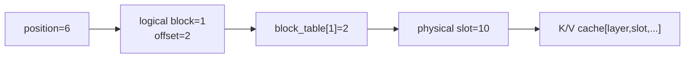
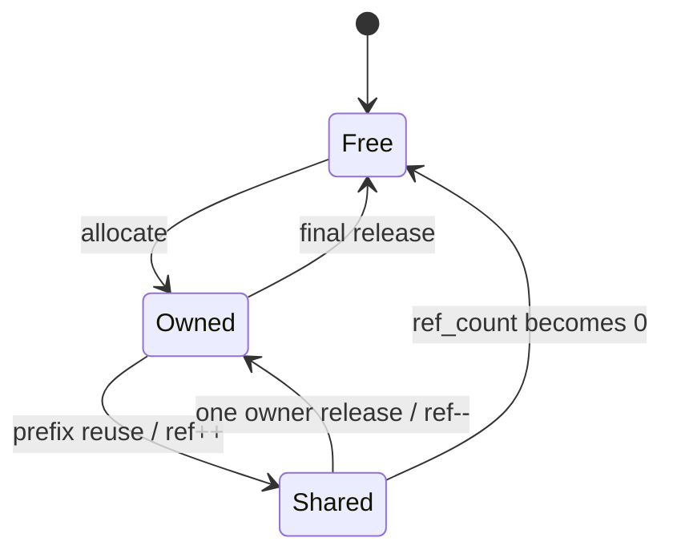

# Week 10：Paged KV，把逻辑连续与物理连续分开

## 连续 Cache 为什么在高并发下变得难管理

Week 08 的连续 KV cache 很直观：一个请求的 token 0、1、2……按顺序放在一段连续显存中。问题是请求最终长度事先未知。

如果按最大长度预留，短请求浪费大量空间；如果每步扩容，会搬运历史数据；如果为不同长度申请不同连续块，请求陆续结束后会留下大小不一的空洞。

Paged KV 的核心不是让 Attention 数学更快，而是改变 KV cache 的内存管理：

```text
逻辑上：一个 sequence 的 token 仍然连续编号
物理上：KV 可以放进任意空闲固定大小 block
中间：block table 完成地址翻译
```

它借鉴虚拟内存分页，但不是操作系统分页的逐项复制。我们使用这个类比理解“逻辑地址与物理地址解耦”，具体分配、hash 和 kernel 都由 serving 系统实现。

---

## 一、五个必须分清的概念

### Logical Token Position

Token 在某条 sequence 中的位置，例如 0..36。它不关心 KV 实际放在哪。

### Logical Block

固定 `block_size` 个逻辑 token 为一组：

```text
logical_block = position // block_size
```

### Offset

Token 在逻辑 block 内的位置：

```text
offset = position % block_size
```

### Physical Block

物理 KV pool 中真正分配的 block ID。Logical block 2 不要求放在 physical block 2。

### Physical Slot

物理 block 内具体 token 槽：

```text
slot = physical_block * block_size + offset
```

最终 K/V tensor 用 slot 找到物理位置。

## 二、完整地址转换例子

设：

```text
block_size = 4
block_table = [7, 2, 9]
```

含义：

```text
logical block 0 -> physical block 7
logical block 1 -> physical block 2
logical block 2 -> physical block 9
```

访问逻辑 token position=6：

```text
logical_block = 6 // 4 = 1
offset        = 6 % 4  = 2
physical_block = block_table[1] = 2
slot = 2 * 4 + 2 = 10
```

因此 position 6 的 K/V 位于物理 slot 10。



如果直接用 `position=6` 当物理 slot，就完全绕过 block table，分页机制失效。

## 三、物理 Cache Shape

一种概念布局：

```text
K/V [num_layers, num_blocks*block_size, num_kv_heads, head_dim]
```

也可以显式保留 block 维：

```text
K/V [num_layers, num_blocks, block_size, num_kv_heads, head_dim]
```

两者可以通过 reshape 对应。Kernel 选择哪种布局取决于访存和向量化；BlockManager 只需要提供正确物理 block/slot。

## 四、Block Table 属于谁

每条 sequence 有自己的 block table：

```text
seq A: [7,2,9]
seq B: [4,1]
```

Logical block ID 只在 sequence 内有意义。A 的 logical block 0 和 B 的 logical block 0 可以映射到不同物理 block；prefix caching 时也可能共享同一个物理 block。

Block table 还需要记录有效 length。最后一个 block 往往只有部分 slot 有效，Attention 不能读取未写入位置。

## 五、BlockManager 的职责

BlockManager 管理的是“谁拥有哪些物理块”，不负责模型算 K/V。

核心状态：

```text
free_block_ids
sequence_id -> block_table
block ref_count
可选 token hash / prefix metadata
```

核心操作：

```text
allocate(sequence, required_tokens)
ensure_capacity(sequence, new_length)
slot_mapping(sequence, positions)
release(sequence)
usage_stats()
```



## 六、Prefill 怎样分配 Block

Prompt 长度 L，需要：

```text
required_blocks = ceil(L / block_size)
```

例如 `L=9, block_size=4`：

```text
required_blocks = 3
logical block 0: tokens 0..3
logical block 1: tokens 4..7
logical block 2: token 8，有 3 个空 slot
```

Manager 从 free list 取 3 个 physical blocks，建立 table，再返回 prompt positions 的 slot mapping。Model backend 把每层 prompt K/V scatter 到这些 slots。

## 七、Decode 怎样增长

假设当前 length=8、block_size=4，已有两个满 block。Append position 8 时：

```text
logical block = 2
```

Block table 尚无第 3 项，因此先分配新 physical block，再写 offset 0。

如果当前 length=7，append position 7 仍位于已有 logical block 1 的 offset 3，无需新 block。

因此 decode 并不是每步都分配 block，而是在跨越 block 边界时分配。

## 八、内部碎片怎样计算

每条 sequence 已分配 slots：

```text
allocated_slots = num_blocks * block_size
wasted_slots = allocated_slots - current_length
```

例：length=17。

| block size | blocks | allocated slots | wasted |
| ---: | ---: | ---: | ---: |
| 16 | 2 | 32 | 15 |
| 8 | 3 | 24 | 7 |
| 4 | 5 | 20 | 3 |

内部碎片率可定义：

```text
wasted_slots / allocated_slots
```

报告必须写清口径：是按某请求、所有活跃请求，还是整个物理 pool 统计。

## 九、Block Size 为什么不是越小越好

小 block：

- 最后 block 浪费少；
- 分配粒度细；
- block table 更长；
- metadata/hash/refcount 更多；
- kernel 间接寻址更频繁。

大 block：

- table 短；
- 连续访问范围更大；
- 最后 block 内部碎片更严重；
- 一个短请求也至少占一个大 block。

最佳值依赖长度分布、cache layout、kernel 和管理开销，不能只在单个 17-token 例子上决定。

## 十、外部碎片与内部碎片

### 外部碎片

连续分配中，总空闲空间足够，却散成多个小洞，无法提供所需连续大块。

### 内部碎片

固定 block 已分配给请求，但最后一块部分 slot 未使用。

Paged KV 用固定 block 大幅减轻连续大块的外部碎片，却仍有最后 block 的内部碎片。它不是“完全没有碎片”。

## 十一、Attention 怎样读取 Paged KV

对每条 sequence、每个历史 position：

```text
position -> block/offset -> physical slot -> K/V
```

Reference 可以先构造 slot list，再 `index_select` 出 dense K/V；生产 kernel 通常在 Attention 内直接按 block table 读取，避免 gather 中间 tensor。

额外间接寻址是代价。PagedAttention 的价值来自整体内存管理与并发容量，而不是每次 load 比连续地址更便宜。

## 十二、Prefix Cache 的基本条件

多个请求可能共享相同 system prompt：

```text
A tokens: [1,2,3,4,5,6,...]
B tokens: [1,2,3,4,9,...]
```

若 block_size=4，第一个完整 block `[1,2,3,4]` 完全相同，其 K/V 可复用。

为什么通常只复用完整 block？

- hash 和 ownership 边界清楚；
- 后续不同 token 可以从新 block 分叉；
- 不需要管理同一物理 block 中部分共享、部分私有的复杂写时复制。

## 十三、Token Hash 不是普通字符串 Hash

Prefix cache key 至少要反映 token 序列。生产环境还可能纳入：

```text
model / adapter identity
cache dtype/layout
position / rope configuration
多模态输入或其他影响 K/V 的信息
```

只用原始文本 hash 不可靠，因为 chat template/tokenizer 配置可能让相同文本产生不同 tokens；不同模型的相同 tokens 也不能共享 K/V。

## 十四、引用计数与释放

若 A/B 共享 physical block 7：

```text
ref_count[7] = 2
```

A 结束：

```text
ref_count[7] -> 1
```

不能归还 free list，因为 B 仍使用。只有归零才释放。

同一 sequence 的独占尾部 block 则可直接释放。Release 应遍历 owned/shared metadata，不能把 block table 中所有 ID 无条件放回 free list。

## 十五、Eviction 与 Prefix Cache 的边界

如果 cache pool 满了，未被活跃请求引用的 cached blocks 可能需要淘汰。策略可考虑：

```text
LRU / recency
prefix length
recompute cost
tenant isolation
```

课程实现只做教学近似，不宣称具备生产级 eviction、一致性或跨租户安全。报告应明确此边界。

## 十六、分配失败与 Preemption

当 free blocks 不足，Manager 应明确返回容量不足，Scheduler 再决定：

- 等待已有请求结束；
- 抢占/换出某些请求；
- 释放可淘汰 prefix blocks；
- 拒绝新请求。

BlockManager 不应偷偷覆盖仍被引用的 block。内存管理提供事实，调度策略做取舍。

## 十七、正确性测试

### 地址映射

使用非顺序 physical block table，例如 `[7,2,9]`，验证跨 block positions。

### 边界

长度：

```text
0, 1, block_size-1, block_size, block_size+1
```

### 写读一致

给每个 position 写可识别 K/V，再按逻辑顺序读取。

### Release

释放后 free count 恢复；重复释放有明确语义。

### Prefix Sharing

共享 block refcount 正确；一方 release 不破坏另一方；尾部不同 block 不误共享。

### OOM

请求需要超过 free blocks 时不部分污染状态；失败后 free list/table 保持一致。

## 十八、本周实验

### 实验 1：手算 Block Table

对给定 table 和 positions 手算 slots，并与程序输出对齐。

### 实验 2：Block Size 与碎片

对同一长度分布比较 block_size=4/8/16，统计 table 长度、wasted slots 和 ratio。

### 实验 3：Paged K/V 写读

写入跨 block prompt 和多个 decode token，再 gather 为 dense 与 reference 对齐。

### 实验 4：Prefix Reuse

构造两个共享完整前缀 block 的请求，比较物理 block 数与引用计数。

### 实验 5：释放顺序

先释放 A 再 B、先 B 再 A，最终 free pool 应一致。

### 实验 6：Attention 对齐

Paged decode 与同一逻辑 K/V 的 dense reference 对齐。

## 十九、常见误区

### Logical block ID 就是 physical block ID

不一定，block table 正是负责二者映射。

### Paged KV 消除了所有碎片

它减少外部碎片，但最后 block 仍有内部碎片。

### Block 越小容量利用率越高，所以越好

还要付出 table、metadata、hash 和 kernel 寻址成本。

### 相同文本一定能复用 Prefix KV

必须比较实际 tokens，并考虑模型和 cache 配置。

### Sequence 结束后可释放 table 中所有 block

共享 prefix block 需要 refcount 归零。

### PagedAttention 改变了 Attention 结果

正确实现只改变地址布局，逻辑 K/V 顺序与数学结果不变。

## 二十、学完本周，应能回答

1. 逻辑 position 如何映射到 physical slot？
2. Block table 为何属于 sequence？
3. Prefill 和 decode 分别何时分配新 block？
4. 内部与外部碎片有何区别？
5. Block size 的主要权衡是什么？
6. Prefix cache 为什么优先复用完整 block？
7. Hash key 还需包含哪些上下文？
8. 引用计数如何避免错误释放？
9. 分配失败时 BlockManager 与 Scheduler 各负责什么？

## 参考与素材说明

- 猛猿：[PagedAttention 原理](https://zhuanlan.zhihu.com/p/691038809)
- 猛猿：[BlockManager](https://zhuanlan.zhihu.com/p/700780161)
- 猛猿：[Prefix Caching](https://zhuanlan.zhihu.com/p/707228704)
- 猛猿：[vLLM V1：KVCacheManager 与 PrefixCaching](https://zhuanlan.zhihu.com/p/1916181593229334390)
- 课程工程：BlockManager、PagedKVCache 与 Week 10 grader

正文、地址算例、状态图和实验均为课程原创组织。课程 prefix cache 是教学近似，生产能力和安全边界不应从示例中外推。
