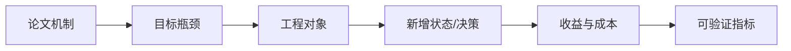
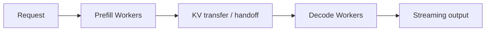
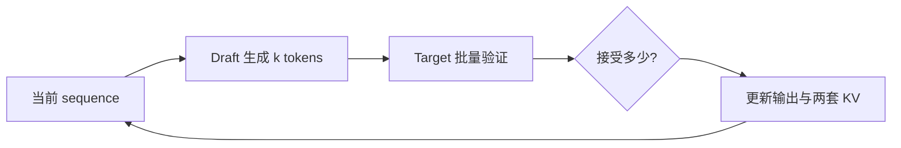

# Week 15：怎样读懂一个新的 LLM Serving 机制

## 不要把论文结论当成产品开关

看到“吞吐提升 2x”时，先不要问代码在哪。先问：

```text
和谁比？
什么模型、硬件、长度和到达率？
满足什么 TTFT/TPOT SLO？
新增多少显存、网络和复杂度？
机制改变了 request、sequence、KV block、batch 还是 worker？
```

Week 15 的目标不是复刻一个工业系统，而是学习把论文机制映射到已有课程结构。无论新策略叫什么，都要落到状态、决策、资源和指标。

---

## 一、Paper-to-System 五问

### 1. 它解决什么瓶颈

例如重复 prefill、prefill/decode 干扰、KV 带宽、尾延迟、公平性或串行 decode。

### 2. 它改变哪个对象

```text
request order
sequence state
KV block ownership
worker placement
batch composition
model execution steps
```

### 3. 新增什么状态

Prefix hash、refcount、worker location、remaining cost、draft KV、acceptance statistics 等。

### 4. 节省什么，新增什么

节省计算/显存/IO，可能新增通信、hash、调度、第二个模型或状态同步。

### 5. 用什么指标证明

```text
TTFT / TPOT / goodput
prefix hit rate / saved prefill tokens
KV transfer bytes/time
preemption/fairness
acceptance rate
GPU utilization / cost
```



## 二、Prefix Cache：跨请求复用 Prefill

同一 system prompt、工具说明或文档前缀会在许多请求中重复。如果前缀 token 完全相同，其 K/V 也相同，可以复用完整 KV blocks。

### 节省多少工作

请求 prompt 长 P，共享前缀 H：

```text
需要新 prefill tokens = P - H
reuse_ratio = H / P
```

例：8k prompt 中 6k system+document 前缀已缓存，仅需 prefill 2k。收益不仅是 token 数比例，因为 attention 复杂度和 kernel shape 也随长度变化，但 saved tokens 是可解释的第一指标。

### 命中条件

至少需要：

```text
相同 token blocks
相同模型/adapter
兼容位置与 RoPE 配置
兼容 cache dtype/layout
block 尚未淘汰且内容有效
```

原始文本相同不够，必须以实际模型输入为准。

### 指标

```text
prefix hit request ratio
cached blocks hit ratio
saved prefill tokens
TTFT reduction
cache memory overhead
eviction rate
```

Hit rate 高不一定收益高：大量只命中一个很短 block 的请求，节省工作可能很少。

## 三、Cache-Aware Scheduling

假设请求：

```text
A: prefix X
B: prefix Y
C: prefix X
D: prefix X
```

FIFO 顺序 A,B,C,D 可能让 X blocks 在资源紧张时被 Y 干扰或淘汰；cache-aware 可以把 A,C,D 靠近执行，提高复用。

### Policy Score

可以概念化：

```text
score = saved_prefill_work
      - waiting_age_penalty
      - fairness_penalty
```

不是只按 shared-prefix 长度排序。否则没有热门前缀的请求可能饥饿。

### 新增状态

```text
request prefix hashes
resident cached blocks
estimated reusable tokens
request age / tenant
```

### 实验不能只比较 Shared-Prefix Score

教学 demo 可用相邻共享前缀得分说明顺序有变化，但完整服务还要测：

- 实际 cache hit；
- TTFT/goodput；
- p99 等待；
- cache 内存与 eviction；
- 不同租户公平性。

## 四、Prefill/Decode Disaggregation

Prefill 与 decode 资源特征不同：

```text
Prefill：大矩阵、长序列、TTFT 相关
Decode：逐 token、读 KV、TPOT 相关
```

共置时，长 prefill 可能打断 decode 节奏。PD 分离把两阶段放到不同 worker 池：



### 获得什么

- 两类 worker 可独立选 batch；
- 可使用不同并行配置或硬件；
- prefill burst 不直接占 decode iteration；
- 独立扩缩容。

### 新增什么

- 请求跨 worker 路由；
- KV cache 传输；
- handoff 状态一致性；
- 两段队列与故障处理；
- worker 比例规划。

## 五、KV Transfer 是 PD 分离的核心成本

Prefill 产生的全部 K/V 必须让 decode worker 可访问。

传输量近似：

```text
KV_transfer_bytes
= prompt_tokens * kv_bytes_per_token
```

用 Week 13 例子 112 KiB/token，8k prompt：

```text
112 KiB * 8192 ≈ 896 MiB
```

如果每请求都跨普通网络搬接近 1 GiB，传输可能吞掉分离收益。

系统可能使用高速互联、RDMA、共享存储层、按 block 流式传输或 cache locality 路由。无论方案如何，必须把 bytes 与时间计入 TTFT/资源成本。

### 粗略收益模型

共置完成时间不简单等于 prefill+decode，因为还有排队/干扰。教学估算可比较：

```text
T_colocated ≈ queue_mix + T_prefill + T_decode_with_interference
T_disagg    ≈ queue_p + T_prefill + T_transfer + queue_d + T_decode
```

只有分离减少的干扰/排队超过 transfer 与协调成本时才有收益。

作者的 [DistServe 文章](https://zhuanlan.zhihu.com/p/706761664) 适合建立 TTFT/TPOT、资源匹配和并行策略的完整问题框架。

## 六、Worker 比例怎样规划

若每秒到达请求的平均 prefill 工作为 `W_p`，平均 decode 工作为 `W_d`，需要分别满足两个池的服务率。

Prefill workers 太少：新请求 TTFT queue 爆炸。

Decode workers 太少：handoff 后排队，TPOT/goodput 恶化。

流量长度分布变化时，静态比例可能失效。动态扩缩容又受模型加载、KV locality 和冷启动影响。

## 七、Chunked Prefill：不完全分离，也不完全共置

Chunked prefill 把长 prompt 拆成 chunks，与 decode iterations 交替/混合。

它在单 worker 池内缓解 prefill 阻塞，不需要跨 worker 传整个 KV；但仍共享 GPU 资源，不能做到两池独立配置。

```text
PD disaggregation：空间上分开 worker
chunked prefill：时间/批次上切分工作
```

两者可以组合。作者的 [chunked-prefills](https://zhuanlan.zhihu.com/p/710165390) 详细讨论了 selective batching、stall-free schedule 与分离边界。

## 八、Attention/FFN Disaggregation

Decode Attention 读取历史 KV，偏带宽；FFN 是大 Linear，计算密度较高。进一步分离两类算子，试图让不同 worker/资源专注适合的工作。

### 新成本

每层 Attention 与 FFN 之间需要传 activation；模型有很多层，若跨设备往返频繁，通信和同步非常复杂。

分析时要算：

```text
activation bytes per layer/token
cross-worker hops
pipeline/batching 机会
failure/state ownership
```

如果只说“Attention memory-bound，FFN compute-bound，所以分开更好”，论证不完整。

## 九、Token-Level Scheduling

Request-level policy 决定请求何时进入；token-level policy 每轮决定哪个 sequence 获得下一 token。

可能利用：

```text
已等待时间
已生成长度
预计剩余长度
deadline/SLO slack
KV 占用
prefix locality
```

### SRPT 直觉

Shortest Remaining Processing Time 可降低平均完成时间，但 LLM 的剩余输出长度未知。可以用用户 max_tokens、历史统计或预测模型估计，预测错误会影响公平性。

### TokenDance-style 教学近似

可定义 completion cost，优先推进预计更快完成的 sequence，再加入 aging 防止长请求饥饿。

Demo 的排序分数不等于完整 scheduler。生产还要结合 KV、batch shape、抢占和多租户。

## 十、Speculative Decoding

小 draft model 先提出 `k` 个候选，target model 一次验证。



### 关键指标

```text
acceptance rate
accepted tokens / target step
draft latency
verify latency
target-step reduction
额外 KV memory
端到端 TPOT/goodput
```

### 粗略判断

如果一次 target verify 平均接受 `a` 个 tokens，而 draft+verify 时间小于 `a` 次普通 target decode，才可能加速。

接受率取决于 draft 与 target 分布接近程度、任务、temperature 和候选长度。不能只在 greedy、小样本上外推。

### 状态难点

被拒绝位置后的 draft KV 可能需回滚；target KV 只保留已接受与校正 token。取消、batch 和不同接受长度让状态管理更复杂。

## 十一、MLA 与 KV 压缩

MLA 通过低秩潜在表示与推理时计算重组，试图减少 KV cache/带宽。它不是调度策略，而是模型架构与执行实现共同改变。

分析时区分：

```text
原生模型结构是否就是 MLA
cache 存压缩还是解压表示
投影是否可吸收到权重
prefill/decode 路径是否不同
TP 下怎样切分
```

作者的 [再读 MLA](https://zhuanlan.zhihu.com/p/19585986234) 按 CacheDecompressed、CacheCompressed、权重吸收等路径区分实现，适合作为“同一公式在推理中有多种数据路径”的案例。

## 十二、前沿机制可以叠加，但不能把收益相加

```text
prefix cache + cache-aware scheduling
chunked prefill + PD disaggregation
speculative decoding + paged KV
MLA + TP
```

机制之间会相互影响。例如 prefix hit 减少 prefill，也减少 PD 需要传输的新 KV；speculative decoding 改变每轮 token 数和 KV append；chunked prefill 改变 worker 负载。

不能把各论文独立 speedup 直接相乘。必须在组合系统中重新测量。

## 十三、如何设计公平对照

保持：

```text
模型与质量目标
硬件总资源
输入/输出分布
到达率
SLO
测量时长与 warmup
```

资源不等价的比较应报告成本。例如分离系统用了双倍 GPU，即使吞吐更高，也要报告 tokens/s/GPU 或 cost/request。

### 指标集合

```text
TTFT/TPOT/E2E p50/p99
goodput under SLO
tokens/s and tokens/s/GPU
GPU memory/utilization
network bytes
cache hit/saved tokens
fairness/starvation
error/retry
```

## 十四、Paper-to-System 映射表

| 项目 | 要回答的问题 |
| --- | --- |
| Bottleneck | 机制针对哪段时间/资源？ |
| Object | request/sequence/block/batch/worker 中谁改变？ |
| State | 新增哪些 metadata？ |
| Decision | schedule、route、evict、verify 中哪个变化？ |
| Fast path | 命中/接受时省掉什么？ |
| Slow path | miss/reject/failure 时发生什么？ |
| Cost | 通信、显存、模型、复杂度？ |
| Metrics | 怎样证明收益且满足 SLO？ |
| Integration | 落到课程哪些模块？ |
| Gap | Demo 与生产系统差什么？ |

## 十五、三个最小复现实验

### Cache-Aware

输入多个 token 前缀，比较 FIFO 与 cache-aware 排序的共享完整 blocks、实际模拟 hit 和公平等待。

### PD Disaggregation

输入 `(prompt_len, output_len)`，估算 prefill/decode workload、KV transfer bytes 和两池 makespan；改变网络带宽看拐点。

### Token-Level Scheduling

给请求 arrival、估计 remaining tokens、age，比较 FIFO/SRPT-like/aging policy 的平均完成时间和最大等待。

这些 demo 用于验证机制方向，不代表完整在线 serving。

## 十六、从 Demo 到主路径要补什么

```text
真实 request metadata
与 BlockManager/cache 的一致性
并发安全
取消/错误/恢复
持续统计与 observability
多 worker RPC/transport
SLO 与多租户公平
端到端 benchmark
故障注入
```

报告必须写这段 gap，避免把排序脚本包装成工业实现。

## 十七、常见误区

### Prefix Hit Rate 高就一定收益大

还要看命中 token 数、prefill 成本和 cache 开销。

### PD 分离消除了干扰，所以一定更快

KV transfer、双队列和协调可能抵消收益。

### Chunked prefill 是 PD 分离的替代品

它在共置资源中切分时间，可与分离组合。

### 短任务优先总是公平

可能让长请求饥饿，需要 aging/配额。

### Speculative k 越大越快

候选更长可能降低接受率、增加 draft/verify 与回滚成本。

### 论文 speedup 可以直接乘起来

机制共享资源并相互改变 workload，必须联合测量。

## 十八、学完本周，应能回答

1. 阅读 serving 论文时首先应映射哪五类问题？
2. Prefix cache 的 hit rate 与 saved tokens 有何区别？
3. Cache-aware scheduling 为什么需要公平性项？
4. PD 分离新增的核心成本是什么，如何估算？
5. Chunked prefill 与 PD 分离的边界是什么？
6. Token-level scheduling 为什么难以知道 remaining time？
7. 投机解码的加速由哪些指标共同决定？
8. MLA 改变的是调度还是模型/cache 数据路径？
9. Demo 推进到生产主路径还缺什么？

## 参考与素材说明

- 猛猿：[vLLM Prefix Caching](https://zhuanlan.zhihu.com/p/707228704)
- 猛猿：[vLLM V1 KVCacheManager 与 PrefixCaching](https://zhuanlan.zhihu.com/p/1916181593229334390)
- 猛猿：[DistServe](https://zhuanlan.zhihu.com/p/706761664)
- 猛猿：[chunked-prefills](https://zhuanlan.zhihu.com/p/710165390)
- 猛猿：[再读 MLA](https://zhuanlan.zhihu.com/p/19585986234)
- 课程工程：policies、cache-aware demo 与 Week 15 paper-to-system 模板

正文、模型、图示和最小实验均为课程原创组织。前沿机制随论文与系统版本变化，报告应引用具体论文/实现版本，并明确教学近似与生产能力的差距。
