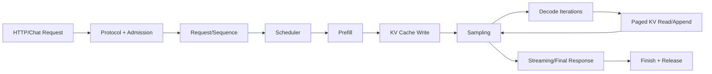
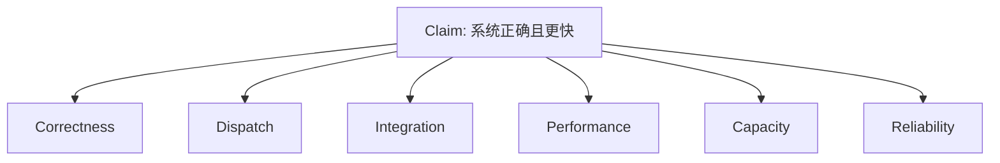
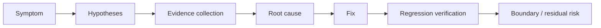

# Week 16：把整个 LLM Serving 系统讲成一条证据链

## 最终展示不是“模型能聊天”

聊天成功只能说明：至少有一条路径产生了文本。它不能单独证明：

```text
自定义 CUDA kernel 正确且真实执行
Paged KV 地址映射没有错
请求结束后 cache 无泄漏
Continuous batching 真实发生
优化提升来自目标机制
容量规划能覆盖目标 workload
系统在过载和取消时可靠
```

Week 16 不引入新算法，而是训练一种更难的能力：从用户请求出发，把算子、cache、调度、服务和指标串成一个可以被质疑、也可以用证据回答的系统故事。

---

## 一、沿一次请求复习，而不是沿文件夹复习



每个箭头都应能回答：

```text
输入是什么？
输出是什么？
维护什么状态？
可能失败在哪里？
用什么测试或指标证明？
```

## 二、把 16 周放回同一条主线

### Week 01–02：定义问题与证据

先知道请求经过 prefill/decode，用户关心 TTFT/TPOT；再学会用服务、框架、时间线和 kernel 四层证据定位瓶颈。

### Week 03–07：模型一步怎样在 GPU 上执行

从 CUDA 线程/内存闭环，到 RMSNorm/RoPE、GEMM、softmax/sampling、Attention 和 online softmax。

### Week 08–10：历史状态怎样存

KV cache 避免重复计算，连续布局揭示生命周期，Paged KV 用 block table 解耦逻辑与物理，prefix cache进一步跨请求复用。

### Week 09–12：请求怎样被编排与保护

Engine 状态机、continuous batching、chunked prefill、preemption、H2D overlap 和 admission control。

### Week 13–15：系统怎样扩展与继续演进

容量/并行策略，跨硬件编程视角，以及 cache-aware、PD 分离、token-level 和 speculative 等前沿机制。

这些不是并列知识点，而是一连串因果：

```text
逐 token 生成
-> 需要状态
-> KV 占显存
-> 需要分页和调度
-> 调度影响延迟/吞吐
-> 容量与通信限制扩展
-> 前沿机制重排状态、计算和资源
```

## 三、六类证据不能互相替代

### 1. Correctness Evidence

证明算得对：

```text
CUDA vs PyTorch reference
cached decode vs full forward
paged attention vs dense gather reference
HF logits alignment
边界/异常测试
```

### 2. Dispatch Evidence

证明目标路径真实执行：

```text
kernel_impl=cuda strict run
profiler 中出现自定义 kernel
禁用 fallback 后仍通过
```

Correctness 通过可能是 `auto` fallback，必须单独证明 dispatch。

### 3. Integration Evidence

证明孤立组件接入系统：

```text
离线生成
HTTP non-stream/stream
取消与 release
多请求 batch
健康统计
```

### 4. Performance Evidence

证明系统表现及变化：

```text
TTFT/TPOT/E2E p50/p99
tokens/s/goodput
batch/queue/KV stats
nsys timeline
ncu kernel counters
```

### 5. Capacity Evidence

证明目标 workload 放得下且有余量：

```text
显存账本
KV blocks/slots
峰值实测
并发增长曲线
通信/并行估算
```

### 6. Reliability Evidence

证明失败不会破坏系统：

```text
过长/队列满明确拒绝
取消后 cache 回收
异常后 worker 继续服务
无资源泄漏
错误信息可定位
```



## 四、Claim-Evidence Matrix

最终报告先写主张，再附证据：

| Claim | Evidence | Boundary |
| --- | --- | --- |
| RMSNorm CUDA 正确 | 多 dtype/shape vs torch max error | 仅已测 GPU/dtype |
| CUDA 路径接入 | strict mode + profiler kernel name | 不代表超过 vendor kernel |
| Paged KV 逻辑正确 | 跨 block slot + dense alignment | prefix eviction 为教学近似 |
| Batching 提升吞吐 | 相同 workload tokens/s、batch stats | p99 可能变化 |
| Transfer overlap 生效 | nsys copy/compute overlap | 仅目标 workload |
| 24GiB 满足目标并发 | 账本 + blocks + peak memory + SLO benchmark | 有 safety margin 假设 |

“Boundary”不是自我否定，而是技术结论可信的必要部分。

## 五、一次高质量最终演示的顺序

### 1. 先说问题

用一分钟说明系统目标和边界：教学版、单进程/单卡、Qwen3、dense/paged、CUDA 教学 kernel。

### 2. 展示请求路径

画主流程图，不先打开代码。

### 3. 跑 Streaming

证明端到端可用，同时指出 TTFT、token events 和 finish reason。

### 4. 展示 Correctness

选择少量关键测试：kernel、attention、cache、scheduler。解释每个测试证明什么。

### 5. 展示 Dispatch

Strict CUDA 或 profiler 中的 kernel，防止 fallback 掩盖。

### 6. 展示 Paged KV

用小 block table 手算一个 slot，再显示实际 stats。

### 7. 展示 Continuous Batching

并发请求 + batch stats + benchmark，不仅打开多个终端。

### 8. 展示性能与优化

Baseline/optimized 同 workload 表；用 timeline 解释，而不是只报百分比。

### 9. 展示容量与前沿映射

给出目标并发判断和一个 paper-to-system 案例。

### 10. 主动说明限制

生产级多 worker/multi-GPU、性能极限、eviction、安全、多租户等未覆盖部分。

## 六、Demo 要有失败预案

现场环境可能：

```text
模型未缓存
CUDA 不可见
JIT 编译过久
端口占用
profiler 无权限
服务启动未 ready
```

准备：

- 预先验证命令；
- 固定短 prompt/max_tokens；
- 保存版本与环境；
- 保留可复现实测输出；
- 明确哪些现场跑、哪些展示已有证据；
- 不用伪造截图代替失败说明。

## 七、如何证明 Continuous Batching 真实发生

不足证据：

```text
多个客户端同时连接
多个请求都返回
服务用了 async/await
```

更强证据：

```text
total_batches < requests 的适当场景
average/max batch size > 1
scheduler trace 同轮多个 sequence
profiler batch tensor shape
吞吐变化与 batch stats 对应
```

还要固定 sampling 参数，否则 HTTP batching 可能因不兼容而分组。

## 八、如何证明一个优化真的有效

### A/B 设计

只改变目标开关，保持：

```text
模型/dtype/backend
prompt/output 分布
并发/到达率
warmup/测量时间
硬件/进程环境
```

### 同时报收益与代价

例如：

```text
tokens/s +12%
p99 TTFT +5%
host pinned memory +1GiB
```

不能只选最好看的指标。

### 解释机制链

```text
代码改变
-> timeline/统计发生预期变化
-> 服务指标变化
```

只有指标变化，没有中间机制证据，可能来自噪声或其他变量。

## 九、故障诊断复盘模板

### 现象

只描述可观察事实：命令、错误、指标。

### 假设

列出多个可能原因，按证据优先级排查。

### 定位

记录每次检查如何排除/支持假设。

### 根因

说明机制，不只抄错误信息。

### 修复

最小改动和取舍。

### 验证

复现原问题、回归测试、相关集成和残余风险。



## 十、一个复盘示例：CUDA 测试全部 Skip

### 现象

`pytest` 通过，但 CUDA tests 显示 skip；服务生成正常。

### 错误结论

“所有测试通过，所以 CUDA kernel 正确。”

### 假设

```text
当前 shell 看不到 GPU
PyTorch 是 CPU build
CUDA extension 编译失败后 auto fallback
测试 marker 配置错误
```

### 证据

```text
nvidia-smi
torch.__version__ / torch.version.cuda
torch.cuda.is_available()
pytest -rs skip reasons
strict cuda_smoke
profiler kernel name
```

### 结论

只有 CUDA 可见、strict path 执行且与 reference 对齐，才能声称 CUDA correctness 已验证。

这个例子说明 skip 不是 pass，端到端文本也不是 dispatch 证据。

## 十一、另一个复盘示例：优化后吞吐没提高

打开 pinned memory/transfer stream，tokens/s 基本不变。

可能不是实现失败：

- 当前 workload 计算占 99%，copy 很小；
- copy/compute 没有依赖窗口可重叠；
- 隐式同步串行化；
- benchmark 样本太少；
- batch/prompt 改变造成噪声。

需要 timeline 判断 copy 是否重叠，再用更敏感 workload 验证；最终可以得出“机制生效但当前 workload 收益不显著”的严谨结论。

## 十二、最终报告结构

### 1. 系统目标与边界

### 2. 环境与复现命令

### 3. 端到端架构与调用链

### 4. Correctness 与 Dispatch

### 5. KV/Paged KV/Prefix Cache

### 6. Scheduler 与 Batching

### 7. Profiling 与瓶颈

### 8. 优化 A/B

### 9. 容量与并行策略

### 10. Paper-to-System

### 11. 故障复盘

### 12. 限制与下一步

每节都包含 claim、evidence、boundary，而不是按周复制实验报告。

## 十三、复现清单

```text
git commit/branch
Python/PyTorch/Transformers
GPU/driver/CUDA/toolchain
model ID/snapshot
安装命令
环境变量
服务启动命令
benchmark workload
warmup/repeat/seed
原始 JSON/profiler 路径
测试与 skip reasons
```

无法复现的性能表只能作为一次观察，不能作为课程结论。

## 十四、怎样呈现图和表

每张图回答一个问题：

- 请求路径图：模块关系；
- 状态机：生命周期；
- Timeline：先后/重叠；
- Block 图：地址映射；
- Roofline：瓶颈上界；
- A/B 表：指标取舍。

不要放一张复杂截图后只写“如图所示”。图中应标注关键区域，正文说明读图顺序和结论。

## 十五、限制部分应该具体

不要只写“未来继续优化”。应写：

```text
当前单 model worker，streaming 执行如何串行
教学 kernel 未覆盖哪些 shape/dtype
prefix cache 缺少何种 eviction/隔离
benchmark 样本和 workload 边界
多卡只做理论规划，未做真实 collective
AscendC 因何 deferred
```

具体限制能自然导出下一步工作。

## 十六、答辩时常见追问

### 为什么 Paged KV 不改变 logits？

因为逻辑 K/V 顺序不变，只改变物理地址；用 dense reference 对齐证明。

### 为什么 auto 模式不够验收 CUDA？

可能 fallback；需要 strict dispatch/profiler。

### 为什么吞吐更高但 p99 更差？

合批/排队取舍；用 queueing 与 batch stats解释。

### 为什么多卡可能更慢？

计算减少但每 token 通信与同步增加。

### 为什么没有照抄生产 vLLM？

课程目标是可读、可测地理解机制；明确说明功能/性能差距。

## 十七、最终评分建议

| 维度 | 关注点 |
| --- | --- |
| Concept | 能否解释机制和取舍 |
| Correctness | Reference、边界、误差 |
| Integration | 端到端与资源生命周期 |
| Dispatch | 目标路径真实执行 |
| Performance | Workload、分位数、profiler、归因 |
| Capacity | 显存、KV、SLO、通信 |
| Reliability | 取消、过载、错误、泄漏 |
| Communication | 图、复现、限制、引用 |

不能让“模型能聊天”覆盖其他维度，也不能让一张漂亮 profiler 截图替代概念理解。

## 十八、最终自检问题

1. 能否不看代码画出请求主路径？
2. 每个模块的输入、状态、输出是什么？
3. 哪些证据证明数值正确？
4. 哪些证据证明 CUDA/paged/batching 真实接入？
5. 性能数字是否绑定 workload 与版本？
6. 优化是否有机制证据和 A/B？
7. 容量是否同时看显存与 SLO？
8. 取消/错误后是否释放资源？
9. Demo 与生产差距是否明确？
10. 引用、图示和复现信息是否完整？

## 十九、课程结束后应该留下什么

不是一套只能在当前机器运行的脚本，而是：

```text
看懂推理请求的系统视角
从公式到硬件的映射能力
用 reference 固定 correctness 的习惯
用 profiler 形成证据的能力
管理状态、显存和队列的工程判断
面对新论文时映射机制与代价的方法
```

这些能力比记住某一版 vLLM 的类名更持久。

## 参考与素材说明

- 猛猿：[vLLM V1 系列整体流程](https://zhuanlan.zhihu.com/p/1900126076279160869)
- 猛猿：[vLLM Scheduler](https://zhuanlan.zhihu.com/p/1908153627639551302)
- 猛猿：[KVCacheManager 与 PrefixCaching](https://zhuanlan.zhihu.com/p/1916181593229334390)
- 猛猿：[DistServe](https://zhuanlan.zhihu.com/p/706761664)
- 猛猿：[chunked-prefills](https://zhuanlan.zhihu.com/p/710165390)
- 课程工程：全量测试、grader、validation、profiling、capacity 与 final report templates

本文的复习结构、证据矩阵、故障案例和图示均为课程原创组织。最终结论必须引用实际运行产物，不用讲义中的示例数字冒充学生实测。
